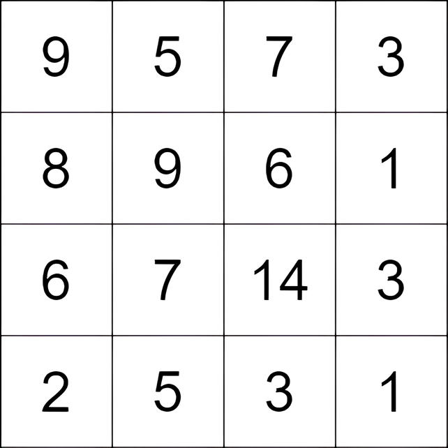

3148. Maximum Difference Score in a Grid

You are given an m x n matrix grid consisting of positive integers. You can move from a cell in the matrix to any other cell that is either to the bottom or to the right (not necessarily adjacent). The score of a move from a cell with the value c1 to a cell with the value c2 is c2 - c1.

You can start at any cell, and you have to make at least one move.

Return the maximum total score you can achieve.

 

**Example 1:**


```
Input: grid = [[9,5,7,3],[8,9,6,1],[6,7,14,3],[2,5,3,1]]

Output: 9

Explanation: We start at the cell (0, 1), and we perform the following moves:
- Move from the cell (0, 1) to (2, 1) with a score of 7 - 5 = 2.
- Move from the cell (2, 1) to (2, 2) with a score of 14 - 7 = 7.
The total score is 2 + 7 = 9.
```

**Example 2:**


```
Input: grid = [[4,3,2],[3,2,1]]

Output: -1

Explanation: We start at the cell (0, 0), and we perform one move: (0, 0) to (0, 1). The score is 3 - 4 = -1.
```
 

**Constraints:**

* `m == grid.length`
* `n == grid[i].length`
* `2 <= m, n <= 1000`
* `4 <= m * n <= 10^5`
* `1 <= grid[i][j] <= 10^5`

# Submissions
---
**Solution 1: (DP Bottom-Up)**
```
Runtime: 120 ms
Memory: 56.57 MB
```
```c++
class Solution {
public:
    int maxScore(vector<vector<int>>& grid) {
        int m = grid.size(), n = grid[0].size(), ans = INT_MIN;
        for (int i = 0; i < m; i ++) {
            for (int j = 0; j < n; j ++) {
                if (i) {
                    ans = max(ans, grid[i][j] - grid[i-1][j]);
                }
                if (j) {
                    ans = max(ans, grid[i][j] - grid[i][j-1]);
                }
                if (i) {
                    grid[i][j] = min(grid[i][j], grid[i-1][j]);
                }
                if (j) {
                    grid[i][j] = min(grid[i][j], grid[i][j-1]);
                }
            }
        }
        return ans;
    }
};
```
