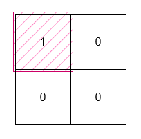

3195. Find the Minimum Area to Cover All Ones I

You are given a 2D **binary** array `grid`. Find a rectangle with horizontal and vertical sides with the smallest area, such that all the 1's in grid lie inside this rectangle.

Return the **minimum** possible area of the rectangle.

 

**Example 1:**


```
Input: grid = [[0,1,0],[1,0,1]]

Output: 6

Explanation:


The smallest rectangle has a height of 2 and a width of 3, so it has an area of 2 * 3 = 6.
```

**Example 2:**


```
Input: grid = [[0,0],[1,0]]

Output: 1

Explanation:


The smallest rectangle has both height and width 1, so its area is 1 * 1 = 1.
```
 

**Constraints:**

* `1 <= grid.length, grid[i].length <= 1000`
* `grid[i][j]` is either `0` or `1`.
* The input is generated such that there is at least one `1` in grid.

# Submissions
---
**Solution 1: (Greedy)**
```
Runtime: 265 ms, Beats 38.98%
Memory: 133.36 MB, Beats 86.90%
```
```c++
class Solution {
public:
    int minimumArea(vector<vector<int>>& grid) {
        int m = grid.size(), n = grid[0].size(), x, y, left_x = m-1, left_y = n-1, right_x = 0, right_y = 0;
        for (x = 0; x < m; x ++) {
            for (y = 0; y < n; y ++) {
                if (grid[x][y]) {
                    left_x = min(left_x, x);
                    right_x = max(right_x, x);
                    left_y = min(left_y, y);
                    right_y = max(right_y, y);
                }
            }
        }
        return (right_x - left_x + 1) * (right_y - left_y + 1);
    }
};
```
