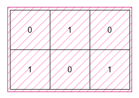

3195. Find the Minimum Area to Cover All Ones I

You are given a 2D **binary** array `grid`. Find a rectangle with horizontal and vertical sides with the smallest area, such that all the 1's in grid lie inside this rectangle.

Return the **minimum** possible area of the rectangle.

 

**Example 1:**


```
Input: grid = [[0,1,0],[1,0,1]]

Output: 6

Explanation:


The smallest rectangle has a height of 2 and a width of 3, so it has an area of 2 * 3 = 6.
```

**Example 2:**


```
Input: grid = [[0,0],[1,0]]

Output: 1

Explanation:


The smallest rectangle has both height and width 1, so its area is 1 * 1 = 1.
```
 

**Constraints:**

* `1 <= grid.length, grid[i].length <= 1000`
* `grid[i][j]` is either `0` or `1`.
* The input is generated such that there is at least one `1` in grid.

# Submissions
---
**Solution 1: (Greedy)**
```
Runtime: 258 ms
Memory: 132.18 MB
```
```c++
class Solution {
public:
    int minimumArea(vector<vector<int>>& grid) {
        int m = grid.size();
        int n = grid[0].size();
        int l = INT_MAX, u = INT_MAX;
        int r = INT_MIN, d = INT_MIN;

        for (int i = 0; i < m; ++i) {
            for (int j = 0; j < n; ++j) {
                if (grid[i][j] == 1) {
                    l = min(l, j);
                    u = min(u, i);
                    r = max(r, j);
                    d = max(d, i);
                }
            }
        }

        return (r - l + 1) * (d - u + 1);
    }
};
```
