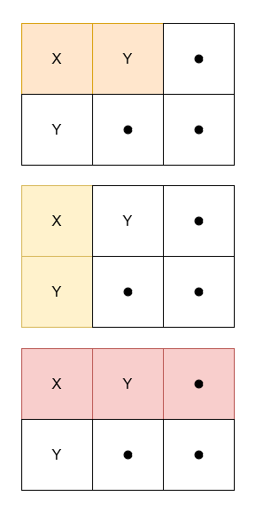

3212. Count Submatrices With Equal Frequency of X and Y

Given a 2D character matrix `grid`, where `grid[i][j]` is either `'X'`, `'Y'`, or `'.'`, return the number of **submatrices** that contains:

* `grid[0][0]`
* an equal frequency of `'X'` and `'Y'`.
* at least one `'X'`.
 

**Example 1:**
```
Input: grid = [["X","Y","."],["Y",".","."]]

Output: 3

Explanation:
```


**Example 2:**
```
Input: grid = [["X","X"],["X","Y"]]

Output: 0

Explanation:

No submatrix has an equal frequency of 'X' and 'Y'.
```

**Example 3:**
```
Input: grid = [[".","."],[".","."]]

Output: 0

Explanation:

No submatrix has at least one 'X'.
```
 

**Constraints:**

* `1 <= grid.length, grid[i].length <= 1000`
* `grid[i][j]` is either `'X'`, `'Y'`, or `'.'`.

# Submissions
---
**Solution 1: (DP Bottom-Up)**
```
Runtime: 383 ms
Memory: 99.67 MB
```
```c++
class Solution {
public:
    int numberOfSubmatrices(vector<vector<char>>& grid) {
        int m = grid.size(), n = grid[0].size(), res = 0;
        vector<pair<int,int>> dp(n); // Create a DP array to store (hasX, diffCount) for each column
        
        // Iterate through each row
        for (auto& vec : grid) {
            int sum = 0, fl = 0; // Initialize sum and flag for the current row
            
            // Iterate through each column in the current row
            for (int i = 0; i < n; i++) {
                if (vec[i] == 'X') {
                    fl = 1;  // Set flag if 'X' is encountered
                    sum++;   // Increment sum for 'X'
                } else if (vec[i] == 'Y') {
                    sum--;   // Decrement sum for 'Y'
                }
                
                dp[i].first |= fl;  // Update dp[i].first to indicate the presence of 'X' up to the current column
                dp[i].second += sum; // Update dp[i].second to maintain the cumulative difference
                
                // Check if the current submatrix meets the criteria
                if (dp[i].first and dp[i].second == 0) {
                    res++; // Increment the result counter if conditions are met
                }
            }
        }
        return res; // Return the count of valid submatrices
    }
};
```
