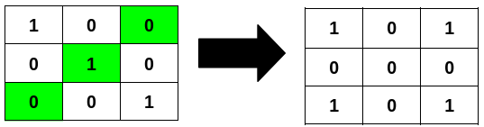
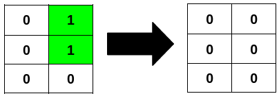

3240. Minimum Number of Flips to Make Binary Grid Palindromic II

You are given an `m x n` binary matrix `grid`.

A row or column is considered **palindromic** if its values read the same forward and backward.

You can **flip** any number of cells in grid from `0` to `1`, or from `1` to `0`.

Return the **minimum** number of cells that need to be flipped to make **all** rows and columns **palindromic**, and the total number of 1's in grid **divisible** by `4`.

 

**Example 1:**
```
Input: grid = [[1,0,0],[0,1,0],[0,0,1]]

Output: 3

Explanation:
```



**Example 2:**
```
Input: grid = [[0,1],[0,1],[0,0]]

Output: 2

Explanation:
```


**Example 3:**
```
Input: grid = [[1],[1]]

Output: 2

Explanation:
```


 

**Constraints:**

* `m == grid.length`
* `n == grid[i].length`
* `1 <= m * n <= 2 * 10^5`
* `0 <= grid[i][j] <= 1`

# Submissions
---
**Solution 1: (case study)**
```
Runtime: 317 ms
Memory: 193.74 MB
```
```c++
class Solution {
public:
    int minFlips(vector<vector<int>>& grid) {
        int m = grid.size(), n = grid[0].size(), ans = 0;
        for (int i = 0; i < m/2; i ++) {
            for (int j = 0; j < n/2; j ++) {
                int dp[2] = {0};
                dp[grid[i][j]] += 1;
                dp[grid[m-1-i][j]] += 1;
                dp[grid[i][n-1-j]] += 1;
                dp[grid[m-1-i][n-1-j]] += 1;
                if (dp[1] >= 2) {
                    ans += dp[0];
                } else {
                    ans += dp[1];
                }
            }
        }
        if (m%2 == 0 && n%2 == 0) {
            return ans;
        }
        int one = 0, two = 0;
        if (m%2) {
            for (int j = 0; j < n/2; j ++) {
                if (grid[m/2][j] != grid[m/2][n-1-j]) {
                    ans += 1;
                    one += 1;
                } else if (grid[m/2][j] == 1) {
                    two += 1;
                }
            }
        }
        if (n%2) {
            for (int i = 0; i < m/2; i++) {
                if (grid[i][n/2] != grid[m-1-i][n/2]) {
                    ans += 1;
                    one += 1;
                } else if (grid[i][n/2] == 1) {
                    two += 1;
                }
            }
        }
        if (two%2 == 1 && one == 0) {
            ans += 2;
        }
        if (m%2 == 1 && n%2 == 1 && grid[m/2][n/2] == 1) {
            ans += 1;
        }
        return ans;
    }
};
```
