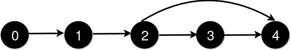
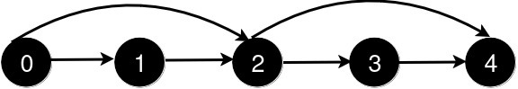

3244. Shortest Distance After Road Addition Queries II

You are given an integer `n` and a 2D integer array `queries`.

There are `n` cities numbered from `0` to `n - 1`. Initially, there is a **unidirectional** road from city `i` to city `i + 1` for all `0 <= i < n - 1`.

`queries[i] = [ui, vi]` represents the addition of a new unidirectional road from city `ui` to city `vi`. After each query, you need to find the length of the **shortest** path from city `0` to city `n - 1`.

There are no two queries such that `queries[i][0] < queries[j][0] < queries[i][1] < queries[j][1].`

Return an array `answer` where for each `i` in the range `[0, queries.length - 1]`, `answer[i]` is the length of the shortest path from city `0` to city `n - 1` after processing the first `i + 1` queries.

 

**Example 1:**
```
Input: n = 5, queries = [[2,4],[0,2],[0,4]]

Output: [3,2,1]

Explanation:
```

```
After the addition of the road from 2 to 4, the length of the shortest path from 0 to 4 is 3.
```

```
After the addition of the road from 0 to 2, the length of the shortest path from 0 to 4 is 2.
```

```
After the addition of the road from 0 to 4, the length of the shortest path from 0 to 4 is 1.
```

**Example 2:**
```
Input: n = 4, queries = [[0,3],[0,2]]

Output: [1,1]

Explanation:
```

```
After the addition of the road from 0 to 3, the length of the shortest path from 0 to 3 is 1.
```

```
After the addition of the road from 0 to 2, the length of the shortest path remains 1.
```
 

**Constraints:**

* `3 <= n <= 10^5`
* `1 <= queries.length <= 105`
* `queries[i].length == 2`
* `0 <= queries[i][0] < queries[i][1] < n`
* `1 < queries[i][1] - queries[i][0]`
* There are no repeated roads among the queries.
* There are no two queries such that `i != j` and `queries[i][0] < queries[j][0] < queries[i][1] < queries[j][1]`.

# Submissions
---
**Solution 1: (Set, binary search)**
```
Runtime: 585 ms
Memory: 220.00 MB
```
```c++
class Solution {
    void sol(set<int>& s, int l, int r) {
        auto it_start = s.lower_bound(l);
        auto it_end = s.upper_bound(r);
        s.erase(it_start, it_end);
    }
public:
    vector<int> shortestDistanceAfterQueries(int n, vector<vector<int>>& queries) {
        set<int> st;    
        for (int i = 0; i < n; i++) {
            st.insert(i);
        }
        vector<int> ans;
        for (auto &q: queries) {
            int x = q[0], y = q[1];
            sol(st, x+1, y-1);  //Nodes to be erased will l+1 to r-1 (Not l to r)
            ans.push_back(st.size()-1);
        }
        return ans;
    }
};
```
