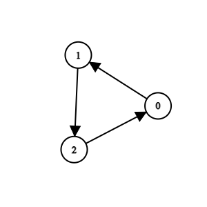

3310. Remove Methods From Project

You are maintaining a project that has `n` methods numbered from `0` to `n - 1`.

You are given two integers `n` and `k`, and a 2D integer array `invocations`, where `invocations[i] = [ai, bi]` indicates that method `ai` invokes method `bi`.

There is a known bug in method `k`. Method `k`, along with any method invoked by it, either **directly** or **indirectly**, are considered **suspicious** and we aim to remove them.

A group of methods can only be removed if no method **outside** the group invokes any methods **within** it.

Return an array containing all the remaining methods after removing all the **suspicious** methods. You may return the answer in any order. If it is not possible to remove **all** the suspicious methods, **none** should be removed.

 

**Example 1:**
```
Input: n = 4, k = 1, invocations = [[1,2],[0,1],[3,2]]

Output: [0,1,2,3]

Explanation:
```

```
Method 2 and method 1 are suspicious, but they are directly invoked by methods 3 and 0, which are not suspicious. We return all elements without removing anything.
```

**Example 2:**
```
Input: n = 5, k = 0, invocations = [[1,2],[0,2],[0,1],[3,4]]

Output: [3,4]

Explanation:
```

```
Methods 0, 1, and 2 are suspicious and they are not directly invoked by any other method. We can remove them.
```

**Example 3:**
```
Input: n = 3, k = 2, invocations = [[1,2],[0,1],[2,0]]

Output: []

Explanation:
```

```
All methods are suspicious. We can remove them.
```
 

Constraints:

`1 <= n <= 10^5`
`0 <= k <= n - 1`
`0 <= invocations.length <= 2 * 10^5`
`invocations[i] == [ai, bi]`
`0 <= ai, bi <= n - 1`
`ai != bi`
`invocations[i] != invocations[j]`

# Submissions
---
**Solution 1: (DFS)**
```
Runtime: 767 ms
Memory: 305.62 MB
```
```c++
class Solution {
    void dfs(int node, vector<int> adj[], vector<int> &visited){
        visited[node] = 1;
        for(auto &it: adj[node]){
            if(!visited[it]){
                dfs(it, adj, visited);
            }
        }
    }
public:
    vector<int> remainingMethods(int n, int k, vector<vector<int>>& invocations) {
        // construct adjacency list
        vector<int> adj[n];
        for(auto it: invocations){
            adj[it[0]].push_back(it[1]);
        }
        vector<int> visited(n,0);
        // mark all nodes as visited that are connected by k (directly or indirectly)
        dfs(k, adj, visited);
        
        bool suspicious = true;
        for(int i = 0; i < n; i++){
            if(!visited[i]){
                for(auto it: adj[i]){
                    // if an outside node invokes a node within group,
                    // then mark suspicious as false
                    if(visited[it]) suspicious = false;
                }
            }
        }
        vector<int> ans;
        if(suspicious){
            // remove nodes which are suspicious
            for(int i = 0; i < n; i++){
                if(!visited[i]) ans.push_back(i);
            }
        } else {
            // add all the nodes since there is no suspicious group
            for(int i = 0; i < n; i++){
                ans.push_back(i);
            }
        }
        return ans;
    }
};
```
