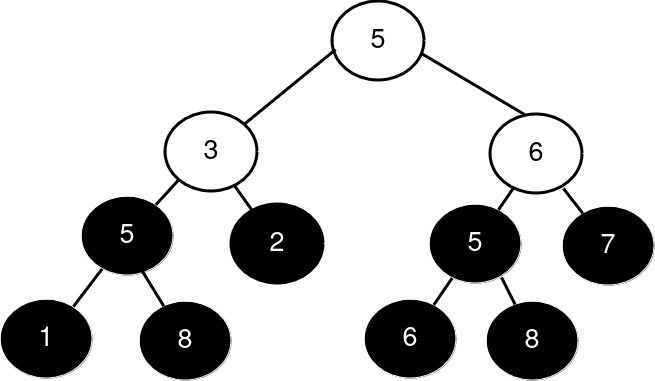
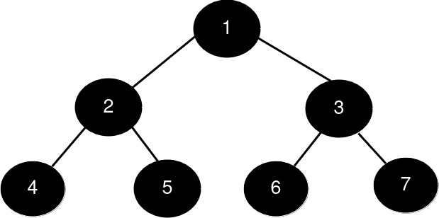
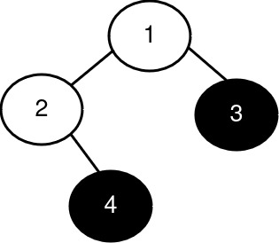

3319. K-th Largest Perfect Subtree Size in Binary Tree

You are given the `root` of a binary tree and an integer `k`.

Return an integer denoting the size of the `k`th **largest perfect binary subtree**, or `-1` if it doesn't exist.

A **perfect binary tree** is a tree where all leaves are on the same level, and every parent has two children.

 

**Example 1:**
```
Input: root = [5,3,6,5,2,5,7,1,8,null,null,6,8], k = 2

Output: 3

Explanation:
```

```
The roots of the perfect binary subtrees are highlighted in black. Their sizes, in decreasing order are [3, 3, 1, 1, 1, 1, 1, 1].
The 2nd largest size is 3.
```

**Example 2:**
```
Input: root = [1,2,3,4,5,6,7], k = 1

Output: 7

Explanation:
```

```
The sizes of the perfect binary subtrees in decreasing order are [7, 3, 3, 1, 1, 1, 1]. The size of the largest perfect binary subtree is 7.
```

**Example 3:**
```
Input: root = [1,2,3,null,4], k = 3

Output: -1

Explanation:
```

```
The sizes of the perfect binary subtrees in decreasing order are [1, 1]. There are fewer than 3 perfect binary subtrees.
```
 

**Constraints:**

* The number of nodes in the tree is in the range `[1, 2000]`.
* `1 <= Node.val <= 2000`
* `1 <= k <= 1024`

# Submissions
---
**Solution 1: (DFS)**
```
Runtime: 58 ms
Memory: 63.89 MB
```
```c++
/**
 * Definition for a binary tree node.
 * struct TreeNode {
 *     int val;
 *     TreeNode *left;
 *     TreeNode *right;
 *     TreeNode() : val(0), left(nullptr), right(nullptr) {}
 *     TreeNode(int x) : val(x), left(nullptr), right(nullptr) {}
 *     TreeNode(int x, TreeNode *left, TreeNode *right) : val(x), left(left), right(right) {}
 * };
 */
class Solution {
    pair<bool, pair<int,int>> dfs(TreeNode *node, priority_queue<int> &pq) {
        if (!node) {
            return {true, {0, 0}};
        }
        auto [left_perfect, lp] = dfs(node->left, pq);
        auto [right_perfect, rp] = dfs(node->right, pq);
        auto [lh, ln] = lp;
        auto [rh, rn] = rp;
        if (!left_perfect || !right_perfect || lh != rh) {
            return {false, {0, 0}};
        }
        pq.push(ln + rn + 1);
        return {true, {lh+1, ln + rn + 1}};
    }
public:
    int kthLargestPerfectSubtree(TreeNode* root, int k) {
        priority_queue<int> pq;
        dfs(root, pq);
        while (pq.size() && k > 1) {
            pq.pop();
            k -= 1;
        }
        return pq.size() ? pq.top() : -1;
    }
};
```
