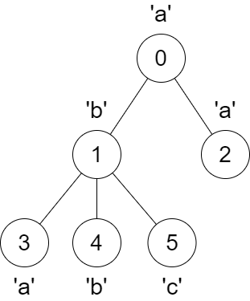
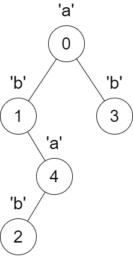

3331. Find Subtree Sizes After Changes

You are given a tree rooted at node `0` that consists of `n` nodes numbered from `0` to `n - 1`. The tree is represented by an array `parent` of size `n`, where `parent[i]` is the parent of node `i`. Since node `0` is the root, `parent[0] == -1`.

You are also given a string `s` of length `n`, where `s[i]` is the character assigned to node `i`.

We make the following changes on the tree **one** time **simultaneously** for all nodes `x` from `1` to `n - 1`:

* Find the **closest** node `y` to node `x` such that `y` is an ancestor of `x`, and `s[x] == s[y]`.
* If node `y` does not exist, do nothing.
* Otherwise, remove the edge between `x` and its current parent and make node `y` the new parent of `x` by adding an edge between them.

Return an array `answer` of size `n` where `answer[i]` is the size of the subtree rooted at node `i` in the final tree.

A subtree of `treeName` is a tree consisting of a node in `treeName` and all of its descendants.

 

**Example 1:**
```
Input: parent = [-1,0,0,1,1,1], s = "abaabc"

Output: [6,3,1,1,1,1]

Explanation:
```

```
The parent of node 3 will change from node 1 to node 0.
```

**Example 2:**
```
Input: parent = [-1,0,4,0,1], s = "abbba"

Output: [5,2,1,1,1]

Explanation:
```

```
The following changes will happen at the same time:

The parent of node 4 will change from node 1 to node 0.
The parent of node 2 will change from node 4 to node 1.
```

**Constraints:**

* `n == parent.length == s.length`
* `1 <= n <= 10^5`
* `0 <= parent[i] <= n - 1 for all i >= 1.`
* `parent[0] == -1`
* `parent` represents a valid tree.
* `s` consists only of lowercase English letters.

# Submissions
---
**Solution 1: (DFS, 2 DFS)**
```
Runtime: 313 ms
Memory: 192.68 MB
```
```c++
class Solution {
    void dfs(int i, vector<vector<int>> &child, vector<int> &parent, vector<vector<int>> &dp, string &s) {
        if (dp[s[i]-'a'].size()) {
            parent[i] = dp[s[i]-'a'].back();
        }
        dp[s[i]-'a'].push_back(i);
        for (auto c: child[i]) {
            dfs(c, child, parent, dp, s);
        }
        dp[s[i]-'a'].pop_back();
    }
    int dfs2(int i, vector<int> &ans,  vector<vector<int>> &child) {
        if (ans[i] != 0) {
            ans[i];
        }
        ans[i] = 1;
        for (auto c: child[i]) {
            ans[i] += dfs2(c, ans, child);
        }
        return ans[i];
    }
public:
    vector<int> findSubtreeSizes(vector<int>& parent, string s) {
        int n = parent.size();
        vector<vector<int>> child(n);
        vector<vector<int>> dp(26);  // char -> {node, ...}
        vector<int> ans(n);
        for (int i = 1; i < n; i ++) {
            child[parent[i]].push_back(i);
        }
        dfs(0, child, parent, dp, s);
        child.clear();
        child.resize(n);
        for (int i = 0; i < n; i ++) {
            if (parent[i] != -1) {
                child[parent[i]].push_back(i);
            }
        }
        dfs2(0, ans, child);
        return ans;
    }
};
```
