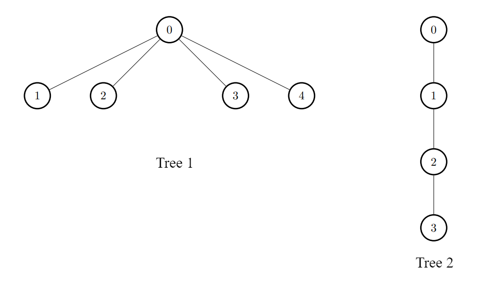

3372. Maximize the Number of Target Nodes After Connecting Trees I

There exist two undirected trees with `n` and `m` nodes, with distinct labels in ranges `[0, n - 1]` and `[0, m - 1]`, respectively.

You are given two 2D integer arrays `edges1` and `edges2` of lengths `n - 1` and `m - 1`, respectively, where `edges1[i] = [ai, bi]` indicates that there is an edge between nodes `ai` and `bi` in the first tree and `edges2[i] = [ui, vi]` indicates that there is an edge between nodes `ui` and `vi` in the second tree. You are also given an integer `k`.

Node `u` is **target** to node `v` if the number of edges on the path from `u` to `v` is less than or equal to `k`. Note that a node is always **target** to itself.

Return an array of `n` integers answer, where `answer[i]` is the **maximum** possible number of nodes **target** to node `i` of the first tree if you have to connect one node from the first tree to another node in the second tree.

**Note** that queries are independent from each other. That is, for every query you will remove the added edge before proceeding to the next query.

 

**Example 1:**
```
Input: edges1 = [[0,1],[0,2],[2,3],[2,4]], edges2 = [[0,1],[0,2],[0,3],[2,7],[1,4],[4,5],[4,6]], k = 2

Output: [9,7,9,8,8]

Explanation:

For i = 0, connect node 0 from the first tree to node 0 from the second tree.
For i = 1, connect node 1 from the first tree to node 0 from the second tree.
For i = 2, connect node 2 from the first tree to node 4 from the second tree.
For i = 3, connect node 3 from the first tree to node 4 from the second tree.
For i = 4, connect node 4 from the first tree to node 4 from the second tree.
```


**Example 2:**
```
Input: edges1 = [[0,1],[0,2],[0,3],[0,4]], edges2 = [[0,1],[1,2],[2,3]], k = 1

Output: [6,3,3,3,3]

Explanation:

For every i, connect node i of the first tree with any node of the second tree.
```

 

**Constraints:**

* `2 <= n, m <= 1000`
* `edges1.length == n - 1`
* `edges2.length == m - 1`
* `edges1[i].length == edges2[i].length == 2`
* `edges1[i] = [ai, bi]`
* `0 <= ai, bi < n`
* `edges2[i] = [ui, vi]`
* `0 <= ui, vi < m`
* The input is generated such that `edges1` and `edges2` represent valid trees.
* `0 <= k <= 1000`

# Submissions
---
**Solution 1: (DFS, Brute Force, try every node)**
```
Runtime: 125 ms
Memory: 61.47 MB
```
```c++
class Solution {
    int dfs(vector<vector<int>> &g, int p, int i, int k) {
        if (k < 0) {
            return 0;
        }
        int rst = 1;
        for (auto j: g[i]) {
            if (j != p) {
                rst += dfs(g, i, j, k-1);
            }
        }
        return rst;
    }
public:
    vector<int> maxTargetNodes(vector<vector<int>>& edges1, vector<vector<int>>& edges2, int k) {
        int m = edges2.size()+1, n = edges1.size()+1, i, a;
        vector<vector<int>> g2(m), g(n);
        for (auto e: edges2) {
            g2[e[0]].push_back(e[1]);
            g2[e[1]].push_back(e[0]);
        }
        a = 0;
        if (k) {
            for (i = 0; i < m; i ++) {
                a = max(a, dfs(g2, -1, i, k-1));
            }
        }
        for (auto e: edges1) {
            g[e[0]].push_back(e[1]);
            g[e[1]].push_back(e[0]);
        }
        vector<int> ans;
        for (i = 0; i < n; i++) {
            ans.push_back(dfs(g, -1, i, k) + a);
        }
        return ans;
    } 
};
```

**Solution 2: (BFS, Brute Force, try every node)**
```
Runtime: 363 ms, Beats 29.96%
Memory: 199.80 MB, Beats 34.10%
```
```c++
class Solution {
    int bfs(int i, vector<vector<int>> &g, int k) {
        int sz, j, rst = 0;
        queue<pair<int,int>> q;
        q.push({i, -1});
        while (q.size() && k >= 0) {
            sz = q.size();
            rst += sz;
            for (j = 0; j < sz; j ++) {
                auto [u, p] = q.front();
                q.pop();
                for (auto v: g[u]) {
                    if (v != p) {
                        q.push({v, u});
                    }
                }
            }
            k -= 1;
        }
        return rst;
    }
public:
    vector<int> maxTargetNodes(vector<vector<int>>& edges1, vector<vector<int>>& edges2, int k) {
        int n = edges1.size()+1, m = edges2.size()+1, i, j, a = 0;
        vector<vector<int>> gn(n), gm(m);
        vector<int> ans(n);
        for (i = 0; i < n-1; i ++) {
            gn[edges1[i][0]].push_back(edges1[i][1]);
            gn[edges1[i][1]].push_back(edges1[i][0]);
        }
        for (i = 0; i < m-1; i ++) {
            gm[edges2[i][0]].push_back(edges2[i][1]);
            gm[edges2[i][1]].push_back(edges2[i][0]);
        }
        for (i = 0; i < m; i ++) {
            a = max(a, bfs(i, gm, k-1));
        }
        for (i = 0; i < n; i ++) {
            ans[i] = bfs(i, gn, k) + a;
        }
        return ans;
    } 
};
```
