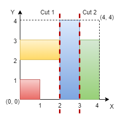

3394. Check if Grid can be Cut into Sections

You are given an integer `n` representing the dimensions of an `n x n` grid, with the origin at the bottom-left corner of the grid. You are also given a 2D array of coordinates rectangles, where `rectangles[i]` is in the form `[startx, starty, endx, endy]`, representing a rectangle on the grid. Each rectangle is defined as follows:

* `(startx, starty)`: The bottom-left corner of the rectangle.
* `(endx, endy)`: The top-right corner of the rectangle.

**Note** that the rectangles do not overlap. Your task is to determine if it is possible to make **either two horizontal or two vertical** cuts on the grid such that:

* Each of the three resulting sections formed by the cuts contains **at least** one rectangle.
* Every rectangle belongs to **exactly** one section.

Return `true` if such cuts can be made; otherwise, return `false`.

 

**Example 1:**
```
Input: n = 5, rectangles = [[1,0,5,2],[0,2,2,4],[3,2,5,3],[0,4,4,5]]

Output: true

Explanation:
```

```
The grid is shown in the diagram. We can make horizontal cuts at y = 2 and y = 4. Hence, output is true.
```

**Example 2:**
```
Input: n = 4, rectangles = [[0,0,1,1],[2,0,3,4],[0,2,2,3],[3,0,4,3]]

Output: true

Explanation:
```

```
We can make vertical cuts at x = 2 and x = 3. Hence, output is true.
```

**Example 3:**
```
Input: n = 4, rectangles = [[0,2,2,4],[1,0,3,2],[2,2,3,4],[3,0,4,2],[3,2,4,4]]

Output: false

Explanation:
```

```
We cannot make two horizontal or two vertical cuts that satisfy the conditions. Hence, output is false.
```
 

**Constraints:**

* `3 <= n <= 10^9`
* `3 <= rectangles.length <= 10^5`
* `0 <= rectangles[i][0] < rectangles[i][2] <= n`
* `0 <= rectangles[i][1] < rectangles[i][3] <= n`
* No two rectangles overlap.

# Submissions
---
**Solution 1: (Line Sweep)**
```
Runtime: 304 ms
Memory: 283.28 MB
```
```c++
class Solution {
public:
    bool checkValidCuts(int n, vector<vector<int>>& rectangles) {
        auto check = [](vector<vector<int>> &A) -> bool {
            int res = 0;
            sort(A.begin(), A.end());
            int pre = A[0][1];
            for (auto& ab : A) {
                int a = ab[0], b = ab[1];
                res += pre <= a;
                pre = max(pre, b);
            }
            return res > 1;
        };

        vector<vector<int>> X, Y;
        for (auto& r : rectangles) {
            X.push_back({r[0], r[2]});
            Y.push_back({r[1], r[3]});
        }
        return check(X) || check(Y);
    }
};
```
