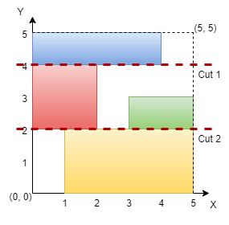

3394. Check if Grid can be Cut into Sections

You are given an integer `n` representing the dimensions of an `n x n` grid, with the origin at the bottom-left corner of the grid. You are also given a 2D array of coordinates rectangles, where `rectangles[i]` is in the form `[startx, starty, endx, endy]`, representing a rectangle on the grid. Each rectangle is defined as follows:

* `(startx, starty)`: The bottom-left corner of the rectangle.
* `(endx, endy)`: The top-right corner of the rectangle.

**Note** that the rectangles do not overlap. Your task is to determine if it is possible to make **either two horizontal or two vertical** cuts on the grid such that:

* Each of the three resulting sections formed by the cuts contains **at least** one rectangle.
* Every rectangle belongs to **exactly** one section.

Return `true` if such cuts can be made; otherwise, return `false`.

 

**Example 1:**
```
Input: n = 5, rectangles = [[1,0,5,2],[0,2,2,4],[3,2,5,3],[0,4,4,5]]

Output: true

Explanation:
```

```
The grid is shown in the diagram. We can make horizontal cuts at y = 2 and y = 4. Hence, output is true.
```

**Example 2:**
```
Input: n = 4, rectangles = [[0,0,1,1],[2,0,3,4],[0,2,2,3],[3,0,4,3]]

Output: true

Explanation:
```

```
We can make vertical cuts at x = 2 and x = 3. Hence, output is true.
```

**Example 3:**
```
Input: n = 4, rectangles = [[0,2,2,4],[1,0,3,2],[2,2,3,4],[3,0,4,2],[3,2,4,4]]

Output: false

Explanation:
```

```
We cannot make two horizontal or two vertical cuts that satisfy the conditions. Hence, output is false.
```
 

**Constraints:**

* `3 <= n <= 10^9`
* `3 <= rectangles.length <= 10^5`
* `0 <= rectangles[i][0] < rectangles[i][2] <= n`
* `0 <= rectangles[i][1] < rectangles[i][3] <= n`
* No two rectangles overlap.

# Submissions
---
**Solution 1: (Counter)**

    Input: n = 5, rectangles = [[1,0,5,2],[0,2,2,4],[3,2,5,3],[0,4,4,5]]


      0  1  2  3  4  5
cnt      1       -1
      1 -1
               1 -1
      1       -1
k     2  2     2  0
cur               1

      0  1  2  3  4  5
cnt2  1 -1
            1 -1
            1-1
                  1-1
k        0     0


    4   |-------x---x---x
    3   |       |   |   |
    2   x-------x---x---x
    1       |       |   |
    0       x-------x---|  
        0   1   2   3   4

cnt
        0   1   2   3   4
        1  -1
            1  -1
                1-1
                    1-1
                    1-1
    k           0   0   0

```
Runtime: 364 ms, Beats 33.92%
Memory: 250.49 MB, Beats 41.80%
```
```c++
class Solution {
public:
    bool checkValidCuts(int n, vector<vector<int>>& rectangles) {
        int k, cur;
        map<int,int> cnt, cnt2;
        for (auto r: rectangles) {
            cnt[r[0]] += 1;
            cnt[r[2] - 1] -= 1;
        }
        k = 0;
        cur = 0;
        for (auto [x, c]: cnt) {
            k += c;
            if (k == 0) {
                cur += 1;
                if (cur == 2 && x < cnt.rbegin()->first) {
                    return true;
                }
            }
        }
        for (auto r: rectangles) {
            cnt2[r[1]] += 1;
            cnt2[r[3] - 1] -= 1;
        }
        k = 0;
        cur = 0;
        for (auto [y, c]: cnt2) {
            k += c;
            if (k == 0) {
                cur += 1;
                if (cur == 2 && y < cnt2.rbegin()->first) {
                    return true;
                }
            }
        }
        return false;
    }
};
```

**Solution 2: (Line Sweep, sort)**


    Input: n = 5, rectangles = [[1,0,5,2],[0,2,2,4],[3,2,5,3],[0,4,4,5]]

    5      
    4  x x x x x   <
    3  x x         
    2  x x   x x x <
    1    x x x x x 
    0    x x x x x   
       0 1 2 3 4 5


                v[pre]
    -------------
    r[i][d]     r[i][d+2]
           -----------------
          r[j][j]          r[j][d+2]

```
Runtime: 125 ms, Beats 72.21%
Memory: 185.52 MB, Beats 95.40%
```
```c++
class Solution {
    bool check(vector<vector<int>> &rectangles, int d) {
        int n = rectangles.size(), i, rst = 0;
        sort(rectangles.begin(), rectangles.end(), [&](auto &a, auto &b){return a[d] < b[d];});
        int pre = rectangles[0][d+2];
        for (i = 1; i < n; i ++) {
            if (rectangles[i][d] >= pre) {
                rst += 1;
            }
            pre = max(pre, rectangles[i][d+2]);
        }
        return rst >= 2;
    }
public:
    bool checkValidCuts(int n, vector<vector<int>>& rectangles) {
        return check(rectangles, 0) || check(rectangles, 1);
    }
};
```
