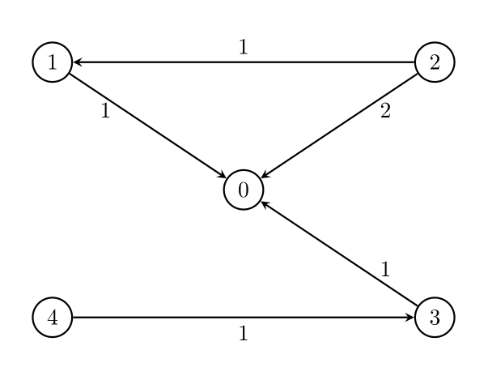
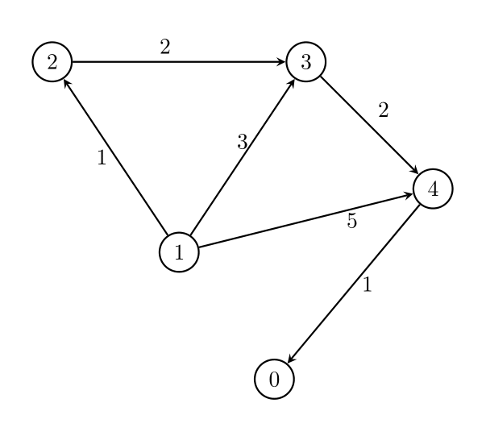

3419. Minimize the Maximum Edge Weight of Graph

You are given two integers, n and threshold, as well as a directed weighted graph of n nodes numbered from 0 to n - 1. The graph is represented by a 2D integer array edges, where edges[i] = [Ai, Bi, Wi] indicates that there is an edge going from node Ai to node Bi with weight Wi.

You have to remove some edges from this graph (possibly none), so that it satisfies the following conditions:

Node 0 must be reachable from all other nodes.
The maximum edge weight in the resulting graph is minimized.
Each node has at most threshold outgoing edges.
Return the minimum possible value of the maximum edge weight after removing the necessary edges. If it is impossible for all conditions to be satisfied, return -1.

 

**Example 1:**
```
Input: n = 5, edges = [[1,0,1],[2,0,2],[3,0,1],[4,3,1],[2,1,1]], threshold = 2

Output: 1

Explanation:
```

```
Remove the edge 2 -> 0. The maximum weight among the remaining edges is 1.
```

**Example 2:**
```
Input: n = 5, edges = [[0,1,1],[0,2,2],[0,3,1],[0,4,1],[1,2,1],[1,4,1]], threshold = 1

Output: -1

Explanation: 

It is impossible to reach node 0 from node 2.
```

**Example 3:**
```
Input: n = 5, edges = [[1,2,1],[1,3,3],[1,4,5],[2,3,2],[3,4,2],[4,0,1]], threshold = 1

Output: 2

Explanation: 
```

```
Remove the edges 1 -> 3 and 1 -> 4. The maximum weight among the remaining edges is 2.
```

**Example 4:**
```
Input: n = 5, edges = [[1,2,1],[1,3,3],[1,4,5],[2,3,2],[4,0,1]], threshold = 1

Output: -1
```
 

**Constraints:**

* `2 <= n <= 10^5`
* `1 <= threshold <= n - 1`
* `1 <= edges.length <= min(105, n * (n - 1) / 2).`
* `edges[i].length == 3`
* `0 <= Ai, Bi < n`
* `Ai != Bi`
* `1 <= Wi <= 10^6`
* There may be multiple edges between a pair of nodes, but they must have unique weights.

# Submissions
---
**Solution 1: (Dijkstra, ignore threshold)**
```
Runtime: 202 ms
Memory: 270.42 MB
```
```c++
class Solution {
public:
    int minMaxWeight(int n, vector<vector<int>>& edges, int threshold) {
        int i, k = n, cur = 0;
        vector<vector<pair<int,int>>> g(n);
        vector<int> visited(n);
        priority_queue<tuple<int,int,int>, vector<tuple<int,int,int>>, greater<tuple<int,int,int>>> pq;
        for (i = 0; i < edges.size(); i++) {
            g[edges[i][1]].push_back({edges[i][0], edges[i][2]});
        }
        pq.push({0, -1, 0});
        while (k && pq.size()) {
            auto [w, u, v] = pq.top();
            pq.pop();
            if (visited[v]) {
                continue;
            }
            visited[v] = 1;
            k -= 1;
            cur = max(cur, w);
            if (k == 0) {
                return cur;
            }
            for (auto [nv, nw]: g[v]) {
                pq.push({nw, v, nv});
            }
        }
        return -1;
    }
};
```
