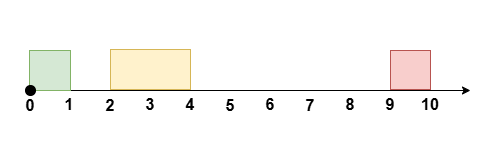

3439. Reschedule Meetings for Maximum Free Time I

You are given an integer `eventTime` denoting the duration of an event, where the event occurs from time `t = 0 `to time `t = eventTime`.

You are also given two integer arrays `startTime` and `endTime`, each of length `n`. These represent the start and end time of `n` **non-overlapping** meetings, where the `i`th meeting occurs during the time `[startTime[i], endTime[i]]`.

You can reschedule at most `k` meetings by moving their start time while maintaining the **same duration**, to **maximize** the **longest** continuous period of free time during the event.

The **relative** order of all the meetings should stay the same and they should remain non-overlapping.

Return the maximum amount of free time possible after rearranging the meetings.

Note that the meetings can not be rescheduled to a time outside the event.

 

**Example 1:**
```
Input: eventTime = 5, k = 1, startTime = [1,3], endTime = [2,5]

Output: 2

Explanation:
```

```
Reschedule the meeting at [1, 2] to [2, 3], leaving no meetings during the time [0, 2].
```

**Example 2:**
```
Input: eventTime = 10, k = 1, startTime = [0,2,9], endTime = [1,4,10]

Output: 6

Explanation:
```

```
Reschedule the meeting at [2, 4] to [1, 3], leaving no meetings during the time [3, 9].
```

**Example 3:**
```
Input: eventTime = 5, k = 2, startTime = [0,1,2,3,4], endTime = [1,2,3,4,5]

Output: 0

Explanation:

There is no time during the event not occupied by meetings.
```
 

**Constraints:**

* `1 <= eventTime <= 10^9`
* `n == startTime.length == endTime.length`
* `2 <= n <= 10^5`
* `1 <= k <= n`
* `0 <= startTime[i] < endTime[i] <= eventTime`
* `endTime[i] <= startTime[i + 1] `where `i` lies in the range `[0, n - 2].`

# Submissions
---
**Solution 1: (Sliding windows, gap)**

     0 1 2 3   5
       xxx xxxxx
gap   1   1

     0 1 2 3 4         9 10 
     xxx xxxxx         xxxx
gap     1         5

```
Runtime: 4 ms, Beats 83.33%
Memory: 125.92 MB, Beats 41.67%
```
```c++
class Solution {
public:
    int maxFreeTime(int eventTime, int k, vector<int>& startTime, vector<int>& endTime) {
        vector<int> gap(1, startTime[0]);
        for (int i = 1; i < startTime.size(); ++i) {
            gap.push_back(startTime[i] -  endTime[i-1]);
        }
        gap.push_back(eventTime - endTime.back());
        int ans = 0, sum = 0;
        for (int i = 0; i < gap.size(); ++i) {
            sum += gap[i] - ((i >=  k+1)? gap[i - (k+1)] : 0);
            ans = max(ans, sum);
        }
        return ans;
    }
};
```

**Solution 2: (Sliding Window)**

    eventTime = 10, k = 1, startTime = [0,2,9], endTime = [1,4,10]

    [0,  2,  9, 10]
    [1,  4, 10, 10]
                 ^
a    1   3   4   4
ans  0   1   6   6


    xx x   xxxx   xxx xx
       ^i-k  ^i
                   ^i

```
Runtime: 0 ms, Beats 100.00%
Memory: 120.89 MB, Beats 99.52%
```
```c++
class Solution {
public:
    int maxFreeTime(int eventTime, int k, vector<int>& startTime, vector<int>& endTime) {
        startTime.push_back(eventTime);
        endTime.push_back(eventTime);
        int n = startTime.size(), i, a = 0, pre = 0, ans = 0;
        for (i = 0; i < n; i ++) {
            a += endTime[i] - startTime[i];
            ans = max(ans, endTime[i] - pre - a);
            if (i >= k) {
                a -= endTime[i - k] - startTime[i - k];
                pre = endTime[i-k];
            }
        }
        return ans;
    }
};
```
