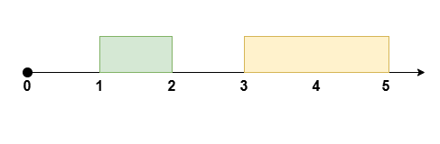
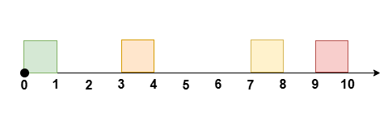

3440. Reschedule Meetings for Maximum Free Time II

You are given an integer `eventTime` denoting the duration of an event. You are also given two integer arrays `startTime` and `endTime`, each of length `n`.

These represent the start and end times of `n` **non-overlapping** meetings that occur during the event between time `t = 0` and time `t = eventTime`, where the `i`th meeting occurs during the time `[startTime[i], endTime[i]]`.

You can reschedule **at most** one meeting by moving its start time while maintaining the **same duration**, such that the meetings remain non-overlapping, to **maximize** the longest continuous period of free time during the event.

Return the **maximum** amount of free time possible after rearranging the meetings.

**Note** that the meetings can not be rescheduled to a time outside the event and they should remain non-overlapping.

**Note**: In this version, it is **valid** for the relative ordering of the meetings to change after rescheduling one meeting.

 

**Example 1:**
```
Input: eventTime = 5, startTime = [1,3], endTime = [2,5]

Output: 2

Explanation:
```

```
Reschedule the meeting at [1, 2] to [2, 3], leaving no meetings during the time [0, 2].
```

**Example 2:**
```
Input: eventTime = 10, startTime = [0,7,9], endTime = [1,8,10]

Output: 7

Explanation:
```

```
Reschedule the meeting at [0, 1] to [8, 9], leaving no meetings during the time [0, 7].
```

**Example 3:**
```
Input: eventTime = 10, startTime = [0,3,7,9], endTime = [1,4,8,10]

Output: 6

Explanation:
```

```
Reschedule the meeting at [3, 4] to [8, 9], leaving no meetings during the time [1, 7].
```

**Example 4:**
```
Input: eventTime = 5, startTime = [0,1,2,3,4], endTime = [1,2,3,4,5]

Output: 0

Explanation:

There is no time during the event not occupied by meetings.
```
 

**Constraints:**

* `1 <= eventTime <= 10^9`
* `n == startTime.length == endTime.length`
* `2 <= n <= 10^5`
* `0 <= startTime[i] < endTime[i] <= eventTime`
* `endTime[i] <= startTime[i + 1]` where `i` lies in the range `[0, n - 2]`.

# Submissions
---
**Solution 1: (Prefix Sum, gap)**

        0 1 2 3 4 5 6 7 8 9 10
        xxx   xxx     xxx xxxx
gap     0 2 3 1 0 
right   3 3 1 0 0
left    0 
```
Runtime: 13 ms, Beats 95.24%
Memory: 148.01 MB, Beats 76.19%
```
```c++
class Solution {
public:
    int maxFreeTime(int eventTime, vector<int>& startTime, vector<int>& endTime) {
        vector<int> gap(1, startTime[0]);
        for (int i = 1; i < startTime.size(); ++i) {
            gap.push_back(startTime[i] -  endTime[i-1]);
        }
        gap.push_back(eventTime - endTime.back());
        vector<int> largestRight(gap.size(), 0);
        for (int i = gap.size()-2; i >= 0; --i) {
            largestRight[i] = max(largestRight[i+1], gap[i+1]);
        }
        int ans = 0, largestLeft = 0;
        for (int i = 1; i < gap.size(); ++i) {
            int curGap = endTime[i-1] - startTime[i-1];
            if (curGap <= max(largestLeft,largestRight[i])) {
                ans = max(ans, gap[i-1] + gap[i] +  curGap);
            }
            ans = max(ans, gap[i-1] + gap[i]);
            largestLeft = max(largestLeft, gap[i-1]);
        }
        return ans;
    }
};
```
