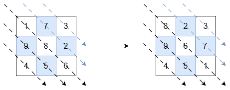
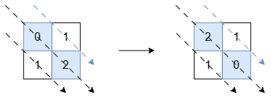

3446. Sort Matrix by Diagonals

You are given an `n x n` square matrix of integers `grid`. Return the matrix such that:

* The diagonals in the **bottom-left triangle** (including the middle diagonal) are sorted in **non-increasing order**.
* The diagonals in the **top-right triangle** are sorted in **non-decreasing order**.
 

**Example 1:**
```
Input: grid = [[1,7,3],[9,8,2],[4,5,6]]

Output: [[8,2,3],[9,6,7],[4,5,1]]

Explanation:
```

```
The diagonals with a black arrow (bottom-left triangle) should be sorted in non-increasing order:

[1, 8, 6] becomes [8, 6, 1].
[9, 5] and [4] remain unchanged.
The diagonals with a blue arrow (top-right triangle) should be sorted in non-decreasing order:

[7, 2] becomes [2, 7].
[3] remains unchanged.
```

**Example 2:**
```
Input: grid = [[0,1],[1,2]]

Output: [[2,1],[1,0]]

Explanation:
```

```
The diagonals with a black arrow must be non-increasing, so [0, 2] is changed to [2, 0]. The other diagonals are already in the correct order.
```

**Example 3:**
```
Input: grid = [[1]]

Output: [[1]]

Explanation:

Diagonals with exactly one element are already in order, so no changes are needed.
```
 

**Constraints:**

* `grid.length == grid[i].length == n`
* `1 <= n <= 10`
* `-10^5 <= grid[i][j] <= 10^5`

# Submissions
---
**Solution 1: (Hash Table)**
```
Runtime: 3 ms, Beats 100.00%
Memory: 45.72 MB, Beats 30.00%
```
```c++
class Solution {
public:
    vector<vector<int>> sortMatrix(vector<vector<int>>& grid) {
        int n = grid.size(), i, j;
        vector<vector<int>> dp(2*n);
        vector<vector<int>> ans(n, vector<int>(n));
        for (i = 0; i < n; i ++) {
            for (j = 0; j < n; j ++) {
                dp[i-j+n].push_back(grid[i][j]);
            }
        }
        for (i = 1; i < dp.size(); i ++) {
            if (i >= j) {
                sort(dp[i].begin(), dp[i].end());
            } else {
                sort(dp[i].rbegin(), dp[i].rend());
            }
        }
        for (i = 0; i < n; i ++) {
            for (j = 0; j < n; j ++) {
                ans[i][j] = dp[i-j+n].back();
                dp[i-j+n].pop_back();
            }
        }
        return ans;
    }
};
```
