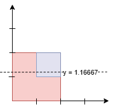

3453. Separate Squares I

You are given a 2D integer array `squares`. Each `squares[i] = [xi, yi, li]` represents the coordinates of the bottom-left point and the side length of a square parallel to the x-axis.

Find the **minimum** y-coordinate value of a horizontal line such that the total area of the squares above the line equals the total area of the squares below the line.

Answers within `10^-5` of the actual answer will be accepted.

**Note**: Squares may overlap. Overlapping areas should be counted **multiple times**.

 

**Example 1:**
```
Input: squares = [[0,0,1],[2,2,1]]

Output: 1.00000

Explanation:
```

```
Any horizontal line between y = 1 and y = 2 will have 1 square unit above it and 1 square unit below it. The lowest option is 1.
```

**Example 2:**
```
Input: squares = [[0,0,2],[1,1,1]]

Output: 1.16667

Explanation:
```

```
The areas are:

Below the line: 7/6 * 2 (Red) + 1/6 (Blue) = 15/6 = 2.5.
Above the line: 5/6 * 2 (Red) + 5/6 (Blue) = 15/6 = 2.5.
Since the areas above and below the line are equal, the output is 7/6 = 1.16667.
```
 

**Constraints:**

* `1 <= squares.length <= 5 * 10^4`
* `squares[i] = [xi, yi, li]`
* `squares[i].length == 3`
* `0 <= xi, yi <= 10^9`
* `1 <= li <= 10^9`

# Submissions
---
**Solution 1: (Binary Search)**
```
Runtime: 99 ms, Beats 62.72%
Memory: 198.60 MB, Beats 89.02%
```
```c++
class Solution {
    bool check(double mid, vector<vector<int>>& squares) {
        int n = squares.size(), i; 
        double a = 0, b = 0, x, y, len;
        for (i = 0; i < n; i ++) {
            x = squares[i][0];
            y = squares[i][1];
            len = squares[i][2];
            if (y >= mid) {
                a += len * len;
            } else if (y + len <= mid) {
                b += len * len;
            } else {
                a += len * (y + len - mid);
                b += len * (mid  - y);
            }
        }
        return b >= a;
    }
public:
    double separateSquares(vector<vector<int>>& squares) {
        double left = 0, right = 0, mid, ans;
        for (int i = 0; i < squares.size(); i++) {
            left = min(left, (double)squares[i][1]);
            right = max(right, (double)squares[i][1] + squares[i][2]);
        }
        while (left <= right) {
            mid = left + (right-left)/2.0;
            if (!check(mid, squares)) {
                left = mid + 0.000001;
            } else {
                ans = mid;
                right = mid - 0.000001;
            }
        }
        return ans;
    }
};
```

**Solution 2: (Scanning Line)**

                 events
                       --->         diff area curr_erea y pre_height covered_width
2  ----------x ^ (2,1,-1) (2,2,-1)   1    3       5     2     2            2
   |    |    | |
1  |    x----| | (1,1,1)             1    2       2     1     1            3
   |         | |                    
0  x---------- | (0,2,1)                                0                  2
   0    1    2

    total_area: 5
```
Runtime: 76 ms, Beats 86.71%
Memory: 232.34 MB, Beats 15.90%
```
```c++
class Solution {
public:
    double separateSquares(vector<vector<int>>& squares) {
        long long total_area = 0;
        vector<tuple<int, int, int>> events;
        for (const auto& sq : squares) {
            int y = sq[1], l = sq[2];
            total_area += (long long)l * l;
            events.emplace_back(y, l, 1);
            events.emplace_back(y + l, l, -1);
        }
        // sort by y-coordinate
        sort(events.begin(), events.end(), [](const auto& a, const auto& b) {
            return get<0>(a) < get<0>(b);
        });

        double covered_width =
            0;  // sum of all bottom edges under the current scanning line
        double curr_area = 0;    // current cumulative area
        double prev_height = 0;  // height of the previous scanning line
        for (const auto& [y, l, delta] : events) {
            int diff = y - prev_height;
            // additional area between two scanning lines
            double area = covered_width * diff;
            // if this part of the area exceeds more than half of the total area
            if (2LL * (curr_area + area) >= total_area) {
                return prev_height +
                       (total_area - 2.0 * curr_area) / (2.0 * covered_width);
            }
            // update width: add width at the start event, subtract width at the
            // end event
            covered_width += delta * l;
            curr_area += area;
            prev_height = y;
        }

        return 0.0;
    }
};
```
