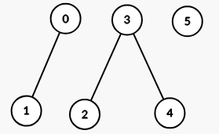
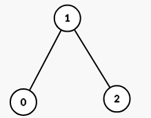

3493. Properties Graph

You are given a 2D integer array `properties` having dimensions `n x m` and an integer `k`.

Define a function `intersect(a, b)` that returns the **number of distinct integers** common to both arrays `a` and `b`.

Construct an **undirected** graph where each index `i` corresponds to `properties[i]`. There is an edge between node `i` and node `j` if and only if `intersect(properties[i], properties[j]) >= k`, where `i` and `j` are in the range `[0, n - 1]` and `i != j`.

Return the number of **connected components** in the resulting graph.

 

**Example 1:**
```
Input: properties = [[1,2],[1,1],[3,4],[4,5],[5,6],[7,7]], k = 1

Output: 3

Explanation:

The graph formed has 3 connected components:
```


**Example 2:**
```
Input: properties = [[1,2,3],[2,3,4],[4,3,5]], k = 2

Output: 1

Explanation:

The graph formed has 1 connected component:
```


**Example 3:**
```
Input: properties = [[1,1],[1,1]], k = 2

Output: 2

Explanation:

intersect(properties[0], properties[1]) = 1, which is less than k. This means there is no edge between properties[0] and properties[1] in the graph.

 

**Constraints:**

* `1 <= n == properties.length <= 100`
* `1 <= m == properties[i].length <= 100`
* `1 <= properties[i][j] <= 100`
* `1 <= k <= m`

# SUbmissions
---
**Solution 1: (Union Find)**
```
Runtime: 128 ms, Beats 75.96%
Memory: 49.64 MB, Beats 80.31%
```
```c++
class Solution {
    vector<int> p, r;
    int find( int x) {
        if (x != p[x]) {
            p[x] = find(p[x]);
        }
        return p[x];
    }
    void uni(int x, int y) {
        int xr = find(x), yr = find(y);
        if (xr == yr) {
            return;
        }
        if (r[xr] < r[yr]) {
            p[xr] = yr;
        } else if (r[xr] > r[yr]) {
            p[yr] = xr;
        } else {
            p[xr] = yr;
            r[yr] += 1;
        }
    }
public:
    int numberOfComponents(vector<vector<int>>& properties, int k) {
        int n = properties.size(), m = properties[0].size(), i, j, ck, ans = 0;
        p.resize(n);
        r.resize(n, 1);
        for (i = 0; i < n; i ++) {
            p[i] = i;
        }
        vector<unordered_set<int>> st(n);
        for (i = 0; i < n; i ++) {
            st[i] = unordered_set<int>(properties[i].begin(), properties[i].end());
        }
        for (i = 0; i < n; i ++) {
            for (j = i+1; j < n; j ++) {
                if (j != i) {
                    ck = 0;
                    for (auto c: st[j]) {
                        if (st[i].count(c)) {
                            ck += 1;
                        }
                    }
                    if (ck >= k) {
                        uni(i, j);
                    }
                } 
            }
        }
        for (i = 0; i < n; i ++) {
            if (i == find(i)) {
                ans += 1;
            }
        }
        return ans;
    }
};
```
