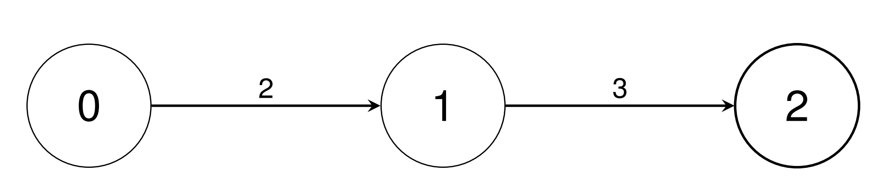

3528. Unit Conversion I

There are `n` types of units indexed from `0` to `n - 1`. You are given a 2D integer array `conversions` of length `n - 1`, where `conversions[i] = [sourceUniti, targetUniti, conversionFactori]`. This indicates that a single unit of type `sourceUniti` is equivalent to `conversionFactori` units of type `targetUniti`.

Return an array `baseUnitConversion` of length `n`, where `baseUnitConversion[i]` is the number of units of type `i` equivalent to a single unit of type 0. Since the answer may be large, return each `baseUnitConversion[i]` **modulo** `10^9 + 7`.

 

**Example 1:**
```
Input: conversions = [[0,1,2],[1,2,3]]

Output: [1,2,6]

Explanation:

Convert a single unit of type 0 into 2 units of type 1 using conversions[0].
Convert a single unit of type 0 into 6 units of type 2 using conversions[0], then conversions[1].
```


**Example 2:**
```
Input: conversions = [[0,1,2],[0,2,3],[1,3,4],[1,4,5],[2,5,2],[4,6,3],[5,7,4]]

Output: [1,2,3,8,10,6,30,24]

Explanation:

Convert a single unit of type 0 into 2 units of type 1 using conversions[0].
Convert a single unit of type 0 into 3 units of type 2 using conversions[1].
Convert a single unit of type 0 into 8 units of type 3 using conversions[0], then conversions[2].
Convert a single unit of type 0 into 10 units of type 4 using conversions[0], then conversions[3].
Convert a single unit of type 0 into 6 units of type 5 using conversions[1], then conversions[4].
Convert a single unit of type 0 into 30 units of type 6 using conversions[0], conversions[3], then conversions[5].
Convert a single unit of type 0 into 24 units of type 7 using conversions[1], conversions[4], then conversions[6].
```

**Constraints:**

* `2 <= n <= 10^5`
* `conversions.length == n - 1`
* `0 <= sourceUniti, targetUniti < n`
* `1 <= conversionFactori <= 10^9`
* It is guaranteed that unit 0 can be converted into any other unit through a **unique** combination of conversions without using any conversions in the opposite direction.

# Submissions
---
**Solution 1: (DFS)**

           6
           | 3
           4
           | 5
    0  -   1  -  3
  3 |   2     4
    2
  2 |
    5  -   7
       4

```
Runtime: 235 ms, Beats 20.09%
Memory: 282.20 MB, Beats 12.15%
```
```c++
\class Solution {
    int MOD = 1e9 + 7;
    void dfs(int u, int p, vector<int> &ans, vector<vector<pair<int,int>>> &g) {
        for (auto [v, f]: g[u]) {
            if (v == p) {
                continue;
            }
            ans[v] = (1LL*ans[u]*f) % MOD;
            dfs(v, u, ans, g);
        }
    }
public:
    vector<int> baseUnitConversions(vector<vector<int>>& conversions) {
        int n = conversions.size() + 1;
        vector<vector<pair<int,int>>> g(n);
        vector<int> ans(n);
        ans[0] = 1;
        for (auto c: conversions) {
            g[c[0]].push_back({c[1], c[2]});
            g[c[1]].push_back({c[0], c[2]});
        }
        dfs(0, -1, ans, g);
        return ans;
    }
};
```
