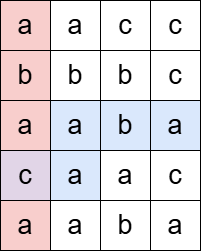
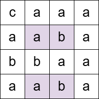

3529. Count Cells in Overlapping Horizontal and Vertical Substrings

You are given an `m x n` matrix `grid` consisting of characters and a string `pattern`.

A **horizontal substring** is a contiguous sequence of characters read from left to right. If the end of a row is reached before the substring is complete, it wraps to the first column of the next row and continues as needed. You do not wrap from the bottom row back to the top.

A **vertical substring** is a contiguous sequence of characters read from top to bottom. If the bottom of a column is reached before the substring is complete, it wraps to the first row of the next column and continues as needed. You do not wrap from the last column back to the first.

Count the number of cells in the matrix that satisfy the following condition:

* The cell must be part of at least one horizontal substring and at least one vertical substring, where both substrings are equal to the given pattern.

Return the count of these cells.

 

**Example 1:**


```
Input: grid = [["a","a","c","c"],["b","b","b","c"],["a","a","b","a"],["c","a","a","c"],["a","a","c","c"]], pattern = "abaca"

Output: 1

Explanation:

The pattern "abaca" appears once as a horizontal substring (colored blue) and once as a vertical substring (colored red), intersecting at one cell (colored purple).
```

**Example 2:**


```
Input: grid = [["c","a","a","a"],["a","a","b","a"],["b","b","a","a"],["a","a","b","a"]], pattern = "aba"

Output: 4

Explanation:

The cells colored above are all part of at least one horizontal and one vertical substring matching the pattern "aba".
```

**Example 3:**
```
Input: grid = [["a"]], pattern = "a"

Output: 1
```
 

**Constraints**:

* `m == grid.length`
* `n == grid[i].length`
* `1 <= m, n <= 1000`
* `1 <= m * n <= 10^5`
* `1 <= pattern.length <= m * n`
* `grid` and `pattern` consist of only lowercase English letters.

# Submissions
---
**Solution 1: (KMP)**
```
Runtime: 57 ms, Beats 66.67%
Memory: 91.92 MB, Beats 22.22%
```
```c++
class Solution {
    vector<int> getLPS(string &s, int n) {
        vector<int> LPS(n);
        for(int i = 1; i < n; i++) {
            int j = LPS[i - 1];
            while(j > 0 && s[i] != s[j]) {
                j = LPS[j - 1];
            }
            if(s[i] == s[j]) j++;
            LPS[i] = j;
        }
        
        return LPS;
    }
public:
    int countCells(vector<vector<char>>& grid, string pattern) {
        int n = grid.size(), m = grid[0].size(), sz = pattern.size();
        
        string horizontalString = "";
        for(int i = 0; i < n; i++) {
            for(int j = 0; j < m; j++) {
                horizontalString += grid[i][j];
            }
        }
        
        string verticalString = "";
        for(int i = 0; i < m; i++) {
            for(int j = 0; j < n; j++) {
                verticalString += grid[j][i];
            }
        }
        
        string horizontalPatternString = pattern + "#" + horizontalString;
        vector<int> lps1 = getLPS(horizontalPatternString, horizontalPatternString.size());
        
        string verticalPatternString = pattern + "#" + verticalString;
        vector<int> lps2 = getLPS(verticalPatternString, verticalPatternString.size());

        // Creating the scan1 and scan2 arrays to use sweep line counting technique.
        int sz1 = lps1.size();
        vector<int> scan1(sz1 + 1);
        for(int i = 0; i < sz1; i++) {
            if(lps1[i] == sz) {
                scan1[i - sz + 1]++;
                scan1[i + 1]--;
            }
        }
        
        int sz2 = lps2.size();
        vector<int> scan2(sz2 + 1);
        for(int i = 0; i < sz2; i++) {
            if(lps2[i] == sz) {
                scan2[i - sz + 1]++;
                scan2[i + 1]--;
            }
        }
        
        vector<vector<bool>> visited(n, vector<bool> (m));
        
        // In the sweep line technique, we maintain a counter variable. At each index, we add the value of scan[i] to the counter. 
        // If the counter becomes greater than 0 after the update, it indicates that the current index is covered by at least one active range.
        int count1 = 0;
        for(int i = 0; i < sz1; i++) {
            count1 += scan1[i];
            if(count1 > 0) {
                // Here, idx = i - sz - 1 because our horizontalPatternString = pattern + "#" + horizontalString, 
                // So here we are decresing the index by sz (length of pattern) and by 1 for ("#").
                int idx = i - sz - 1;
                int row = idx / m, column = idx % m;
                visited[row][column] = true;
            }
        }
        
        int count2 = 0;
        int ans = 0;
        for(int i = 0; i < sz2; i++) {
            count2 += scan2[i];
            if(count2 > 0) {
                int idx = i - sz - 1;
                int row = idx % n, column = idx / n;

                // Increasing the ans only if the current cell is already visited while processing horizontalString.
                if(visited[row][column]) ans++;
            }
        }
        
        return ans;
    }
};
```
