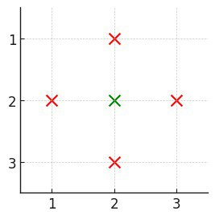
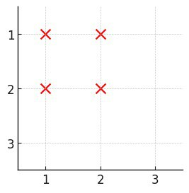
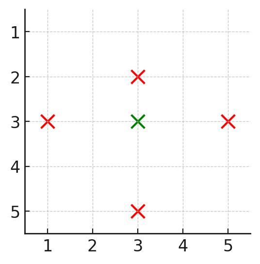

3531. Count Covered Buildings

You are given a positive integer `n`, representing an `n x n` city. You are also given a 2D grid `buildings`, where `buildings[i] = [x, y]` denotes a **unique** building located at coordinates `[x, y]`.

A building is **covered** if there is at least one building in all four directions: left, right, above, and below.

Return the number of **covered** buildings.

 

**Example 1:**


```
Input: n = 3, buildings = [[1,2],[2,2],[3,2],[2,1],[2,3]]

Output: 1

Explanation:

Only building [2,2] is covered as it has at least one building:
above ([1,2])
below ([3,2])
left ([2,1])
right ([2,3])
Thus, the count of covered buildings is 1.
```

**Example 2:**


```
Input: n = 3, buildings = [[1,1],[1,2],[2,1],[2,2]]

Output: 0

Explanation:

No building has at least one building in all four directions.
```

**Example 3:**


```
Input: n = 5, buildings = [[1,3],[3,2],[3,3],[3,5],[5,3]]

Output: 1

Explanation:

Only building [3,3] is covered as it has at least one building:
above ([1,3])
below ([5,3])
left ([3,2])
right ([3,5])
Thus, the count of covered buildings is 1.
```

**Constraints:**

* `2 <= n <= 10^5`
* `1 <= buildings.length <= 10^5` 
* `buildings[i] = [x, y]`
* `1 <= x, y <= n`
* All coordinates of `buildings` are **unique**.

# Submissions
---
**Solution 1: (Sort, Hash Table, left and right)**

    1        x
    2  x  x  x
    3        x
       1  2  3

dp
    1: [3]
    2: {1,2,3}
    3: [3]
left
   3: 1 -> 2
   1: 1
   2: 1
right 
   1: 1 -> 0
   2: 1 -> 0
   3: 3 -> 2 -> 1

```
Runtime: 910 ms, Beats 33.20%
Memory: 455.31 MB, Beats 10.92%
```
```c++
class Solution {
public:
    int countCoveredBuildings(int n, vector<vector<int>>& buildings) {
        int i, ans = 0;
        map<int,set<int>> dp;
        unordered_map<int,int> left, right;
        for (i = 0; i < buildings.size(); i ++) {
            dp[buildings[i][0]].insert(buildings[i][1]);
            right[buildings[i][1]] += 1;
        }
        for (auto it = dp.begin(); next(it) != dp.end(); it++) {
            auto [_, ys] = *it;
            for (auto y: ys) {
                right[y] -= 1;
                left[y] += 1;
                if (it != dp.begin()) {
                    if (y != *ys.begin() && y != *ys.rbegin() && left[y] > 1 && right[y]) {
                        ans += 1;
                    }
                }
            }
        }
        return ans;
    }
};
```
