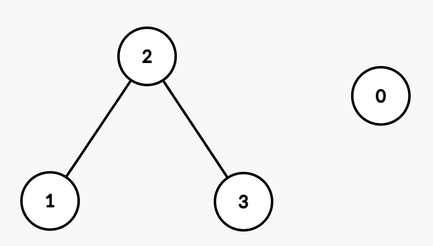

3532. Path Existence Queries in a Graph I

You are given an integer `n` representing the number of nodes in a graph, labeled from 0 to n - 1.

You are also given an integer array `nums` of length `n` sorted in **non-decreasing** order, and an integer `maxDiff`.

An undirected edge exists between nodes `i` and `j` if the absolute difference between `nums[i]` and `nums[j]` is **at most** `maxDiff` (i.e., `|nums[i] - nums[j]| <= maxDiff`).

You are also given a 2D integer array `queries`. For each `queries[i] = [ui, vi]`, determine whether there exists a path between nodes `ui` and `vi`.

Return a boolean array `answer`, where `answer[i]` is `true` if there exists a path between `ui` and `vi` in the `i`th query and `false` otherwise.

 

**Example 1:**
```
Input: n = 2, nums = [1,3], maxDiff = 1, queries = [[0,0],[0,1]]

Output: [true,false]

Explanation:

Query [0,0]: Node 0 has a trivial path to itself.
Query [0,1]: There is no edge between Node 0 and Node 1 because |nums[0] - nums[1]| = |1 - 3| = 2, which is greater than maxDiff.
Thus, the final answer after processing all the queries is [true, false].
```

**Example 2:**
```
Input: n = 4, nums = [2,5,6,8], maxDiff = 2, queries = [[0,1],[0,2],[1,3],[2,3]]

Output: [false,false,true,true]

Explanation:

The resulting graph is:
```

```
Query [0,1]: There is no edge between Node 0 and Node 1 because |nums[0] - nums[1]| = |2 - 5| = 3, which is greater than maxDiff.
Query [0,2]: There is no edge between Node 0 and Node 2 because |nums[0] - nums[2]| = |2 - 6| = 4, which is greater than maxDiff.
Query [1,3]: There is a path between Node 1 and Node 3 through Node 2 since |nums[1] - nums[2]| = |5 - 6| = 1 and |nums[2] - nums[3]| = |6 - 8| = 2, both of which are within maxDiff.
Query [2,3]: There is an edge between Node 2 and Node 3 because |nums[2] - nums[3]| = |6 - 8| = 2, which is equal to maxDiff.
Thus, the final answer after processing all the queries is [false, false, true, true].
```

**Constraints:**

* `1 <= n == nums.length <= 105`
* `0 <= nums[i] <= 105`
* `nums` is sorted in **non-decreasing** order.
* `0 <= maxDiff <= 105`
* `1 <= queries.length <= 105`
* `queries[i] == [ui, vi]`
* `0 <= ui, vi < n`

# Submissions
---
**Solution 1: (Prefix Sum)**
```
Runtime: 46 ms, Beats 36.00%
Memory: 235.92 MB, Beats 24.39%
```
```c++
class Solution {
public:
    vector<bool> pathExistenceQueries(int n, vector<int>& nums, int maxDiff, vector<vector<int>>& queries) {
        int i = 0, c = 1;
        vector<int> dp(n);
        vector<bool> ans;
        while (i < n) {
            dp[i] = c;
            while (i+1 < n && (nums[i+1] - nums[i] <= maxDiff)) {
                i += 1;
                dp[i] = c;
            }
            c += 1;
            i += 1;
        }
        for (auto q: queries) {
            if (dp[q[0]] == dp[q[1]]) {
                ans.push_back(true);
            } else {
                ans.push_back(false);
            }
        }
        return ans;
    }
};
```
