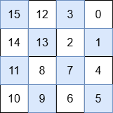

3537. Fill a Special Grid

You are given a non-negative integer `n` representing a `2^n x 2^n` grid. You must fill the grid with integers from 0 to `2^2n - 1` to make it **special**. A grid is special if it satisfies **all** the following conditions:

* **All** numbers in the top-right quadrant are smaller than those in the bottom-right quadrant.
* **All** numbers in the bottom-right quadrant are smaller than those in the bottom-left quadrant.
* **All** numbers in the bottom-left quadrant are smaller than those in the top-left quadrant.
* **Each** of its quadrants is also a special grid.

Return the **special** 2^n x 2^n grid.

**Note**: Any 1x1 grid is special.

 

**Example 1:**
```
Input: n = 0

Output: [[0]]

Explanation:

The only number that can be placed is 0, and there is only one possible position in the grid.
```

**Example 2:**
```
Input: n = 1

Output: [[3,0],[2,1]]

Explanation:

The numbers in each quadrant are:

Top-right: 0
Bottom-right: 1
Bottom-left: 2
Top-left: 3
Since 0 < 1 < 2 < 3, this satisfies the given constraints.
```

**Example 3:**
```
Input: n = 2

Output: [[15,12,3,0],[14,13,2,1],[11,8,7,4],[10,9,6,5]]

Explanation:
```

```
The numbers in each quadrant are:

Top-right: 3, 0, 2, 1
Bottom-right: 7, 4, 6, 5
Bottom-left: 11, 8, 10, 9
Top-left: 15, 12, 14, 13
max(3, 0, 2, 1) < min(7, 4, 6, 5)
max(7, 4, 6, 5) < min(11, 8, 10, 9)
max(11, 8, 10, 9) < min(15, 12, 14, 13)
This satisfies the first three requirements. Additionally, each quadrant is also a special grid. Thus, this is a special grid.
```
 

**Constraints:**

* `0 <= n <= 10`

# Submissions
---
**Solution 1: (Divide and Conquer)**
```
Runtime: 12 ms, Beats 37.32%
Runtime: 12 ms, Beats 37.32%
```
```c++
class Solution {
    int val = 0;
    void solve(vector<vector<int>>& grid, int rowStart, int rowEnd, int colStart, int colEnd){
        int size = rowEnd - rowStart;
        if (size == 1){
            grid[rowStart][colStart] = val++;
            return;
        }
        int midRow = rowStart + size / 2;
        int midCol = colStart + size / 2;

        solve(grid, rowStart, midRow, midCol, colEnd); // top right
        solve(grid, midRow, rowEnd, midCol, colEnd); // bottom right
        solve(grid, midRow, rowEnd, colStart, midCol); // bottom left
        solve(grid, rowStart, midRow, colStart, midCol); // top left
    }
public:
    vector<vector<int>> specialGrid(int N) {
        int size = 1 << N;
        vector<vector<int>> grid(size, vector<int>(size));
        solve(grid, 0, size, 0, size);
        return grid;
    }
};
```

**Solution 2: (DP Bottom-Up)**

n = 0
             [0]
n = 1    
           [3 0]
           [2 1]
n = 2
             0  2^(n-1)-1
                    2^(n-1)  
                       2^n - 1
          0 [15,12, 3, 0],
2^(n-1) - 1 [14,13, 2, 1],
2^(n-1)     [11, 8, 7, 4],
2^n -1      [10, 9, 6, 5]

```
Runtime: 5 ms, Beats 89.23%
Memory: 66.10 MB, Beats 73.87%
```
```c++
class Solution {
public:
    vector<vector<int>> specialGrid(int N) {
        int i, j, k, n;
        vector<vector<int>> ans(1<<N, vector<int>(1<<N));
        for (n = 1; n <= N; n ++) {
            k = pow(2,n-1);
            for (i = 0; i < k; i ++) {
                for (j = (size_t)pow(2,N) - k; j < ans.size(); j ++) {
                    ans[i+k][j] = ans[i][j] + k*k;
                    ans[i+k][j-k] = ans[i][j] + 2*(k*k);
                    ans[i][j-k] = ans[i][j] + 3*(k*k);
                }
            }
        }
        return ans;
    }
};
```
