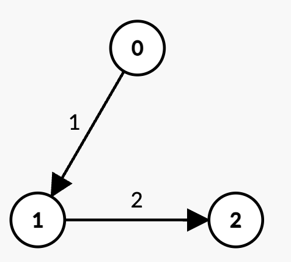

3543. Maximum Weighted K-Edge Path

You are given an integer `n` and a Directed Acyclic Graph (DAG) with `n` nodes labeled from `0` to `n - 1`. This is represented by a 2D array `edges`, where `edges[i] = [ui, vi, wi]` indicates a directed edge from node `ui` to `vi` with weight `wi`.

You are also given two integers, `k` and `t`.

Your task is to determine the **maximum** possible sum of edge weights for any path in the graph such that:

* The path contains **exactly** `k` edges.
* The total sum of edge weights in the path is **strictly** less than `t`.

Return the **maximum** possible sum of weights for such a path. If no such path exists, return `-1`.

 

**Example 1:**
```
Input: n = 3, edges = [[0,1,1],[1,2,2]], k = 2, t = 4

Output: 3

Explanation:
```

```
The only path with k = 2 edges is 0 -> 1 -> 2 with weight 1 + 2 = 3 < t.
Thus, the maximum possible sum of weights less than t is 3.
```

**Example 2:**
```
Input: n = 3, edges = [[0,1,2],[0,2,3]], k = 1, t = 3

Output: 2

Explanation:
```

```
There are two paths with k = 1 edge:
0 -> 1 with weight 2 < t.
0 -> 2 with weight 3 = t, which is not strictly less than t.
Thus, the maximum possible sum of weights less than t is 2.
```

**Example 3:**
```
Input: n = 3, edges = [[0,1,6],[1,2,8]], k = 1, t = 6

Output: -1

Explanation:
```

```
There are two paths with k = 1 edge:
0 -> 1 with weight 6 = t, which is not strictly less than t.
1 -> 2 with weight 8 > t, which is not strictly less than t.
Since there is no path with sum of weights strictly less than t, the answer is -1.
```

**Constraints:**

* `1 <= n <= 300`
* `0 <= edges.length <= 300`
* `edges[i] = [ui, vi, wi]`
* `0 <= ui, vi < n`
* `ui != vi`
* `1 <= wi <= 10`
* `0 <= k <= 300`
* `1 <= t <= 600`
* The input graph is **guaranteed** to be a DAG.
* There are no duplicate edges.

# Submissions
---
**Solution 1: (DP Bottom-Up, O(k * n * m * w))**
```
untime: 423 ms, Beats 100.00%
Memory: 369.53 MB, Beats 68.75%
```
```c++
class Solution {
public:
    int maxWeight(int n, vector<vector<int>>& edges, int k, int t) {
        // Build adjacency list for DAG
        vector<vector<pair<int, int>>> adj(n);
        for (auto &e : edges) {
            adj[e[0]].push_back({e[1], e[2]});
        }
        vector<vector<set<int>>> dp(n, vector<set<int>>(k + 1));
        // Base Case
        for (int u = 0; u < n; u++) {
            dp[u][0].insert(0);
        }
        for (int e = 0; e < k; e++){
            for (int u = 0; u < n; ++u){
                for (auto &[v, wt] : adj[u]){
                    for (int w : dp[u][e]){
                        int new_w = w + wt;
                        if (new_w < t) dp[v][e + 1].insert(new_w);
                    }
                }
            }
        }

        // Find the maximum weight across all nodes that used exactly k edges
        int ans = -1;
        for (int u = 0; u < n; ++u) {
            if (!dp[u][k].empty()) { 
                ans = max(ans, *prev(dp[u][k].end()));
            }
        }
        return ans;
    }
};
```
