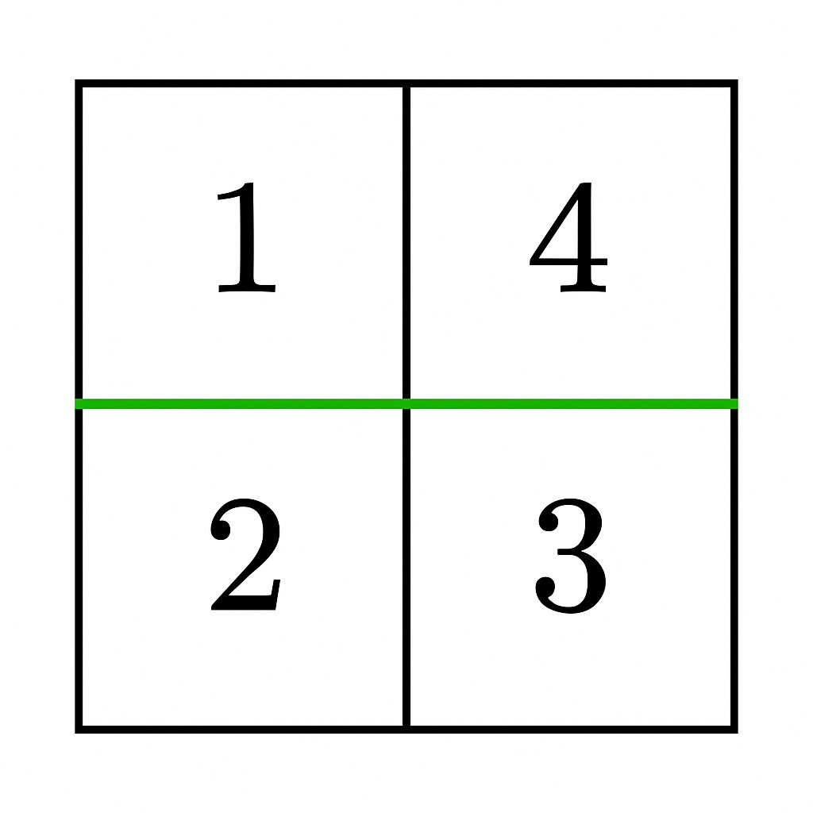

3546. Equal Sum Grid Partition I

You are given an `m x n` matrix `grid` of positive integers. Your task is to determine if it is possible to make either one horizontal or one vertical cut on the grid such that:

* Each of the two resulting sections formed by the cut is **non-empty**.
* The sum of the elements in both sections is **equal**.

Return `true` if such a partition exists; otherwise return `false`.

 

**Example 1:**
```
Input: grid = [[1,4],[2,3]]

Output: true

Explanation:
```

```
A horizontal cut between row 0 and row 1 results in two non-empty sections, each with a sum of 5. Thus, the answer is true.
```

**Example 2:**
```
Input: grid = [[1,3],[2,4]]

Output: false

Explanation:

No horizontal or vertical cut results in two non-empty sections with equal sums. Thus, the answer is false.
```
 

**Constraints:**

* `1 <= m == grid.length <= 10^5`
* `1 <= n == grid[i].length <= 10^5`
* `2 <= m * n <= 10^5`
* `1 <= grid[i][j] <= 10^5`

# Submissions
---
**Solution 1: (Prefix Sum)**
```
Runtime: 10 ms, Beats 54.06%
Memory: 130.52 MB, Beats 46.62%
```
```c++
class Solution {
public:
    bool canPartitionGrid(vector<vector<int>>& grid) {
        int m = grid.size(), n = grid[0].size(), i, j;
        long long a = 0, left, right;
        vector<long long> dpr(m), dpc(n);
        for (i = 0; i < m; i ++) {
            for (j = 0; j < n; j ++) {
                a += grid[i][j];
                dpr[i] += grid[i][j];
                dpc[j] += grid[i][j];
            }
        }
        left = 0;
        right = a;
        for (i = 0; i < m-1; i ++) {
            left += dpr[i];
            right -= dpr[i];
            if (left == right) {
                return true;
            }
        }
        left = 0;
        right = a;
        for (j = 0; j < n-1; j ++) {
            left += dpc[j];
            right -= dpc[j];
            if (left == right) {
                return true;
            }
        }
        return false;
    }
};
```
