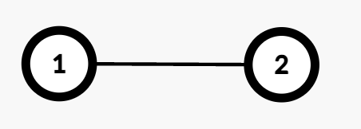
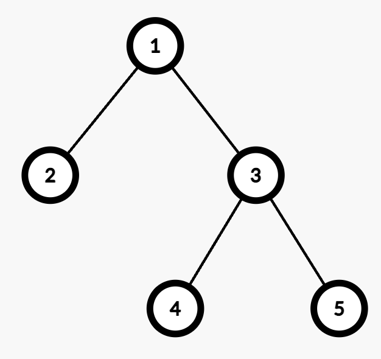

3558. Number of Ways to Assign Edge Weights I

There is an undirected tree with `n` nodes labeled from `1` to `n`, rooted at node 1. The tree is represented by a 2D integer array `edges` of length `n - 1`, where `edges[i] = [ui, vi]` indicates that there is an edge between nodes `ui` and `vi`.

Initially, all edges have a weight of 0. You must assign each edge a weight of either **1** or **2**.

The **cost** of a path between any two nodes `u` and `v` is the total weight of all edges in the path connecting them.

Select any one node `x` at the maximum depth. Return the number of ways to assign edge weights in the path from node 1 to `x` such that its total cost is odd.

Since the answer may be large, return it modulo `10^9 + 7`.

**Note**: Ignore all edges not in the path from node 1 to `x`.

 

**Example 1:**


```
Input: edges = [[1,2]]

Output: 1

Explanation:

The path from Node 1 to Node 2 consists of one edge (1 → 2).
Assigning weight 1 makes the cost odd, while 2 makes it even. Thus, the number of valid assignments is 1.
```

**Example 2:**


```
Input: edges = [[1,2],[1,3],[3,4],[3,5]]

Output: 2

Explanation:

The maximum depth is 2, with nodes 4 and 5 at the same depth. Either node can be selected for processing.
For example, the path from Node 1 to Node 4 consists of two edges (1 → 3 and 3 → 4).
Assigning weights (1,2) or (2,1) results in an odd cost. Thus, the number of valid assignments is 2.
```

**Constraints:**

* `2 <= n <= 10^5`
* `edges.length == n - 1`
* `edges[i] == [ui, vi]`
* `1 <= ui, vi <= n`
* `edges` represents a valid tree.

# Submissions
---
**Solution 1: (BFS)**
```
Runtime: 305 ms, Beats 16.67%
Memory: 332.24 MB, Beats 77.78%
```
```c++
class Solution {
public:
    int assignEdgeWeights(vector<vector<int>>& edges) {
        int n = edges.size()+1, i, sz, MOD = 1e9 + 7;
        long long ans = 0;
        vector<vector<int>> g(n+1);
        for (i = 0; i < n-1; i ++) {
            g[edges[i][0]].push_back(edges[i][1]);
            g[edges[i][1]].push_back(edges[i][0]);
        }
        queue<int> q;
        vector<int> visited(n+1);
        q.push(1);
        visited[1] = 1;
        while (q.size()) {
            sz = q.size();
            for (i = 0; i < sz; i ++) {
                auto u = q.front();
                q.pop();
                for (auto v: g[u]) {
                    if (!visited[v]) {
                        q.push(v);
                        visited[v] = 1;
                    }
                }
            }
            if (q.size() == 0) {
                break;
            }
            if (ans == 0) {
                ans = 1;
            } else {
                ans <<= 1;
                ans %= MOD;
            }
        }
        return ans;
    }
};
```

**Solution 2: (DFS)**
```
Runtime: 266 ms, Beats 77.78%
Memory: 332.66 MB, Beats 72.22%
```
```c++
const int MOD = 1e9 + 7;
class Solution {
    int maxDepth = 0;
    void dfs(int node, int par, int depth, vector<vector<int>> &graph) {
        maxDepth = max(maxDepth, depth);
        for (auto &x: graph[node]) {
            if (x != par) {
                dfs(x, node, depth + 1, graph);
            }
        }
    }

    long long powerMod(long long x, long long y, int mod) {
        long long result = 1;
        while (y > 0) {
            if (y % 2) {
                result = (result * x) % mod;
            }
            x = (x * x) % mod;
            y /= 2;
        }
        return result;
    }
public:
    int assignEdgeWeights(vector<vector<int>>& edges) {
        int n = edges.size();
        
        vector<vector<int>> graph(n + 2);
        for (auto &edge : edges) {
            graph[edge[0]].push_back(edge[1]);
            graph[edge[1]].push_back(edge[0]);
        }
    
        maxDepth = 0;
        dfs(1, -1, 0, graph);
        return powerMod(2, maxDepth - 1, MOD);
    }
};
```
