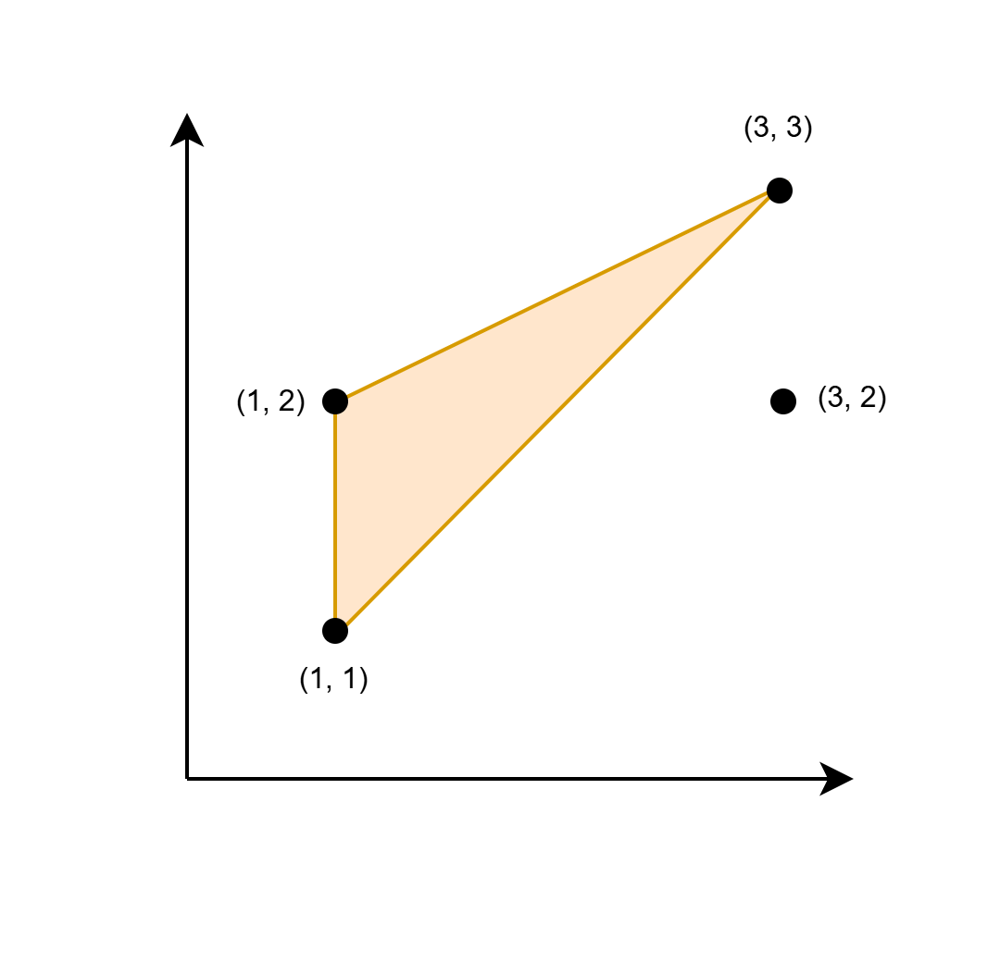

3588. Find Maximum Area of a Triangle

You are given a 2D array `coords` of size `n x 2`, representing the coordinates of n points in an infinite Cartesian plane.

Find twice the maximum area of a triangle with its corners at any three elements from `coords`, such that at least one side of this triangle is parallel to the x-axis or y-axis. Formally, if the maximum area of such a triangle is `A`, return `2 * A`.

If no such triangle exists, return `-1`.

**Note** that a triangle cannot have zero area.

 

**Example 1:**
```
Input: coords = [[1,1],[1,2],[3,2],[3,3]]

Output: 2

Explanation:
```

```
The triangle shown in the image has a base 1 and height 2. Hence its area is 1/2 * base * height = 1.
```

**Example 2:**
```
Input: coords = [[1,1],[2,2],[3,3]]

Output: -1

Explanation:

The only possible triangle has corners (1, 1), (2, 2), and (3, 3). None of its sides are parallel to the x-axis or the y-axis.
```
 

**Constraints:**

* `1 <= n == coords.length <= 10^5`
* `1 <= coords[i][0], coords[i][1] <= 10^6`
* All `coords[i]` are unique.

# Submissions
---
**Solution 1: (Hash Table, Sort, Brute Force, try all solution)**
```
Runtime: 1285 ms, Beats 12.50%
Memory: 466.40 MB, Beats 12.50%
```
```c++
class Solution {
public:
    long long maxArea(vector<vector<int>>& coords) {
        map<int,set<int>> mx, my;
        long long ans = 0, dx, dy;
        for (auto coord: coords) {
            mx[coord[0]].insert(coord[1]);
            my[coord[1]].insert(coord[0]);
        }
        for (auto [x, ys]: mx) {
            dy = *ys.rbegin() - *ys.begin();
            dx = x - mx.begin()->first;
            ans = max(ans, dx*dy);
            dx = mx.rbegin()->first - x;
            ans = max(ans, dx*dy);
        }
        for (auto [y, xs]: my) {
            dx = *xs.rbegin() - *xs.begin();
            dy = y - my.begin()->first;
            ans = max(ans, dx*dy);
            dy = my.rbegin()->first - y;
            ans = max(ans, dx*dy);
        }
        return ans ? ans : -1;
    }
};
```
