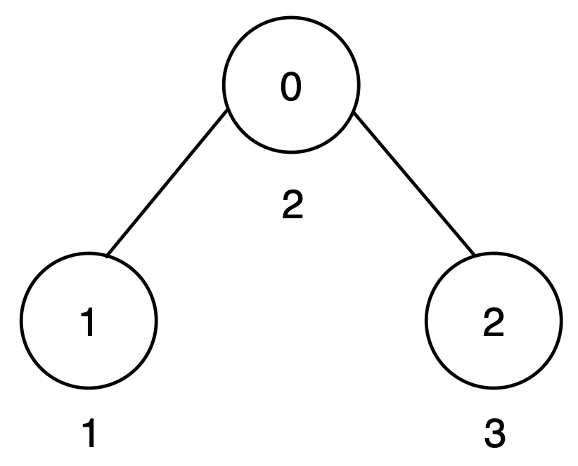
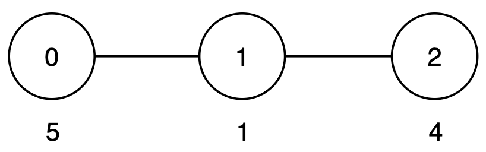
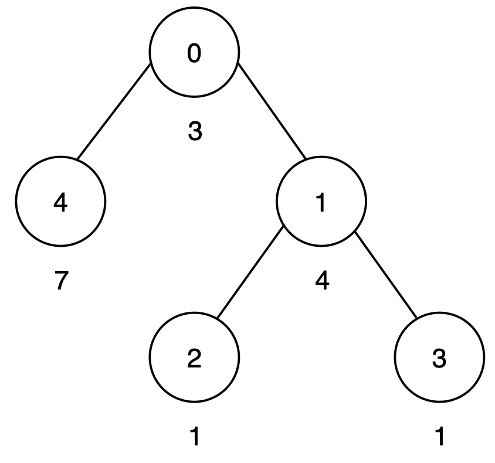

3593. Minimum Increments to Equalize Leaf Paths

You are given an integer `n` and an undirected tree rooted at node 0 with `n` nodes numbered from 0 to `n - 1`. This is represented by a 2D array `edges` of length `n - 1`, where `edges[i] = [ui, vi]` indicates an edge from node `ui` to `vi` .

Each node `i` has an associated cost given by `cost[i]`, representing the cost to traverse that node.

The score of a path is defined as the sum of the costs of all nodes along the path.

Your goal is to make the scores of all **root-to-leaf** paths **equal** by **increasing** the cost of any number of nodes by **any non-negative** amount.

Return the **minimum** number of nodes whose cost must be increased to make all root-to-leaf path scores equal.

 

**Example 1:**
```
Input: n = 3, edges = [[0,1],[0,2]], cost = [2,1,3]

Output: 1

Explanation:
```

```
There are two root-to-leaf paths:

Path 0 → 1 has a score of 2 + 1 = 3.
Path 0 → 2 has a score of 2 + 3 = 5.
To make all root-to-leaf path scores equal to 5, increase the cost of node 1 by 2.
Only one node is increased, so the output is 1.
```

**Example 2:**
```
Input: n = 3, edges = [[0,1],[1,2]], cost = [5,1,4]

Output: 0

Explanation:
```

```
There is only one root-to-leaf path:

Path 0 → 1 → 2 has a score of 5 + 1 + 4 = 10.

Since only one root-to-leaf path exists, all path costs are trivially equal, and the output is 0.
```

**Example 3:**
```
Input: n = 5, edges = [[0,4],[0,1],[1,2],[1,3]], cost = [3,4,1,1,7]

Output: 1

Explanation:
```

```
There are three root-to-leaf paths:

Path 0 → 4 has a score of 3 + 7 = 10.
Path 0 → 1 → 2 has a score of 3 + 4 + 1 = 8.
Path 0 → 1 → 3 has a score of 3 + 4 + 1 = 8.
To make all root-to-leaf path scores equal to 10, increase the cost of node 1 by 2. Thus, the output is 1.
```
 

**Constraints:**

* `2 <= n <= 10^5`
* `edges.length == n - 1`
* `edges[i] == [ui, vi]`
* `0 <= ui, vi < n`
* `cost.length == n`
* `1 <= cost[i] <= 10^9`
* The input is generated such that `edges` represents a valid tree.

# Submissions
---
**Solution 1: (DFS, post order)**
```
Runtime: 1002 ms, Beats 7.23%
Memory: 372.60 MB, Beats 5.17%
```
```c++
class Solution {
    long long dfs(int u, int p, vector<vector<int>> &g, vector<int> &cost, int &ans) {
        long long cur = cost[u], mx = 0;
        vector<long long> dp;
        for (auto v: g[u]) {
            if (v != p) {
                dp.push_back(dfs(v, u, g, cost, ans));
            }
        }
        if (dp.size() == 0) {
            return cur;
        } else {
            for (auto a: dp) {
                mx = max(mx, a);
            }
            for (auto a: dp) {
                ans += a != mx;
            }
            return cur + mx;
        }
    }
public:
    int minIncrease(int n, vector<vector<int>>& edges, vector<int>& cost) {
        int ans = 0;
        vector<vector<int>> g(100000);
        for (auto e: edges) {
            g[e[0]].push_back(e[1]);
            g[e[1]].push_back(e[0]);
        }
        dfs(0, -1, g, cost, ans);
        return ans;
    }
};
```
