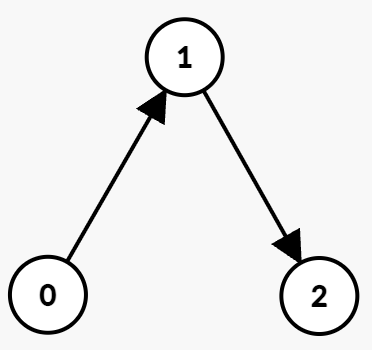
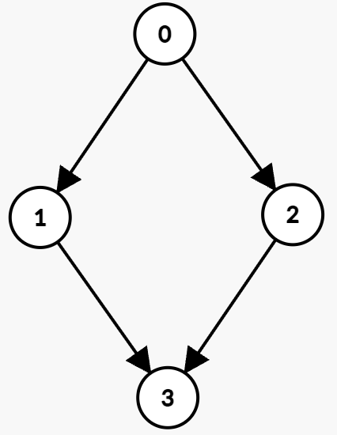
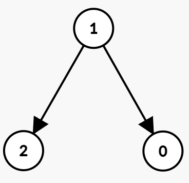

3604. Minimum Time to Reach Destination in Directed Graph

You are given an integer `n` and a directed graph with `n` nodes labeled from 0 to `n - 1`. This is represented by a 2D array edges, where `edges[i] = [ui, vi, starti, endi]` indicates an edge from node `ui` to `vi` that can only be used at any integer time `t` such that `starti <= t <= endi`.

You start at node 0 at time 0.

In one unit of time, you can either:

* Wait at your current node without moving, or
* Travel along an outgoing edge from your current node if the current time `t` satisfies `starti <= t <= endi`.

Return the **minimum** time required to reach node `n - 1`. If it is impossible, return `-1`.

 

**Example 1:**
```
Input: n = 3, edges = [[0,1,0,1],[1,2,2,5]]

Output: 3

Explanation:
```

```
The optimal path is:

At time t = 0, take the edge (0 → 1) which is available from 0 to 1. You arrive at node 1 at time t = 1, then wait until t = 2.
At time t = 2, take the edge (1 → 2) which is available from 2 to 5. You arrive at node 2 at time 3.
Hence, the minimum time to reach node 2 is 3.
```

**Example 2:**
```
Input: n = 4, edges = [[0,1,0,3],[1,3,7,8],[0,2,1,5],[2,3,4,7]]

Output: 5

Explanation:
```

```
The optimal path is:

Wait at node 0 until time t = 1, then take the edge (0 → 2) which is available from 1 to 5. You arrive at node 2 at t = 2.
Wait at node 2 until time t = 4, then take the edge (2 → 3) which is available from 4 to 7. You arrive at node 3 at t = 5.
Hence, the minimum time to reach node 3 is 5.
```

**Example 3:**
```
Input: n = 3, edges = [[1,0,1,3],[1,2,3,5]]

Output: -1

Explanation:
```

```
Since there is no outgoing edge from node 0, it is impossible to reach node 2. Hence, the output is -1.
```

**Constraints:**

* `1 <= n <= 10^5`
* `0 <= edges.length <= 10^5`
* `edges[i] == [ui, vi, starti, endi]`
* `0 <= ui, vi <= n - 1`
* `ui != vi`
* `0 <= starti <= endi <= 10^9`

# Submissions
---
**Solution 1: (Dijkstra)**
```
Runtime: 62 ms, Beats 76.73%
Memory: 192.14 MB, Beats 100.00%
```
```c++
class Solution {
public:
    int minTime(int n, vector<vector<int>>& edges) {
        int nt;
        vector<vector<array<int,3>>> g(n);
        priority_queue<array<int,2>, vector<array<int,2>>, greater<>> pq;
        vector<int> dist(n, INT_MAX);
        for (auto &e: edges) {
            g[e[0]].push_back({e[1], e[2], e[3]});
        }
        pq.push({0, 0});
        dist[0] = 0;
        while (pq.size()) {
            auto [t, u] = pq.top();
            pq.pop();
            if (u == n-1) {
                return t;
            }
            for (auto &[v, st, et]: g[u]) {
                if (t <= et) {
                    nt = max(t, st) + 1;
                    if (dist[v] > nt) {
                        dist[v] = nt;
                        pq.push({nt, v});
                    }
                }
            }
            
        }
        return -1;
    }
};
```
