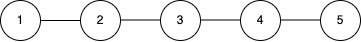

3607. Power Grid Maintenance

You are given an integer `c` representing `c` power stations, each with a unique identifier `id` from 1 to `c` (1‑based indexing).

These stations are interconnected via `n` bidirectional cables, represented by a 2D array connections, where each element `connections[i] = [ui, vi]` indicates a connection between station `ui` and station `vi`. Stations that are directly or indirectly connected form a power grid.

Initially, all stations are online (operational).

You are also given a 2D array queries, where each query is one of the following two types:

* `[1, x]`: A maintenance check is requested for station `x`. If station `x` is online, it resolves the check by itself. If station `x` is offline, the check is resolved by the operational station with the smallest `id` in the same power grid as `x`. If no operational station exists in that grid, return `-1`.
* `[2, x]`: Station `x` goes offline (i.e., it becomes non-operational).

Return an array of integers representing the results of each query of type `[1, x]` in the **order** they appear.

**Note**: The power grid preserves its structure; an offline (non‑operational) node remains part of its grid and taking it offline does not alter connectivity.

 

**Example 1:**
```
Input: c = 5, connections = [[1,2],[2,3],[3,4],[4,5]], queries = [[1,3],[2,1],[1,1],[2,2],[1,2]]

Output: [3,2,3]

Explanation:
```

```
Initially, all stations {1, 2, 3, 4, 5} are online and form a single power grid.
Query [1,3]: Station 3 is online, so the maintenance check is resolved by station 3.
Query [2,1]: Station 1 goes offline. The remaining online stations are {2, 3, 4, 5}.
Query [1,1]: Station 1 is offline, so the check is resolved by the operational station with the smallest id among {2, 3, 4, 5}, which is station 2.
Query [2,2]: Station 2 goes offline. The remaining online stations are {3, 4, 5}.
Query [1,2]: Station 2 is offline, so the check is resolved by the operational station with the smallest id among {3, 4, 5}, which is station 3.
```

**Example 2:**
```
Input: c = 3, connections = [], queries = [[1,1],[2,1],[1,1]]

Output: [1,-1]

Explanation:

There are no connections, so each station is its own isolated grid.
Query [1,1]: Station 1 is online in its isolated grid, so the maintenance check is resolved by station 1.
Query [2,1]: Station 1 goes offline.
Query [1,1]: Station 1 is offline and there are no other stations in its grid, so the result is -1.
```

**Constraints:**

* `1 <= c <= 10^5`
* `0 <= n == connections.length <= min(10^5, c * (c - 1) / 2)`
* `connections[i].length == 2`
* `1 <= ui, vi <= c`
* `ui != vi`
* `1 <= queries.length <= 2 * 10^5`
* `queries[i].length == 2`
* `queries[i][0]` is either `1` or `2`.
* `1 <= queries[i][1] <= c`

# Submissions
---
**Solution 1: (Union Find)**
```
Runtime: 252 ms, Beats 70.34%
Memory: 485.43 MB, Beats 5.04%
```
```c++
class Solution {
    vector<int> p, r;
    int find(int x) {
        if (p[x] != x) {
            p[x] = find(p[x]);
        }
        return p[x];
    }
    void uni(int x, int y) {
        int xr = find(x), yr = find(y);
        if (xr == yr) {
            return;
        }
        if (r[xr] < r[yr]) {
            p[yr] = p[xr];
        } else if (r[yr] < r[xr]) {
            p[xr] = p[yr];
        } else {
            p[xr] = p[yr];
            r[yr] += 1;
        }
    }
public:
    vector<int> processQueries(int c, vector<vector<int>>& connections, vector<vector<int>>& queries) {
        unordered_map<int, queue<int>> m;
        vector<int> visited(c+1);
        vector<int> ans;
        p.resize(c+1);
        r.resize(c+1, 1);
        int i, pi;
        for (i = 1; i <= c; i ++) {
            p[i] = i;
        }
        for (auto &c: connections) {
            uni(c[0], c[1]);
        }
        for (i = 1; i <= c; i ++) {
            pi = find(i);
            m[pi].push(i);
        }
        for (auto &q: queries) {
            pi = find(q[1]);
            if (q[0] == 1) {
                if (!visited[q[1]]) {
                    ans.push_back(q[1]);
                } else {
                    while (m[pi].size()) {
                        auto j = m[pi].front();
                        if (!visited[j]) {
                            break;
                        }
                        m[pi].pop();
                    }
                    if (m[pi].size()) {
                        ans.push_back(m[pi].front());
                    } else {
                        ans.push_back(-1);
                    }
                }
            } else {
                visited[q[1]] = 1;
            }
        }
        return ans;
    }
};
```
