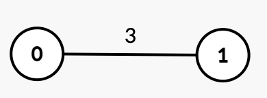
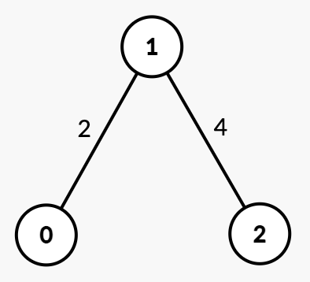
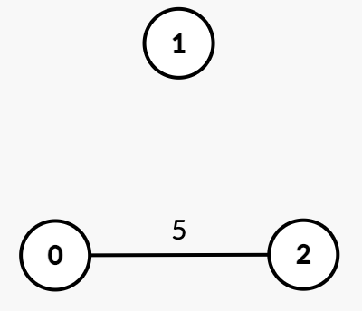

3608. Minimum Time for K Connected Components

You are given an integer `n` and an undirected graph with `n` nodes labeled from 0 to `n - 1`. This is represented by a 2D array `edges`, where `edges[i] = [ui, vi, timei]` indicates an undirected edge between nodes `ui` and `vi` that can be removed at `timei`.

You are also given an integer `k`.

Initially, the graph may be connected or disconnected. Your task is to find the minimum time `t` such that after removing all edges with `time <= t`, the graph contains at least `k` connected components.

Return the **minimum** time `t`.

A **connected component** is a subgraph of a graph in which there exists a path between any two vertices, and no vertex of the subgraph shares an edge with a vertex outside of the subgraph.

 

**Example 1:**
```
Input: n = 2, edges = [[0,1,3]], k = 2

Output: 3

Explanation:
```

```
Initially, there is one connected component {0, 1}.
At time = 1 or 2, the graph remains unchanged.
At time = 3, edge [0, 1] is removed, resulting in k = 2 connected components {0}, {1}. Thus, the answer is 3.
```

**Example 2:**
```
Input: n = 3, edges = [[0,1,2],[1,2,4]], k = 3

Output: 4

Explanation:
```

```
Initially, there is one connected component {0, 1, 2}.
At time = 2, edge [0, 1] is removed, resulting in two connected components {0}, {1, 2}.
At time = 4, edge [1, 2] is removed, resulting in k = 3 connected components {0}, {1}, {2}. Thus, the answer is 4.
```

**Example 3:**
```
Input: n = 3, edges = [[0,2,5]], k = 2

Output: 0

Explanation:
```

```
Since there are already k = 2 disconnected components {1}, {0, 2}, no edge removal is needed. Thus, the answer is 0.
```

**Constraints:**

* `1 <= n <= 10^5`
* `0 <= edges.length <= 10^5`
* `edges[i] = [ui, vi, timei]`
* `0 <= ui, vi < n`
* `ui != vi`
* `1 <= timei <= 10^9`
* `1 <= k <= n`
* There are no duplicate `edges`.

# Submissions
---
**Solution 1: (Binary Search)**
```
Runtime: 385 ms, Beats 38.24%
Memory: 353.45 MB, Beats 38.18%
```
```c++
class Solution {
    bool check(int mid, int k, vector<vector<array<int,2>>> &g, vector<int> &visited) {
        int n = g.size(), i, ck = 0;
        fill(visited.begin(), visited.end(), 0);
        queue<int> q;
        for (i = 0; i < n; i ++) {
            if (visited[i] == 0) {
                ck += 1;
                q.push(i);
                visited[i] = 1;
                while (q.size()) {
                    auto u = q.front();
                    q.pop();
                    for (auto &[v, t]: g[u]) {
                        if (t > mid && !visited[v]) {
                            q.push(v);
                            visited[v] = 1;
                        }
                    }
                }
            }
        }
        return ck >= k;
    }
public:
    int minTime(int n, vector<vector<int>>& edges, int k) {
        int left = 0, right = 1e9, mid, ans = INT_MAX;
        vector<vector<array<int,2>>> g(n);
        vector<int> visited(n);
        for (auto &e: edges) {
            g[e[0]].push_back({e[1], e[2]});
            g[e[1]].push_back({e[0], e[2]});
        }
        while (left <= right) {
            mid = left + (right - left)/2;
            if (!check(mid, k, g, visited)) {
                left = mid + 1;
            } else {
                ans = min(ans, mid);
                right = mid - 1;
            }
        }
        return ans;
    }
};
```

**Solution 2: (Sort)**
```
Runtime: 81 ms, Beats 91.52%
Memory: 215.28 MB, Beats 99.01%
```
```c++
class Solution {
    vector<int> p;
    int find(int x) {
        if (p[x] != x) {
            p[x] = find(p[x]);
        }
        return p[x];
    }
    bool uni(int x, int y) {
        int xr = find(x), yr = find(y);
        if (xr != yr) {
            p[xr] = yr;
            return true;
        }
        return false;
    }
public:
    int minTime(int n, vector<vector<int>>& edges, int k) {
        if (edges.empty()) {
            return 0;
        }
        sort(edges.begin(), edges.end(), [](auto &a, auto &b) {
            return a[2] > b[2];
        });
        p.resize(n);
        iota(p.begin(), p.end(), 0);
        int cnt = n;
        for (const auto& e : edges) {
            int u = e[0], v = e[1], t = e[2];
            if (uni(u, v)) {
                cnt -= 1;
            }
            if (cnt < k) {
                return t;
            }
        }
        return 0;
    }
};
```
