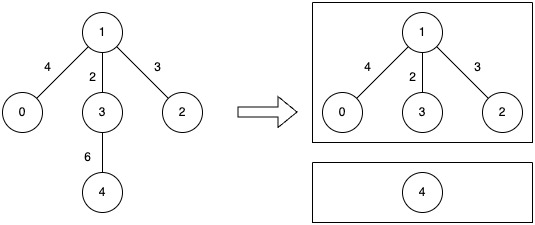
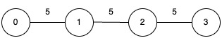

3613. Minimize Maximum Component Cost

You are given an undirected connected graph with `n` nodes labeled from `0` to `n - 1` and a 2D integer array `edges` where `edges[i] = [ui, vi, wi]` denotes an undirected edge between node `ui` and node `vi` with weight `wi`, and an integer `k`.

You are allowed to remove any number of edges from the graph such that the resulting graph has **at most** `k` connected components.

The **cost** of a component is defined as the **maximum** edge weight in that component. If a component has no edges, its cost is `0`.

Return the **minimum** possible value of the maximum cost among all components after such removals.

 

**Example 1:**
```
Input: n = 5, edges = [[0,1,4],[1,2,3],[1,3,2],[3,4,6]], k = 2

Output: 4

Explanation:
```

```
Remove the edge between nodes 3 and 4 (weight 6).
The resulting components have costs of 0 and 4, so the overall maximum cost is 4.
```

**Example 2:**
```
Input: n = 4, edges = [[0,1,5],[1,2,5],[2,3,5]], k = 1

Output: 5

Explanation:
```

```
No edge can be removed, since allowing only one component (k = 1) requires the graph to stay fully connected.
That single component’s cost equals its largest edge weight, which is 5.
```

**Constraints:**

* `1 <= n <= 5 * 10^4`
* `0 <= edges.length <= 10^5`
* `edges[i].length == 3`
* `0 <= ui, vi < n`
* `1 <= wi <= 10^6`
* `1 <= k <= n`
* The input graph is connected.

# Submissions
---
**Solution 1: (Binary Search, DFS)**
```
Runtime: 255 ms, Beats 45.81%
Memory: 259.88 MB, Beats 26.69%
```
```c++
class Solution {
    void dfs(int u, int a, vector<int> &visited, vector<vector<array<int,2>>> &g) {
        visited[u] = 1;
        for (auto [v, w]: g[u]) {
            if (w <= a && !visited[v]) {
                dfs(v, a, visited, g);
            }
        }
    }
    bool check(int a, int k, vector<int> &visited, vector<vector<array<int,2>>> &g) {
        int ck = 0, i;
        fill(visited.begin(), visited.end(), 0);
        for (i = 0; i < g.size(); i ++) {
            if (!visited[i]) {
                ck += 1;
                dfs(i, a, visited, g);
            }
        }
        return ck <= k;
    }
public:
    int minCost(int n, vector<vector<int>>& edges, int k) {
        int m = edges.size(), left = 0, right = 0, mid, ans = -1;
        vector<vector<array<int,2>>> g(n);
        vector<int> visited(n);
        for (auto &e: edges) {
            g[e[0]].push_back({e[1], e[2]});
            g[e[1]].push_back({e[0], e[2]});
            right = max(right, e[2]);
        }
        while (left <= right) {
            mid = left + (right - left)/2;
            if (!check(mid, k, visited, g)) {
                left = mid + 1;
            } else {
                ans = mid;
                right = mid - 1;
            }
        }
        return ans;
    }
};
```
