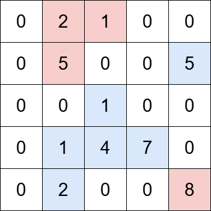
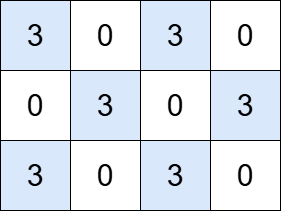

3619. Count Islands With Total Value Divisible by K

You are given an `m x n` matrix `grid` and a positive integer `k`. An island is a group of positive integers (representing land) that are 4-directionally connected (horizontally or vertically).

The total value of an island is the sum of the values of all cells in the island.

Return the number of islands with a total value **divisible** by `k`.

 

**Example 1:**


```
Input: grid = [[0,2,1,0,0],[0,5,0,0,5],[0,0,1,0,0],[0,1,4,7,0],[0,2,0,0,8]], k = 5

Output: 2

Explanation:

The grid contains four islands. The islands highlighted in blue have a total value that is divisible by 5, while the islands highlighted in red do not.
```

**Example 2:**


```
Input: grid = [[3,0,3,0], [0,3,0,3], [3,0,3,0]], k = 3

Output: 6

Explanation:

The grid contains six islands, each with a total value that is divisible by 3.
```
 

**Constraints:**

* `m == grid.length`
* `n == grid[i].length`
* `1 <= m, n <= 1000`
* `1 <= m * n <= 10^5`
* `0 <= grid[i][j] <= 10^6`
* `1 <= k <= 10^6`

# Submissions
---
**Solution 1: (BFS)**
```
Runtime: 40 ms, Beats 54.86%
Memory: 76.10 MB, Beats 100.00%
```
```c++
class Solution {
    int dd[5] = {0, 1, 0, -1, 0};
public:
    int countIslands(vector<vector<int>>& grid, int k) {
        int m = grid.size(), n = grid[0].size(), i, j, a, d, nr, nc, ans = 0;
        queue<array<int,2>> q;
        for (i = 0; i < m; i ++) {
            for (j = 0; j < n; j ++) {
                if (grid[i][j]) {
                    q.push({i, j});
                    a = grid[i][j]%k;
                    grid[i][j] = 0;
                    while (q.size()) {
                        auto [r, c] = q.front();
                        q.pop();
                        for (d = 0; d < 4; d ++) {
                            nr = r + dd[d];
                            nc = c + dd[d+1];
                            if (0 <= nr && nr < m && 0 <= nc && nc < n && grid[nr][nc]) {
                                q.push({nr, nc});
                                a = (a + grid[nr][nc])%k;
                                grid[nr][nc] = 0;
                            }
                        }
                    }
                    if (a == 0) {
                        ans += 1;
                    }
                }
            }
        }
        return ans;
    }
};
```
