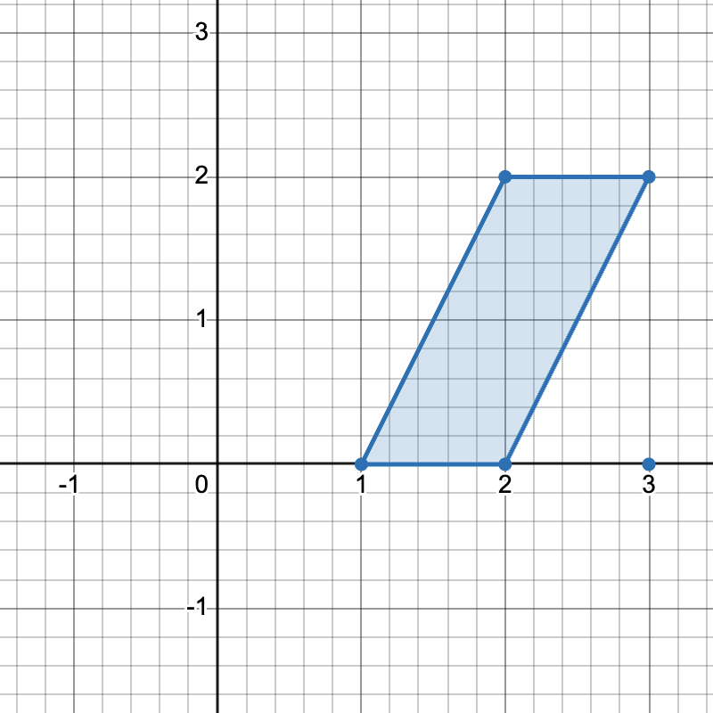
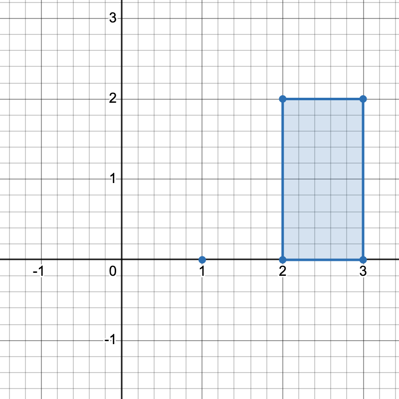
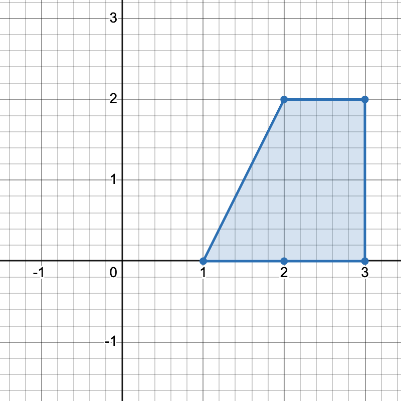
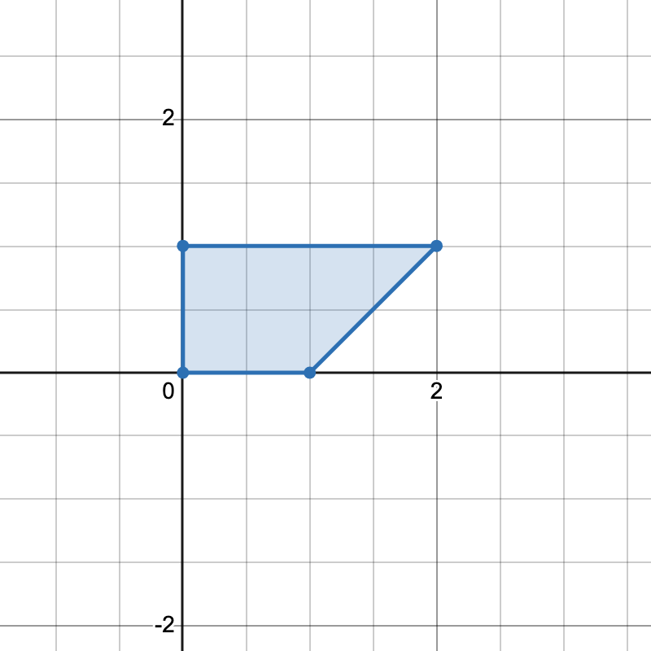

3623. Count Number of Trapezoids I

You are given a 2D integer array `points`, where `points[i] = [xi, yi]` represents the coordinates of the ith point on the Cartesian plane.

A **horizontal trapezoid** is a convex quadrilateral with **at least one pair** of horizontal sides (i.e. parallel to the x-axis). Two lines are parallel if and only if they have the same slope.

Return the number of unique **horizontal trapezoids** that can be formed by choosing any four distinct points from `points`.

Since the answer may be very large, return it modulo `10^9 + 7`.

 

**Example 1:**
```
Input: points = [[1,0],[2,0],[3,0],[2,2],[3,2]]

Output: 3

Explanation:
```




```
There are three distinct ways to pick four points that form a horizontal trapezoid:

Using points [1,0], [2,0], [3,2], and [2,2].
Using points [2,0], [3,0], [3,2], and [2,2].
Using points [1,0], [3,0], [3,2], and [2,2].
```

Example 2:
```
Input: points = [[0,0],[1,0],[0,1],[2,1]]

Output: 1

Explanation:
```

```
There is only one horizontal trapezoid that can be formed.
```
 

**Constraints:**

* `4 <= points.length <= 10^5`
* `–10^8 <= xi, yi <= 10^8`
* All points are pairwise distinct.

# Submissions
---
**Solution 1: (Prefix Sum)**
```
Runtime: 56 ms, Beats 50.00%
Memory: 191.64 MB, Beats -%
```
```c++
class Solution {
public:
    int countTrapezoids(vector<vector<int>>& points) {
        int MOD = 1e9 + 7;
        long long right = 0, ans = 0;
        unordered_map<int,int> cnt;
        for (auto &p: points) {
            cnt[p[1]] += 1;
        }
        for (auto [_, c]: cnt) {
            right += 1LL * c*(c-1)/2;
        }
        auto it = cnt.begin();
        while (it != cnt.end()) {
            auto [_, c] = *it;
            right -= 1LL * c*(c-1)/2;
            ans += 1LL * c*(c-1)/2 * right;
            ans %= MOD;
            it ++;
        }
        return ans;
    }
};
```
