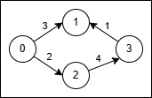

3650. Minimum Cost Path with Edge Reversals

You are given a directed, weighted graph with `n` nodes labeled from 0 to `n - 1`, and an array `edges` where `edges[i] = [ui, vi, wi]` represents a directed edge from node `ui` to node `vi` with cost `wi`.

Each node `ui` has a switch that can be used at most once: when you arrive at ui and have not yet used its switch, you may activate it on one of its incoming edges `vi → ui` reverse that edge to `ui → vi` and immediately traverse it.

The reversal is only valid for that single move, and using a reversed edge costs `2 * wi`.

Return the **minimum** total cost to travel from node 0 to node n - 1. If it is not possible, return `-1`.

 

**Example 1:**
```
Input: n = 4, edges = [[0,1,3],[3,1,1],[2,3,4],[0,2,2]]

Output: 5

Explanation:
```

```
Use the path 0 → 1 (cost 3).
At node 1 reverse the original edge 3 → 1 into 1 → 3 and traverse it at cost 2 * 1 = 2.
Total cost is 3 + 2 = 5.
```

**Example 2:**
```
Input: n = 4, edges = [[0,2,1],[2,1,1],[1,3,1],[2,3,3]]

Output: 3

Explanation:

No reversal is needed. Take the path 0 → 2 (cost 1), then 2 → 1 (cost 1), then 1 → 3 (cost 1).
Total cost is 1 + 1 + 1 = 3.
```

**Constraints:**

* `2 <= n <= 5 * 10^4`
* `1 <= edges.length <= 10^5`
* `edges[i] = [ui, vi, wi]`
* `0 <= ui, vi <= n - 1`
* `1 <= wi <= 1000`

# Submissions
---
**Solution 1: (Dijkstra)**
```
Runtime: 321 ms, Beats 51.85%
Memory: 315.83 MB, Beats 54.51%
```
```c++
class Solution {
public:
    int minCost(int n, vector<vector<int>>& edges) {
        vector<vector<array<int,2>>> g(n);
        priority_queue<array<int,2>, vector<array<int,2>>, greater<>> pq;
        vector<int> dist(n, INT_MAX);
        for (auto e: edges) {
            g[e[0]].push_back({e[1], e[2]});
            g[e[1]].push_back({e[0], 2*e[2]});
        }
        pq.push({0, 0});
        dist[0] = 0;
        while (pq.size()) {
            auto [w, u] = pq.top();
            pq.pop();
            if (u == n-1) {
                return w;
            }
            for (auto [v, dw]: g[u]) {
                if (w + dw < dist[v]) {
                    dist[v] = w + dw;
                    pq.push({w+dw, v});
                } 
            }
        }
        return -1;
    }
};
```
