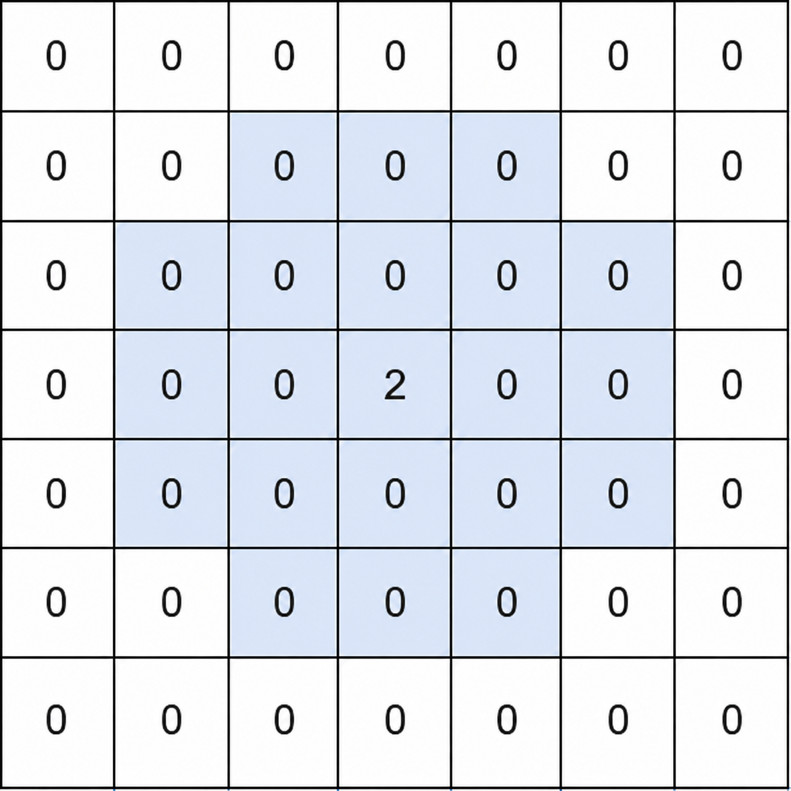

3933. Largest Local Values in a Matrix II

You are given an `n x m` integer matrix `matrix` containing non-negative integers.

A non-zero cell `(row, col)` checks the cells near it as follows:

* Let `x = matrix[row][col]`.
* Consider every cell within `x` rows and `x` columns of `(row, col)`.
* Ignore cells that are outside the matrix.
* Ignore the cells where both the row distance and column distance are exactly `x`.

The cell `(row, col)` is a **local maximum** if it is non-zero and no considered cell has a value greater than `x`.

Return an integer denoting the number of **local maximums** in `matrix`.

 

**Example 1:**
```
Input: matrix = [[0,0,0,0,0,0,0],[0,0,0,0,0,0,0],[0,0,0,0,0,0,0],[0,0,0,2,0,0,0],[0,0,0,0,0,0,0],[0,0,0,0,0,0,0],[0,0,0,0,0,0,0]]

Output: 1
```

```
Explanation:

For the non-zero cell (3, 3), x = matrix[3][3] = 2.
The highlighted cells are the considered cells within x rows and x columns of (3, 3).
The four cells with both row and column distances equal to x = 2 are ignored.
No considered cell has a value greater than 2, so (3, 3) is a local maximum.
There are no other non-zero cells, so the answer is 1.
```

**Example 2:**
```
Input: matrix = [[1,2],[3,4]]

Output: 1

Explanation:

Only the cell with value 4 is a local maximum. Every other non-zero cell considers a cell with a greater value.
```

**Example 3:**
```
Input: matrix = [[1,0,1],[0,1,0],[1,0,1]]

Output: 5

Explanation:

For a cell with value 1, the considered cells are the cell itself and its 4-directionally adjacent cells that are inside the matrix.
Each of the five cells with value 1 only considers cells with values 0 or 1, so all five of them are local maximums.
```

**Example 4:**
```
Input: matrix = [[1,1],[1,1]]

Output: 4

Explanation:

All cells have the same value. Therefore, no cell considers another cell with a greater value, so all 4 cells are local maximums.
```
 

**Constraints:**

* `1 <= n == matrix.length <= 200`
* `1 <= m == matrix[i].length <= 200`
* `0 <= matrix[i][j] <= 200`

# Submissions
---
**Solution 1: (Hash Table, map each value to location list then check larger value location difference within range)**
```
Runtime: 112 ms, Beats 84.37%
Memory: 47.90 MB, Beats 84.57%
```
```c++
class Solution {
public:
    int countLocalMaximums(vector<vector<int>>& matrix) {
        int n = matrix.size();
        int m = matrix[0].size();

        //store coordinates as per value
        vector<pair<int,int>> pos[201];
        for (int i = 0; i < n; i++) {
            for (int j = 0; j < m; j++) {
                pos[matrix[i][j]].push_back({i, j});
            }
        }

        int ans = 0;
        for (int r = 0; r < n; r++) {
            for (int c = 0; c < m; c++) {
                int x = matrix[r][c];
                if (x == 0) {
                    continue;
                }

                bool ok = true;

                // only check values > x
                for (int val = x + 1; val <= 200 && ok; val++) {
                    for (auto &[nr, nc] : pos[val]) {

                        int dr = abs(nr - r);
                        int dc = abs(nc - c);

                        // must lie inside square
                        if (dr <= x && dc <= x) {
                            // ignore corners
                            if (dr == x && dc == x) {
                                continue;
                            }
                            ok = false;
                            break;
                        }
                    }
                }
                if (ok) {
                    ans++;
                }
            }
        }

        return ans;
    }
};
```
