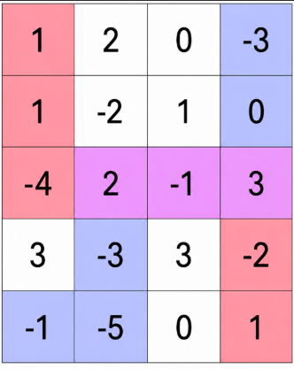
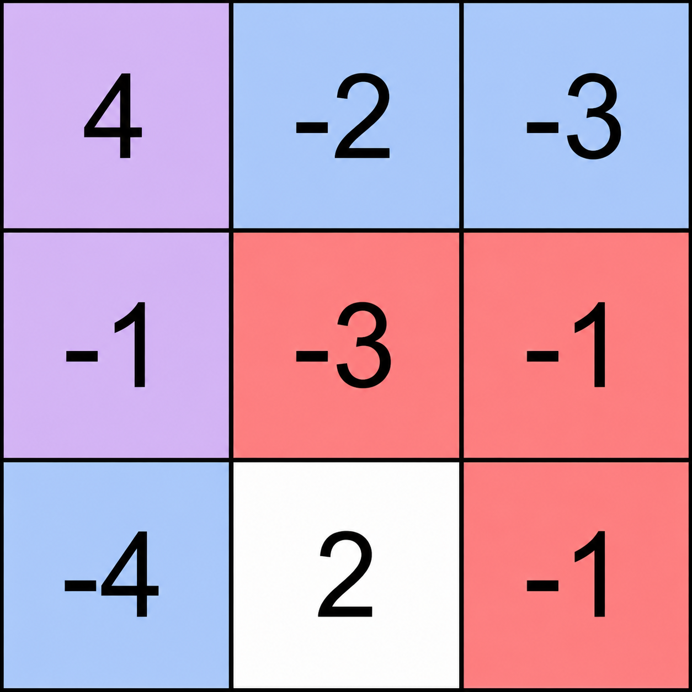

3938. Maximum Path Intersection Sum in a Grid

You are given an m x n integer matrix `grid`.

Two players move across the grid:

* Player 1 starts at the top-left cell `(0, 0)` and can move only right or down. Their destination is the bottom-right cell `(m - 1, n - 1)`.
* Player 2 starts at the bottom-left cell `(m - 1, 0)` and can move only right or up. Their destination is the top-right cell `(0, n - 1)`.

Each player must choose a valid path from their respective starting cell to their destination.

A cell is called **shared** if it belongs to **both** chosen paths.

Return an integer denoting the **maximum** possible sum of values of all **shared** cells.

 

**Example 1:**


```
Input: grid = [[1,2,0,-3],[1,-2,1,0],[-4,2,-1,3],[3,-3,3,-2],[-1,-5,0,1]]

Output: 4

Explanation:

The diagram shows one optimal choice of paths.
Player 1 follows the red/purple path from the top-left cell to the bottom-right cell:
(0, 0) → (1, 0) → (2, 0) → (2, 1) → (2, 2) → (2, 3) → (3, 3) → (4, 3)
Player 2 follows the blue/purple path from the bottom-left cell to the top-right cell:
(4, 0) → (4, 1) → (3, 1) → (2, 1) → (2, 2) → (2, 3) → (1, 3) → (0, 3)
The shared cells are (2, 1), (2, 2), and (2, 3).
The sum is 2 + (-1) + 3 = 4, which is the maximum possible sum.
```

**Example 2:**


```
Input: grid = [[4,-2,-3],[-1,-3,-1],[-4,2,-1]]

Output: 3

Explanation:

One optimal pair of paths is shown in the diagram.

Player 1 follows the red/purple path:
(0, 0) → (1, 0) → (1, 1) → (1, 2) → (2, 2)
Player 2 follows the blue/purple path:
(2, 0) → (1, 0) → (0, 0) → (0, 1) → (0, 2)
The shared cells are (0, 0) and (1, 0).
The sum is 4 + (-1) = 3, which is the maximum possible.
```

**Constraints:**

* `m == grid.length`
* `n == grid[i].length`
* ` <= m, n <= 1000
* `4 <= m * n <= 5 * 10^5`
* `-100 <= grid[i][j] <= 100`

# Submissions
---
**Solution 1: (Kadane, border at least 2 cell and non-boarder at least 1)**

Intuition
Because Player 1 moves Down/Right and Player 2 moves Up/Right, their paths can never cross twice.

Since they only share the "Right" direction but move in opposite vertical directions, they can only meet, travel together along a single straight line (either horizontally in one row or vertically in one column), and then split. Therefore, the problem boils down to finding the maximum contiguous subarray sum in any single row or column.

Approach
Use Kadane’s Algorithm: Treat every row and every column as a 1D array and apply Kadane's algorithm to find the maximum subarray sum.

The Boundary Catch (Entry/Exit Rules):

If the players meet on the edge/boundary of the grid, the directional rules force them to share at least 2 cells to enter and exit that path.

A shared path of exactly 1 cell is physically only possible if the cell is strictly inside the grid (not on the edges).

The Logic:

Run Kadane's on every row and column.

Always check and update your global maximum for subarrays of length >= 2.

Only consider a single cell (length 1) as a valid answer if it is an inner cell (i.e., not in the first/last row or first/last column).

Complexity
Time complexity:
O(m*n)

Space complexity:
O(1)

```
Runtime: 24 ms, Beats 70.42%
Memory: 137.82 MB, Beats 42.37%
```
```c++
class Solution {
public:
    int maxScore(vector<vector<int>>& grid) {
        int m = grid.size(), n = grid[0].size(), i, j, a, ans = INT_MIN;
        for (i = 0; i < m; i ++) {
            a = grid[i][0];
            j = 1;
            while (j < n) {
                a += grid[i][j];
                ans = max(ans, a);
                if (j && j < n - 1 && i && i < m - 1) {
                    ans = max(ans, grid[i][j]);
                }
                if (a < grid[i][j]) {
                    a = grid[i][j];
                }
                j += 1;
            }
        }
        for (j = 0; j < n; j ++) {
            a = grid[0][j];
            i = 1;
            while (i < m) {
                a += grid[i][j];
                ans = max(ans, a);
                if (j && j < n - 1 && i && i < m - 1) {
                    ans = max(ans, grid[i][j]);
                }
                if (a < grid[i][j]) {
                    a = grid[i][j];
                }
                i += 1;
            }
        }
        return ans;
    }
};
```

