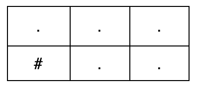
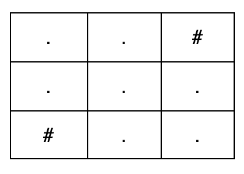

3988. Create Grid With Exactly K Paths I

You are given three integers `m`, `n`, and `k`.

Construct any `m x n` grid consisting only of the characters `'.'` and `'#'`, where:

* `'.'` represents a free cell.
* `'#'` represents an obstacle cell.

A **valid path** is a sequence of free cells that:

* Starts at the top-left cell `(0, 0)`.
* Ends at the bottom-right cell `(m - 1, n - 1)`.
* Moves only:
    * Right, from `(i, j)` to `(i, j + 1)`, or
    * Down, from `(i, j)` to `(i + 1, j)`.

Return any grid such that there are exactly `k` valid paths from the top-left cell to the bottom-right cell. If no such grid exists, return an empty array.

 

**Example 1:**
```
Input: m = 2, n = 3, k = 2

Output: ["...","#.."]

Explanation:

```

```

There are exactly k = 2 valid paths from (0, 0) to (1, 2):

(0, 0) → (0, 1) → (0, 2) → (1, 2)
(0, 0) → (0, 1) → (1, 1) → (1, 2)
```

**Example 2:**
```
Input: m = 3, n = 3, k = 4

Output: ["..#","...","#.."]

Explanation:

```

```

There are exactly k = 4 valid paths from (0, 0) to (2, 2):

(0, 0) → (0, 1) → (1, 1) → (1, 2) → (2, 2)
(0, 0) → (0, 1) → (1, 1) → (2, 1) → (2, 2)
(0, 0) → (1, 0) → (1, 1) → (1, 2) → (2, 2)
(0, 0) → (1, 0) → (1, 1) → (2, 1) → (2, 2)
```

**Example 3:**
```
Input: m = 1, n = 4, k = 2

Output: []

Explanation:​

No grid exists with exactly k = 2 valid paths for a 1 x 4 grid, so the answer is an empty array.
```
 

**Constraints:**

* `1 <= m, n <= 10`
* `1 <= k <= 4`

# Submissions
---
**Solution 1: (Prefix Sum, precompute smallest solution set and extend to full size)**

Intuition
Since k is very small (between 1 and 4),
we can predefine the minimal base shapes
required to create exactly k paths.

Explanation
This solution uses a template-based
approach to build the grid.

For a given k,
we check if any of its predefined templates
can fit inside m * n boundaries.

If a template fits,
we copy its shape into the top-left corner of the grid,
which is initially filled with obstacles.

Then, we simply extend the path
from the bottom-right corner of the template
straight down, and then straight right,
until it reaches the grid's final cell.

If no template fits, it returns empty.

Complexity
Time O(mn)
Space O(mn)

---------------------------
    m = 2, n = 3, k = 2
t:
    . .
    . .
ans:
    . . #
    . . .
----------------------------
    m = 3, n = 3, k = 4
t:
    . . #
    . . .
    # . .
ans:
    . . #
    . . .
    # . .

```
Runtime: 7 ms, Beats 31.49%
Memory: 11.83 MB, Beats 29.54%
```
```c++
class Solution {
public:
    vector<string> createGrid(int m, int n, int k) {
        map<int, vector<vector<string>>> templates = {
            {1, {{"."}}},
            {2, {{"..", ".."}}},
            {3, {{"..", "..", ".."}, {"...", "..."}}},
            {4, {{"..", "..", "..", ".."}, {"....", "...."}, {"..#", "...", "#.."}}}
        };
        for (const auto &t: templates[k]) {
            int r = t.size();
            int c = t[0].size();
            if (r > m || c > n)  {
                continue;
            }
            vector<string> ans(m, string(n, '#'));
            for (int i = 0; i < r; ++i) {
                for (int j = 0; j < c; ++j) {
                    ans[i][j] = t[i][j];
                }
            }
            for (int i = r; i < m; ++i) {
                ans[i][c - 1] = '.';
            }
            for (int j = c; j < n; ++j) {
                ans[m - 1][j] = '.';
            }
            return ans;
        }
        return {};
    }
};
```
