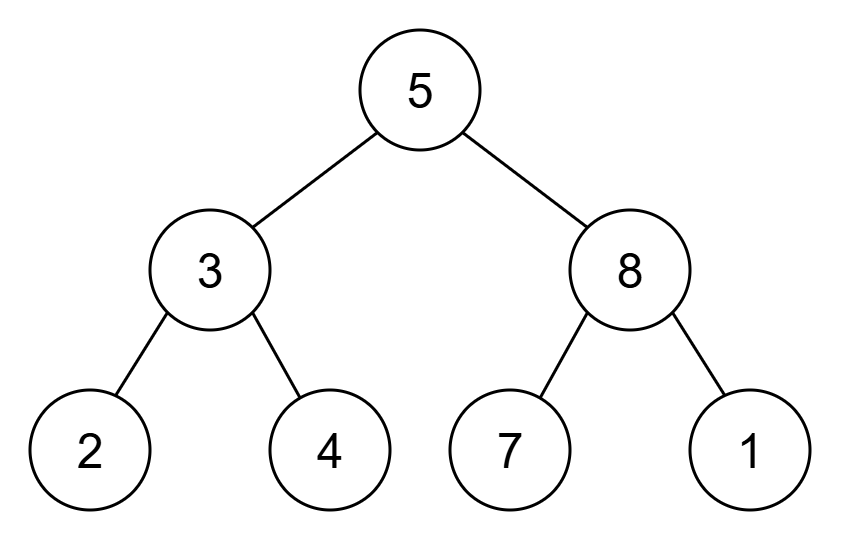
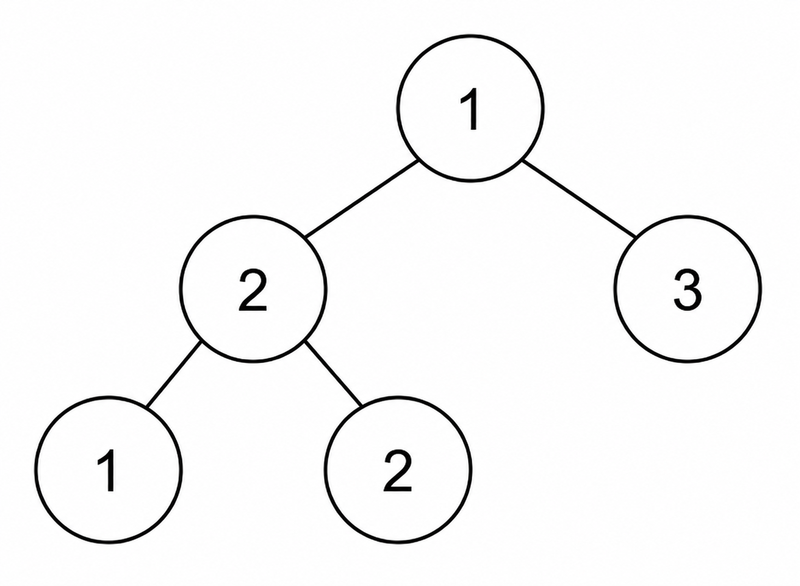

3997. Count Dominant Nodes in a Binary Tree

You are given the `root` of a **complete binary tree**.

A node `x` is called **dominant** if its value is equal to the maximum value among all nodes in the **subtree** rooted at `x`.

Return the number of dominant nodes in the tree.

 

**Example 1:**


```
Input: root = [5,3,8,2,4,7,1]

Output: 5

Explanation:

The leaf nodes with values 2, 4, 7, and 1 are dominant.
The node with value 8 is dominant because its value is the maximum value in its subtree [8, 7, 1].
Thus, the answer is 5.
```

**Example 2:**


```
Input: root = [1,2,3,1,2]

Output: 4

Explanation:

The leaf nodes with values 1, 2, and 3 are dominant.
The node with value 2 whose subtree is [2, 1, 2] is dominant because its value is the maximum value in its subtree.
Thus, the answer is 4.
```

**Constraints:**

* The number of nodes in the tree is in the range `[1, 10^5]`.
* `1 <= Node.val <= 10^9`
* The tree is guaranteed to be a complete binary tree.

# Submissions
---
**Solution 1: (DFS)**
```
Runtime: 34 ms, Beats 30.82%
Memory: 338.26 MB, Beats 22.99%
```
```c++
/**
 * Definition for a binary tree node.
 * struct TreeNode {
 *     int val;
 *     TreeNode *left;
 *     TreeNode *right;
 *     TreeNode() : val(0), left(nullptr), right(nullptr) {}
 *     TreeNode(int x) : val(x), left(nullptr), right(nullptr) {}
 *     TreeNode(int x, TreeNode *left, TreeNode *right) : val(x), left(left), right(right) {}
 * };
 */
class Solution {
    int dfs(TreeNode *node, int &ans) {
        if (!node) {
            return 0;
        }
        if (!node->left && !node->right) {
            ans += 1;
            return node->val;
        }
        int left = dfs(node->left, ans);
        int right = dfs(node->right, ans);
        if (node->val >= left && node->val >= right) {
            ans += 1;
        }
        return max({node->val, left, right});
    }
public:
    int countDominantNodes(TreeNode* root) {
        int ans = 0;
        dfs(root, ans);
        return ans;
    }
};
```
