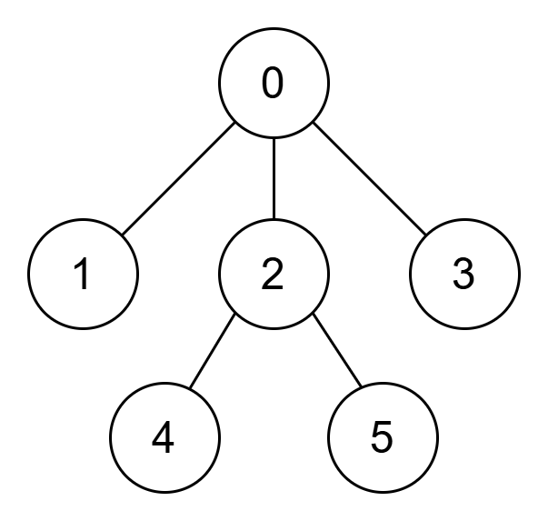
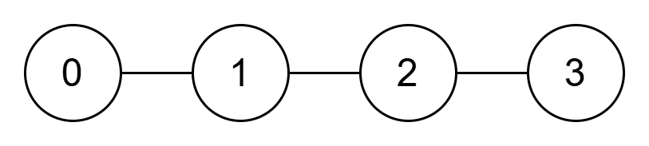

4015. Weighted Sum of a Tree

You are given an integer array `parent` of length `n` representing a rooted tree with nodes labeled from 0 to `n - 1`.

The tree is rooted at node 0, so `parent[0] = -1`. For each node `i` where `1 <= i <= n - 1`, `parent[i]` denotes the parent of node `i`.

You are also given an integer array `nums` of length `n`, where `nums[i]` denotes the value of node `i`.

The weight of a node `i` at depth `d` is `nums[i] * (h - d + 1)`, where `h` is the height of the tree.

Return the sum of the weights of all nodes in the tree.

The depth of a node is the number of nodes on the path from the root to that node, inclusive, with the root having depth 1.

The height of the tree is the maximum depth among all nodes in the tree.

 

**Example 1:**



```
Input: parent = [-1,0,0,0,2,2], nums = [5,2,3,1,4,6]

Output: 37

Explanation:

The height of the tree is 3.

Node	nums[i]	Depth (d)	Weight
0	5	1	5 * (3 - 1 + 1) = 15
1	2	2	2 * (3 - 2 + 1) = 4
2	3	2	3 * (3 - 2 + 1) = 6
3	1	2	1 * (3 - 2 + 1) = 2
4	4	3	4 * (3 - 3 + 1) = 4
5	6	3	6 * (3 - 3 + 1) = 6
The sum of all node weights is 15 + 4 + 6 + 2 + 4 + 6 = 37.
```

**Example 2:**



```
Input: parent = [-1,0,1,2], nums = [1,2,3,4]

Output: 20

Explanation:

The height of the tree is 4.

Node	nums[i]	Depth (d)	Weight
0	1	1	1 * (4 - 1 + 1) = 4
1	2	2	2 * (4 - 2 + 1) = 6
2	3	3	3 * (4 - 3 + 1) = 6
3	4	4	4 * (4 - 4 + 1) = 4
The sum of all node weights is 4 + 6 + 6 + 4 = 20.
```
 

**Constraints:**

* `1 <= n <= 10^5`
* `n == parent.length == nums.length`
* `parent[0] == -1`
* `0 <= parent[i] <= n - 1` for all `i` in `[1, n - 1]`
* `1 <= nums[i] <= 106`
* The input is generated such that the array parent represents a valid tree rooted at node 0.

# Submissions
---
**Solution 1: (DFS)**
```
Runtime: 14 ms, Beats 94.34%
Memory: 189.24 MB, Beats 97.29%
```
```c++
class Solution {
    int dfs(int i, vector<int> &dp, vector<int> &parent) {
        if (i == 0) {
            return 1;
        }
        if (dp[i]) {
            return dp[i];
        }
        dp[i] =  1 + dfs(parent[i], dp, parent);
        return dp[i];
    }
public:
    long long weightedSum(vector<int>& parent, vector<int>& nums) {
        int n = parent.size();
        vector<int> dp(n);
        dp[0] = 1;
        for (int i = 0; i < n; i ++) {
            dfs(i, dp, parent);
        }
        int h = *max_element(dp.begin(), dp.end());
        long long ans = 0;
        for (int i = 0; i < n; i ++) {
            ans += 1LL * nums[i] * (h - dp[i] + 1);
        }
        return ans;
    }
};
```
