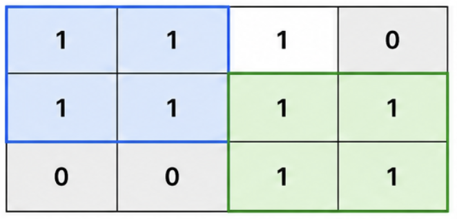
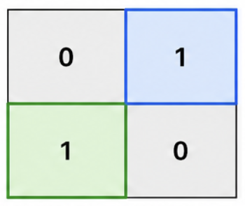
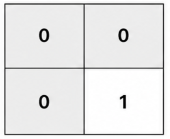

4016. Maximum Area of Two Non-Overlapping Square Submatrices

You are given a 2D integer matrix `mat` of size `m × n`, where:

* `mat[r][c] == 1` means the cell at row `r` and column `c` is usable.
* `mat[r][c] == 0` means it is not usable.

Your task is to find two submatrices that satisfy the following conditions:

Both submatrices must be squares of the same side length `k`.
* The two submatrices must not share any cell.
* Each submatrix can only cover cells where `mat[r][c] == 1`.

Return the **maximum possible area** of each of the two squares. If it is not possible to choose two such squares, return 0.

 

**Example 1:**


```
Input: mat = [[1,1,1,0],[1,1,1,1],[0,0,1,1]]

Output: 4

Explanation:

The largest equal non-overlapping squares have side length k = 2 with area 4.

First square starts at top-left (0, 0) and covers cells (0, 0), (0, 1), (1, 0), and (1, 1).
Second square starts at top-left (1, 2) and covers cells (1, 2), (1, 3), (2, 2), and (2, 3).
Thus, the answer is 4.
```

**Example 2:**


```
Input: mat = [[0,1],[1,0]]

Output: 1

Explanation:

The largest equal non-overlapping squares have side length k = 1 with area 1.

First square starts at top-left (0, 1) and covers cell (0, 1).
Second square starts at top-left (1, 0) and covers cell (1, 0).
Thus, the answer is 1.
```

**Example 3:**


```
Input: mat = [[0,0],[0,1]]

Output: 0

Explanation:

There is only one usable cell, so it is impossible to choose two non-overlapping squares. Thus, the answer is 0.
```
 

**Constraints:**

* `mat.length == m`
* `mat[i].length == n`
* `1 <= m, n <= 500`
* `mat[i][j]` is either `0` or `1`.

# Submissions
---
**Solution 1: (DP Bottom-Up)**
```
Runtime: 46 ms, Beats 89.48%
Memory: 124.53 MB, Beats 52.51%
```
```c++
class Solution {
public:
    int maxArea(vector<vector<int>>& mat) {
        int m = mat.size();
        int n = mat[0].size();
        int ans = 0;
        vector<vector<int>> dp(m, vector<int>(n));
        for (int j = n - 1; j >= 0; j --) {
            for (int i = m - 1; i >= 0; i --) {
                if (i == m - 1 || j == n - 1) {
                    dp[i][j] = mat[i][j];
                } else{
                    if (mat[i][j]) {
                        dp[i][j] = min({dp[i + 1][j], dp[i][j + 1], dp[i + 1][j + 1]}) + 1;
                    }
                }
            }
        }
        vector<int> right(n + 1);
        for (int j = n - 1; j >= 0; j --) {
            for (int i = 0; i < m; i ++) {
                int len = min(dp[i][j], right[j + dp[i][j]]);
                ans = max(ans, len * len);
                right[j] = max(right[j], dp[i][j]);
            }
            right[j] = max(right[j], right[j + 1]);
        }
        vector<int> bottom(m + 1);
        for (int i = m - 1; i >= 0; i --) {
            for (int j = 0; j < n; j ++) {
                int len = min(dp[i][j], bottom[i + dp[i][j]]);
                ans = max(ans, len * len);
                bottom[i] = max(bottom[i], dp[i][j]);
            }
            bottom[i] = max(bottom[i], bottom[i + 1]);
        }
        return ans;
    }
};
```
