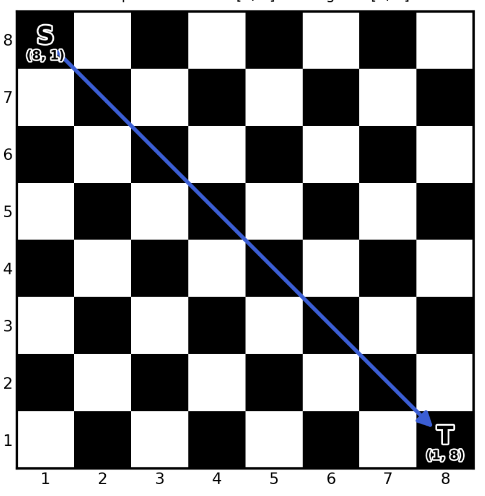
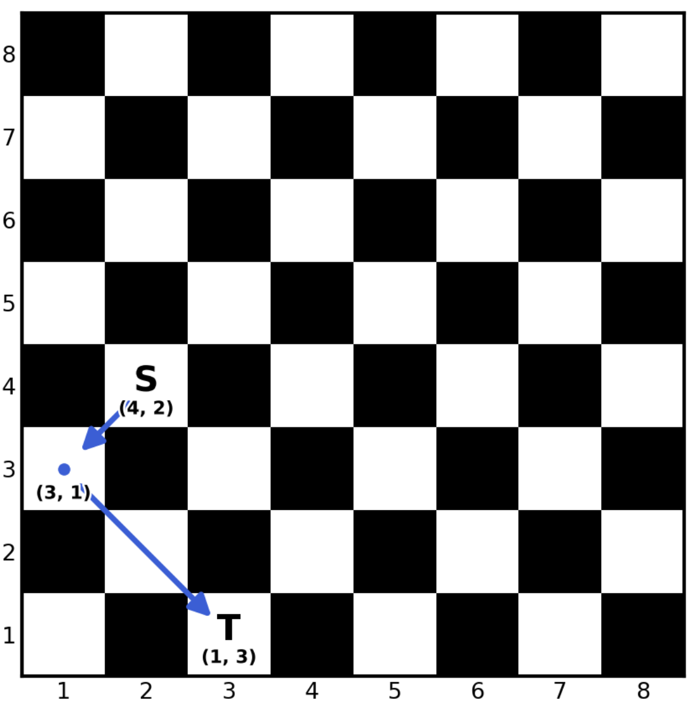

4034. Minimum Bishop Moves to Reach Target

There is an `8 x 8` empty chessboard with **1-indexed** rows and columns.

You are given an array `source = [sr, sc]` representing the starting position of a bishop, and an array `target = [tr, tc]` representing the target position.

In one move, the bishop travels one or more squares along a single diagonal direction, staying within the board.

Return the **minimum** number of moves for the bishop to land exactly on `target`. If it can never reach `target`, return `-1`.

 

**Example 1:**
```
Input: source = [8,1], target = [1,8]

Output: 1

Explanation:


A single diagonal move takes the bishop straight from (8, 1) to (1, 8).
```

**Example 2:**
```
Input: source = [4,2], target = [1,3]

Output: 2

Explanation:
```


The bishop moves from (4, 2) to (3, 1), then from (3, 1) to (1, 3), reaching the target in 2 moves.

**Example 3:**
```
Input: source = [1,1], target = [3,4]

Output: -1

Explanation:

No matter how many diagonal moves it makes, the bishop starting at (1, 1) can never land on (3, 4). Thus, the answer is -1.
```
 

**Constraints:**

* `source.length == target.length == 2`
* `1 <= sr, sc, tr, tc <= 8`
* `source != target`

# Submissions
---
**Solution 1: (BFS)**
```
Runtime: 5 ms, Beats -%
Memory: 53.84 MB, Beats -%
```
```c++
class Solution {
    const vector<vector<int>> dd = {
        {1, 1},
        {1, -1},
        {-1, 1},
        {-1,-1}
    };
public:
    int minBishopMoves(vector<int>& source, vector<int>& target) {
        queue<array<int, 3>> q;
        q.push({source[0], source[1], 0});
        vector<vector<bool>> visited(9, vector<bool>(9));
        visited[source[0]][source[1]] = true;
        while (!q.empty()) {
            auto [r, c, t] = q.front();
            q.pop();
            if (r == target[0] && c == target[1]) {
                return t;
            }
            for (int d = 0; d < 4; d ++) {
                int nr = r + dd[d][0];
                int nc = c + dd[d][1];
                while (nr >= 1 && nr <= 8 && nc >= 1 && nc <= 8) {
                    if (!visited[nr][nc]) {
                        visited[nr][nc] = true;
                        q.push({nr, nc, t + 1});
                    }
                    nr += dd[d][0];
                    nc += dd[d][1];
                }
            }
        }
        return -1;
    }
};
```

**Solution 2: (Case Study)**
```
Runtime: 0 ms, Beats 100.00%
Memory: 50.45 MB, Beats 37.50%
```
```c++
class Solution {
public:
    int minBishopMoves(vector<int>& source, vector<int>& target) {
        int sr = source[0];
        int sc = source[1];

        int tr = target[0];
        int tc = target[1];

        // Bishop cannot change square color
        if ((sr + sc) % 2 != (tr + tc) % 2) {
            return -1;
        }

        // Same diagonal
        if (abs(sr - tr) == abs(sc - tc)) {
            return 1;
        }

        // Same color, different diagonal
        return 2;
    }
};
```
