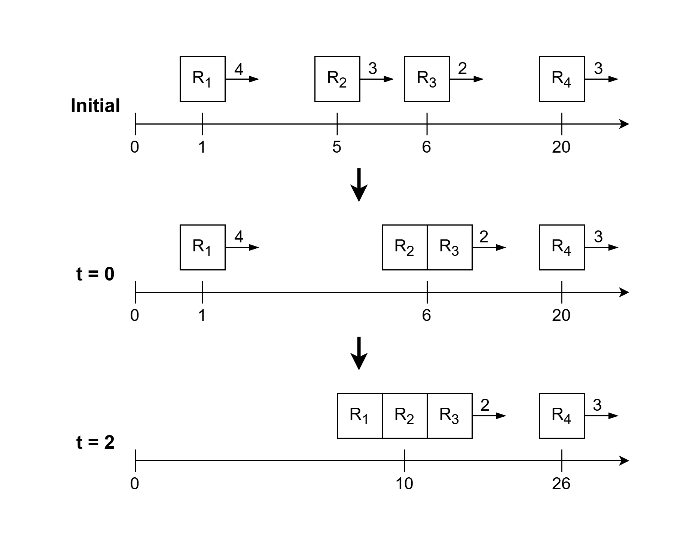
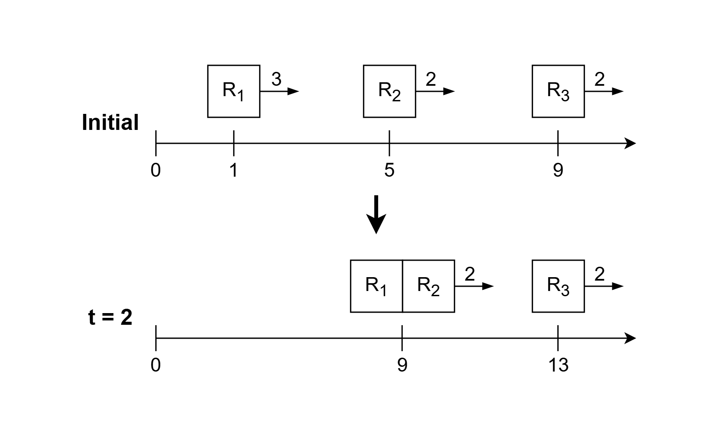

4045. Count Robot Groups

You are given a **strictly increasing** integer array `position`, where `position[i]` is the initial position of the ith robot at time `t = 0`.

You are also given an integer array `speed`, where `speed[i]` is the constant speed of the ith robot in units per second, and an integer distance.

Time is continuous and measured in seconds. A robot or group with speed `v` moves `v * t` units to the right over any interval of `t` seconds.

Whenever the distance between two robots or groups becomes at most `distance`, they merge into a single group.

If multiple robots or groups satisfy the merging condition at the same time, all merges happen **simultaneously**. In particular, every connected collection of robots or groups whose consecutive positions differ by at most `distance` merges into one group.

After a merge, the resulting group takes the current position and speed of the **rightmost** robot in that group. Once merged, robots never separate.

Return the number of groups remaining after all possible merges have occurred.

 

**Example 1:**
```
Input: position = [1,5,6,20], speed = [4,3,2,3], distance = 1

Output: 2

Explanation:
```

```
Initially, the groups are {R1}, {R2}, {R3}, and {R​​​​​​​4}.
At t = 0, the robots R2 and R3 at positions 5 and 6, respectively, merge because they are 1 unit apart. The resulting group moves with the position and speed of the rightmost robot R3. The groups are now {R1}, {R2, R3}, and {R​4}.
Later at t = 2, the robot R1 catches up to the group {R2, R3} and merges with it. The groups are now {R1, R2, R3} and {R​4}.
Thus, the answer is 2.
```

**Example 2:**
```
Input: position = [1,5,9], speed = [3,2,2], distance = 2

Output: 2

Explanation:
```

```
Initially, the groups are {R1}, {R2}, and {R3}.
At t = 2, the robot R1 catches up to the robot R2 and merges with it. The resulting group moves with the position and speed of the rightmost robot R2. The groups are now {R1, R2} and {R3}.
Thus, the answer is 2.
```

**Example 3:**
```
Input: position = [9], speed = [8], distance = 5

Output: 1

Explanation:

Initially, there is only one group. Therefore, the answer is 1.
```
 

**Constraints:**

* `1 <= position.length == speed.length <= 10^5`
* `1 <= position[i], speed[i], distance <= 10^9`
* `position` is strictly increasing.

# Submissions
---
**Solution 1: (Greedy)**
```
Runtime: 0 ms, Beats 100.00%
Memory: 202.71 MB, Beats 82.22%
```
```c++
class Solution {
public:
    int countGroups(vector<int>& position, vector<int>& speed, int distance) {
        pair<int, int> prev;
        int n = position.size();
        prev = {speed[n - 1], position[n - 1]};
        int ans = 1;
        for (int i = n - 2; i >= 0; i--){
            if (speed[i] > prev.first || prev.second - position[i] <= distance) {
                prev = {prev.first, position[i]};
            } else {
                ans += 1;
                prev = {speed[i], position[i]};
            }
        }
        return ans;
    }
};
```
