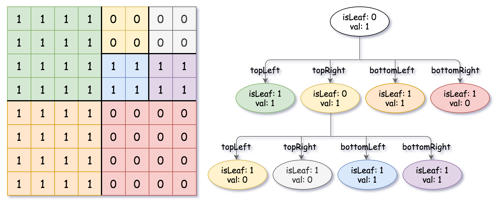

427. Construct Quad Tree

Given a n `* n` matrix `grid` of `0's` and `1's` only. We want to represent the `grid` with a Quad-Tree.

Return the root of the Quad-Tree representing the `grid`.

Notice that you can assign the value of a node to **True** or **False** when `isLeaf` is **False**, and both are **accepted** in the answer.

A Quad-Tree is a tree data structure in which each internal node has exactly four children. Besides, each node has two attributes:

`val`: True if the node represents a grid of 1's or False if the node represents a grid of 0's. 
`isLeaf`: True if the node is leaf node on the tree or False if the node has the four children.
```
class Node {
    public boolean val;
    public boolean isLeaf;
    public Node topLeft;
    public Node topRight;
    public Node bottomLeft;
    public Node bottomRight;
}
```
We can construct a Quad-Tree from a two-dimensional area using the following steps:

1. If the current `grid` has the same value (i.e all `1's` or all `0's`) set `isLeaf` True and set `val` to the value of the grid and set the four children to Null and stop.
1. If the current `grid` has different values, set `isLeaf` to False and set `val` to any value and divide the current `grid` into four sub-grids as shown in the photo.
1. Recurse for each of the children with the proper sub-grid.


If you want to know more about the Quad-Tree, you can refer to the wiki.

**Quad-Tree format:**

The output represents the serialized format of a Quad-Tree using level order traversal, where null signifies a path terminator where no node exists below.

It is very similar to the serialization of the binary tree. The only difference is that the node is represented as a list `[isLeaf, val]`.

If the value of `isLeaf` or `val` is True we represent it as **1** in the list `[isLeaf, val]` and if the value of `isLeaf` or `val` is False we represent it as **0**.

 

**Example 1:**


```
Input: grid = [[0,1],[1,0]]
Output: [[0,1],[1,0],[1,1],[1,1],[1,0]]
Explanation: The explanation of this example is shown below:
Notice that 0 represnts False and 1 represents True in the photo representing the Quad-Tree.
```


**Example 2:**


```
Input: grid = [[1,1,1,1,0,0,0,0],[1,1,1,1,0,0,0,0],[1,1,1,1,1,1,1,1],[1,1,1,1,1,1,1,1],[1,1,1,1,0,0,0,0],[1,1,1,1,0,0,0,0],[1,1,1,1,0,0,0,0],[1,1,1,1,0,0,0,0]]
Output: [[0,1],[1,1],[0,1],[1,1],[1,0],null,null,null,null,[1,0],[1,0],[1,1],[1,1]]
Explanation: All values in the grid are not the same. We divide the grid into four sub-grids.
The topLeft, bottomLeft and bottomRight each has the same value.
The topRight have different values so we divide it into 4 sub-grids where each has the same value.
Explanation is shown in the photo below:
```


**Example 3:**
```
Input: grid = [[1,1],[1,1]]
Output: [[1,1]]
```

**Example 4:**
```
Input: grid = [[0]]
Output: [[1,0]]
```

**Example 5:**
```
Input: grid = [[1,1,0,0],[1,1,0,0],[0,0,1,1],[0,0,1,1]]
Output: [[0,1],[1,1],[1,0],[1,0],[1,1]]
```

**Constraints:**

* `n == grid.length == grid[i].length`
* `n == 2^x where 0 <= x <= 6`

# Submissions
---
**Solution 1: (DFS)**
```
Runtime: 120 ms
Memory Usage: 14.4 MB
```
```python
"""
# Definition for a QuadTree node.
class Node:
    def __init__(self, val, isLeaf, topLeft, topRight, bottomLeft, bottomRight):
        self.val = val
        self.isLeaf = isLeaf
        self.topLeft = topLeft
        self.topRight = topRight
        self.bottomLeft = bottomLeft
        self.bottomRight = bottomRight
"""

class Solution:
    def construct(self, grid: List[List[int]]) -> 'Node':
        R, C = len(grid), len(grid[0])
        
        def dfs(x1, y1, x2, y2):
            isSame = all(grid[y][x] == grid[y1][x1] for y in range(y1, y2+1) for x in range(x1, x2+1))
            if isSame:
                return Node(grid[y1][x1] == 1, True, None, None, None, None)
            node = Node(1, False)
            node.topLeft = dfs(x1, y1, x1 + (x2-x1)//2, y1 + (y2-y1)//2)
            node.topRight = dfs((x2-x1)//2 + 1 + x1, y1, x2, (y2-y1)//2 + y1)
            node.bottomLeft = dfs(x1, (y2-y1)//2 + 1 + y1, x1 + (x2-x1)//2, y2)
            node.bottomRight = dfs((x2-x1)//2 + 1 + x1, (y2-y1)//2 + 1 + y1, x2, y2)
            return node
        
        return dfs(0, 0, R - 1, C - 1)
```

**Solution 2: (DFS)**
```
Runtime: 20 ms
Memory Usage: 16.1 MB
```
```c++
/*
// Definition for a QuadTree node.
class Node {
public:
    bool val;
    bool isLeaf;
    Node* topLeft;
    Node* topRight;
    Node* bottomLeft;
    Node* bottomRight;
    
    Node() {
        val = false;
        isLeaf = false;
        topLeft = NULL;
        topRight = NULL;
        bottomLeft = NULL;
        bottomRight = NULL;
    }
    
    Node(bool _val, bool _isLeaf) {
        val = _val;
        isLeaf = _isLeaf;
        topLeft = NULL;
        topRight = NULL;
        bottomLeft = NULL;
        bottomRight = NULL;
    }
    
    Node(bool _val, bool _isLeaf, Node* _topLeft, Node* _topRight, Node* _bottomLeft, Node* _bottomRight) {
        val = _val;
        isLeaf = _isLeaf;
        topLeft = _topLeft;
        topRight = _topRight;
        bottomLeft = _bottomLeft;
        bottomRight = _bottomRight;
    }
};
*/

class Solution {
    bool isSame(vector<vector<int>>& grid, int a, int b, int c, int d) {
        for (int i = a; i <= c; i++) {
            for (int j = b; j <= d; j++) {
                if (grid[i][j] != grid[a][b])
                    return false;
            }
        }
        return true;
    }
    Node* constructUtil(vector<vector<int>>& grid, int a, int b, int c, int d) {
        if (a > c || b > d) return NULL;
        if (isSame(grid, a, b, c, d)) {
            Node* r = new Node(grid[a][b], true, NULL, NULL, NULL, NULL);
            return r;
        }
        
        Node* tl = constructUtil(grid, a,  b, a + ((c-a)/2), b + ((d-b)/2));
        Node* tr = constructUtil(grid, a, b + ((d-b)/2) + 1, a + ((c-a)/2), d);
        Node* bl = constructUtil(grid, a + ((c-a)/2) + 1, b, c, b + ((d-b)/2));
        Node* br = constructUtil(grid, a + ((c-a)/2) + 1, b + ((d-b)/2) + 1, c, d);
        
        Node* r = new Node(grid[a][b], false, tl, tr, bl, br);
        return r;
    }
public:
    Node* construct(vector<vector<int>>& grid) {
        int m = grid.size();
        int n = grid[0].size();
        return constructUtil(grid, 0, 0, m-1, n-1);
    }
};
```