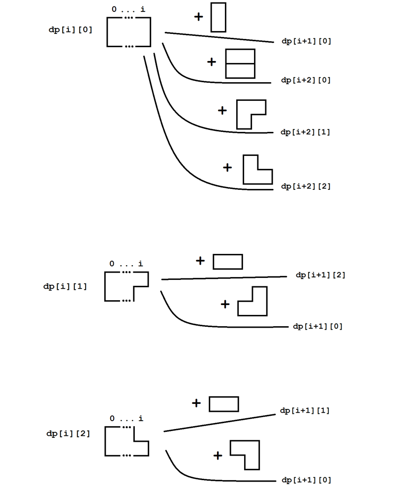

790. Domino and Tromino Tiling

We have two types of tiles: a 2x1 domino shape, and an "L" tromino shape. These shapes may be rotated.

```
XX  <- domino

XX  <- "L" tromino
X
```

Given `N`, how many ways are there to tile a `2 x N` board? **Return your answer modulo 10^9 + 7**.

(In a tiling, every square must be covered by a tile. Two tilings are different if and only if there are two 4-directionally adjacent cells on the board such that exactly one of the tilings has both squares occupied by a tile.)

**Example:**

```
Input: 3
Output: 5
Explanation: 
The five different ways are listed below, different letters indicates different tiles:
XYZ XXZ XYY XXY XYY
XYZ YYZ XZZ XYY XXY
```

**Note:**

* `N` will be in range `[1, 1000]`.

# Submissions
---
**Solution 1: (DP Bottom-Up)**

The idea of this problem is demonstrated in the picture below, after some failure and this is the thing I finally came up.


```
Runtime: 48 ms
Memory Usage: 13.9 MB
```
```python
class Solution:
    def numTilings(self, N: int) -> int:
        MOD = 10**9 + 7
        if N == 1:
            return 1
        dp = [[0]*3 for _ in range(N+2)]
        # base
        dp[0][0] = dp[1][0] = dp[1][1] = dp[1][2] = 1
        # rest
        for i in range(N):
            for j in range(3):
                if j == 0:
                    dp[i+1][0] += dp[i][0]
                    dp[i+2][0] += dp[i][0]
                    dp[i+2][1] += dp[i][0]
                    dp[i+2][2] += dp[i][0]
                elif j == 1:
                    dp[i+1][2] += dp[i][1]
                    dp[i+1][0] += dp[i][1]
                elif j == 2:
                    dp[i+1][1] += dp[i][2]
                    dp[i+1][0] += dp[i][2]
                        
        return dp[N-1][0] % MOD 
```

**Solution 2: (DP Bottom-Up)**

Tiles can end at column `i` with one of the three ending states:

```
Ending state A:
      x
...   x
      i
Ending state B:
      x
...   xx
       i
Ending state C:
      xx
...   x
       i
```

Let `S[i]` be the number of ways to get to state `S` at `i`'th column, where `S` can be `A`, `B` or `C`. Then, we just need to write down all posiible transitions between the states.

```
Runtime: 28 ms
Memory Usage: 12.8 MB
```
```python
class Solution:
    def numTilings(self, N: int) -> int:
        MOD = 10**9 + 7
        A = [0 for i in range(N+1)]
        B = [0 for i in range(N+1)]
        C = [0 for i in range(N+1)]
        A[0] = 1
        for i in range(1, N+1):
            A[i] = (B[i-1] + C[i-1] + A[i-1] + (A[i-2] if i >=2 else 0)) % MOD
            B[i] = (C[i-1] + (A[i-2] if i >=2 else 0)) % MOD
            C[i] = (B[i-1] + (A[i-2] if i >=2 else 0)) % MOD
        return A[-1]
```

**Solution 3: (DP Bottom-Up)**
```
Runtime: 0 ms
Memory Usage: 5.7 MB
```
```c


int numTilings(int n){
    if(n <= 1) return 1;
    int modulo = 1e9 + 7;
    long dp[n + 1];
    dp[0] = 1;
    dp[1] = 1;
    dp[2] = 2;
    for(int i = 3; i <= n; i++)
        dp[i] = (dp[i - 1] * 2 + dp[i - 3]) % modulo;
    return dp[n];
}
```

**Solution 4: (DP Bottom-Up)**
```
Runtime: 47 ms
Memory: 13.9 MB
```
```python
class Solution:
    def numTilings(self, n: int) -> int:
        MOD = 10**9 + 7
        dp = [[0]*3 for _ in range(n+1)]
        dp[0][0] = 1
        for i in range(1, n+1):
            dp[i][0] = ((dp[i-2][0] if i >= 2 else 0) + dp[i-1][0] + dp[i-1][1] + dp[i-1][2]) % MOD
            dp[i][1] = ((dp[i-2][0] if i >= 2 else 0) + dp[i-1][2]) % MOD
            dp[i][2] = ((dp[i-2][0] if i >= 2 else 0) + dp[i-1][1]) % MOD
        return dp[-1][0]
```

**Solution 5: (DP Bottom-Up)**

    dp[i][0]
        x x   .. 1      .. 1 1       ...... 1    .... 1 1
        x x = .. 1    + .. 2 2    +  .... 1 1  + ...... 1
          ^i   ^i-1     ^i-2              ^i-1        ^i-1
    dp[i][1]
        x x   .. 1 1    .. 1 1
        x   = .. 1    + .... 
          ^i   ^i-2        ^i-1
    dp[i][2]
        x     .. 1      ....
        x x = .. 1 1  + .. 1 1
          ^i   ^i-2        ^i-1
    dp:
      0 1 2 3  4  5
      -------------
      1 1 2 5 11 24
          1 2  4
          1 2  4

```
Runtime: 3 ms, Beats 17.99%
Memory: 10.45, MB Beats 8.88%
```
```c++
class Solution {
public:
    int numTilings(int n) {
        int MOD = 1e9 + 7, i;
        vector<vector<long long>> dp(n+1, vector<long long>(3));
        dp[0][0] = 1;
        for (i = 1; i <= n; i ++) {
            dp[i][0] = dp[i-1][0] + (i >= 2 ? dp[i-2][0] : 0) + dp[i-1][1] + dp[i-1][2];
            dp[i][0] %= MOD;
            dp[i][1] = dp[i-1][2] + (i >= 2 ? dp[i-2][0] : 0);
            dp[i][1] %= MOD;
            dp[i][2] = dp[i-1][1] + (i >= 2 ? dp[i-2][0] : 0);
            dp[i][2] %= MOD;
        }
        return dp[n][0];
    }
```

**Solution 6: (DP Bottom-Up)**

      0  1  2  3  4  5
     ------------------
dp
      1  1  2  5 11 24
            1  2  4
            1  2  4
            
         x |  x x x    | x
         x |  x x      | x x
         ^ |      ^i   |   ^
           |    ^i-1   |

    dp[i][0] = dp[i-1][0] + dp[i-2][0] + dp[i-1][1] + dp[i-1][2]
    dp[i][1] = dp[i-2][0] + dp[i-1][2]
    dp[i][2] = dp[i-2][0] + dp[i-1][1]


```
Runtime: 0 ms, Beats 100.00%
Memory: 7.88 MB, Beats 89.34%
```
```c++
class Solution {
public:
    int numTilings(int n) {
        if (n <= 2) {
            return n;
        }
        int MOD = 1e9 + 7, i;
        array<long long,3> ppre, pre, dp;
        ppre = {1, 0, 0};
        pre = {1, 0, 0};
        for (i = 2; i <= n; i ++) {
            dp[0] = (pre[0] + ppre[0] + pre[1] + pre[2]) % MOD;
            dp[1] = (ppre[0] + pre[2]) % MOD;
            dp[2] = (ppre[0] + pre[1]) % MOD;
            ppre = pre;
            pre = dp;
        }
        return pre[0];
    }
};
```
