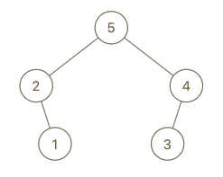

998. Maximum Binary Tree II

We are given the `root` node of a maximum tree: a tree where every node has a value greater than any other value in its subtree.

Just as in the previous problem, the given tree was constructed from an `list A` (`root = Construct(A)`) recursively with the following `Construct(A)` routine:

* If `A` is empty, return null.
* Otherwise, let `A[i]` be the largest element of A.  Create a root node with value `A[i]`.
* The left child of root will be `Construct([A[0], A[1], ..., A[i-1]])`
* The right child of root will be `Construct([A[i+1], A[i+2], ..., A[A.length - 1]])`
* Return `root`.

Note that we were not given `A` directly, only a root node `root = Construct(A)`.

Suppose `B` is a copy of `A` with the value val appended to it.  It is guaranteed that `B` has unique values.

Return `Construct(B)`.

 

**Example 1:**


```
Input: root = [4,1,3,null,null,2], val = 5
Output: [5,4,null,1,3,null,null,2]
Explanation: A = [1,4,2,3], B = [1,4,2,3,5]
```

**Example 2:**


```
Input: root = [5,2,4,null,1], val = 3
Output: [5,2,4,null,1,null,3]
Explanation: A = [2,1,5,4], B = [2,1,5,4,3]
```

**Example 3:**



```
Input: root = [5,2,3,null,1], val = 4
Output: [5,2,4,null,1,3]
Explanation: A = [2,1,5,3], B = [2,1,5,3,4]
``` 

**Note:**

* `1 <= B.length <= 100`

# Submissions
---
**Solution 1:**
```
Runtime: 36 ms
Memory Usage: 12.7 MB
```
```python
# Definition for a binary tree node.
# class TreeNode:
#     def __init__(self, x):
#         self.val = x
#         self.left = None
#         self.right = None

class Solution:
    def insertIntoMaxTree(self, root: TreeNode, val: int) -> TreeNode:
        # dissemble tree A
        def dissemble(node):
            return dissemble(node.left) + [node.val] + dissemble(node.right) if node else []
        
        # construct tree B with val appended. This part is similar to previous question.
        def construct(L):
            if not L: return None
            max_val = max(L)
            max_index = L.index(max_val)
            root = TreeNode(max_val)
            root.left = construct(L[: max_index])
            root.right = construct(L[max_index + 1 :])
            return root

        return construct(dissemble(root) + [val])
```