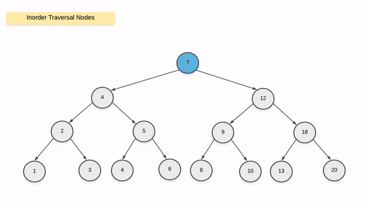
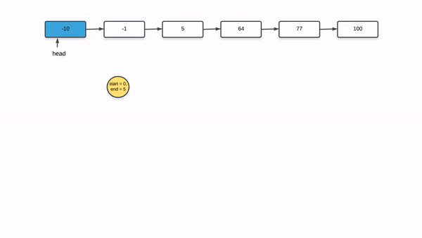

109. Convert Sorted List to Binary Search Tree

Given a singly linked list where elements are sorted in ascending order, convert it to a height balanced BST.

For this problem, a height-balanced binary tree is defined as a binary tree in which the depth of the two subtrees of every node never differ by more than 1.

**Example:**
```
Given the sorted linked list: [-10,-3,0,5,9],

One possible answer is: [0,-3,9,-10,null,5], which represents the following height balanced BST:

      0
     / \
   -3   9
   /   /
 -10  5
```

# Solution
---
## Approach 1: Recursion
**Intuition**

The important condition that we have to adhere to in this problem is that we have to create a height balanced binary search tree using the set of nodes given to us in the form of a linked list. The good thing is that the nodes in the linked list are sorted in ascending order.

As we know, a binary search tree is essentially a rooted binary tree with a very special property or relationship amongst its nodes. For a given node of the binary search tree, it's value must be \ge≥ the value of all the nodes in the left subtree and \le≤ the value of all the nodes in the right subtree. Since a binary tree has a recursive substructure, so does a BST i.e. all the subtrees are binary search trees in themselves.

The main idea in this approach and the next is that:
> the middle element of the given list would form the root of the binary search tree. All the elements to the left of the middle element would form the left subtree recursively. Similarly, all the elements to the right of the middle element will form the right subtree of the binary search tree. This would ensure the height balance required in the resulting binary search tree.

**Algorithm**

1. Since we are given a linked list and not an array, we don't really have access to the elements of the list using indexes. We want to know the middle element of the linked list.
1. We can use the two pointer approach for finding out the middle element of a linked list. Essentially, we have two pointers called slow_ptr and fast_ptr. The slow_ptr moves one node at a time whereas the fast_ptr moves two nodes at a time. By the time the fast_ptr reaches the end of the linked list, the slow_ptr would have reached the middle element of the linked list. For an even sized list, any of the two middle elements can act as the root of the BST.
1. Once we have the middle element of the linked list, we disconnect the portion of the list to the left of the middle element. The way we do this is by keeping a prev_ptr as well which points to one node before the slow_ptr i.e. prev_ptr.next = slow_ptr. For disconnecting the left portion we simply do prev_ptr.next = None
1. We only need to pass the head of the linked list to the function that converts it to a height balances BST. So, we recurse on the left half of the linked list by passing the original head of the list and on the right half by passing slow_ptr.next as the head.

Let's look at this algorithm in action on a sample linked list.


```python
# Definition for singly-linked list.
# class ListNode:
#     def __init__(self, x):
#         self.val = x
#         self.next = None

# Definition for a binary tree node.
# class TreeNode:
#     def __init__(self, x):
#         self.val = x
#         self.left = None
#         self.right = None

class Solution:

    def findMiddle(self, head):

        # The pointer used to disconnect the left half from the mid node.
        prevPtr = None
        slowPtr = head
        fastPtr = head

        # Iterate until fastPr doesn't reach the end of the linked list.
        while fastPtr and fastPtr.next:
            prevPtr = slowPtr
            slowPtr = slowPtr.next
            fastPtr = fastPtr.next.next

        # Handling the case when slowPtr was equal to head.
        if prevPtr:
            prevPtr.next = None

        return slowPtr


    def sortedListToBST(self, head):
        """
        :type head: ListNode
        :rtype: TreeNode
        """

        # If the head doesn't exist, then the linked list is empty
        if not head:
            return None

        # Find the middle element for the list.
        mid = self.findMiddle(head)

        # The mid becomes the root of the BST.
        node = TreeNode(mid.val)

        # Base case when there is just one element in the linked list
        if head == mid:
            return node

        # Recursively form balanced BSTs using the left and right halves of the original list.
        node.left = self.sortedListToBST(head)
        node.right = self.sortedListToBST(mid.next)
        return node
```

**Complexity Analysis**

* Time Complexity: $O(N\log{}N)$. Suppose our linked list consists of $N$ elements. For every list we pass to our recursive function, we have to calculate the middle element for that list. For a list of size $N$, it takes $N/2$ steps to find the middle element i.e. $O(N)$ to find the mid. We do this for every half of the original linked list. From the looks of it, this seems to be an $O(N^2)$ algorithm. However, on closer analysis, it turns out to be a bit more efficient than $O(N^2)$.

Let's look at the number of operations that we have to perform on each of the halves of the linked list. As we mentioned earlier, it takes $N/2$ steps to find the middle of a linked list with $N$ elements. After finding the middle element, we are left with two halves of size $N/2$ each. Then, we find the middle element for both of these halves and it would take a total of $2 \times N/4$ steps for that. And similarly for the smaller sublists that keep forming recursively. This would give us the following series of operations for a list of size $N$.

$\frac{N}{2} + 2\cdot\frac{N}{4} + 4\cdot\frac{N}{8} + 8\cdot\frac{N}{16}...$

Essentially, this is done $logN$ times since we split the linked list in half every time. Hence, the above equation becomes:

$$
\sum_{i=1}^{\log N}2^{i-1}\cdot\frac{N}{2^i}
\\= \sum_{i=1}^{\log N}\frac{N}{2}
\\= \frac{N}{2}\log N
\\= O(N\log N)
$$

* Space Complexity: $O(\log N)$. Since we are resorting to recursion, there is always the added space complexity of the recursion stack that comes into picture. This could have been $O(N)$ for a skewed tree, but the question clearly states that we need to maintain the height balanced property. This ensures the height of the tree to be bounded by $O(\log N)$. Hence, the space complexity is $O(\log N)$.

## Approach 2: Recursion + Conversion to Array
This approach is a classic example of the time-space tradeoff.

> You can get the time complexity down by using more space.

That's exactly what we're going to do in this approach. Essentially, we will convert the given linked list into an array and then use that array to form our binary search tree. In an array fetching the middle element is a $O(1)$ operation and this will bring down the overall time complexity.

**Algorithm**
* Convert the given linked list into an array. Let's call the beginning and the end of the array as `left` and `right`
* Find the middle element as `(left + right) / 2`. Let's call this element as `mid`. This is a $O(1)$ time operation and is the only major improvement over the previous algorithm.
* The middle element forms the root of the BST.
* Recursively form binary search trees on the two halves of the array represented by `(left, mid - 1)` and `(mid + 1, right)` respectively.

Let's look at the implementation for this algorithm and then we will get to the complexity analysis.

```python
# Definition for singly-linked list.
# class ListNode:
#     def __init__(self, x):
#         self.val = x
#         self.next = None

# Definition for a binary tree node.
# class TreeNode:
#     def __init__(self, x):
#         self.val = x
#         self.left = None
#         self.right = None

class Solution:
    # Convert the given linked list to an array
    def mapListToValues(self, head):
        vals = []
        while head:
            vals.append(head.val)
            head = head.next
        return vals    

    def sortedListToBST(self, head):
        """
        :type head: ListNode
        :rtype: TreeNode
        """

        # Form an array out of the given linked list and then
        # use the array to form the BST.
        values = self.mapListToValues(head)

        # l and r represent the start and end of the given array
        def convertListToBST(l, r):

            # Invalid case
            if l > r:
                return None

            # Middle element forms the root.
            mid = (l + r) // 2
            node = TreeNode(values[mid])

            # Base case for when there is only one element left in the array
            if l == r:
                return node

            # Recursively form BST on the two halves
            node.left = convertListToBST(l, mid - 1)
            node.right = convertListToBST(mid + 1, r)
            return node
        return convertListToBST(0, len(values) - 1)
```

** Complexity Analysis** 

* Time Complexity: The time complexity comes down to just $O(N)$ now since we convert the linked list to an array initially and then we convert the array into a BST. Accessing the middle element now takes $O(1)$ time and hence the time complexity comes down.
* Space Complexity: Since we used extra space to bring down the time complexity, the space complexity now goes up to $O(N)$ as opposed to just $O(\log N)$ in the previous solution. This is due to the array we construct initially.

## Approach 3: Inorder Simulation
**Intuition**

As we know, there are three different types of traversals for a binary tree:

* Inorder
* Preorder and
* Postorder traversals.

The inorder traversal on a binary search tree leads to a very interesting outcome.
> Elements processed in the inorder fashion on a binary search tree turn out to be sorted in ascending order.

The approach listed here make use of this idea to formulate the construction of a binary search tree. The reason we are able to use this idea in this problem is because we are given a sorted linked list initially.

Before looking at the algorithm, let us look at how the inorder traversal actually leads to a sorted order of nodes' values.

The critical idea based on the inorder traversal that we will exploit to solve this problem, is:
> We know that the leftmost element in the inorder traversal has to be the head of our given linked list. Similarly, the next element in the inorder traversal will be the second element in the linked list and so on. This is made possible because the initial list given to us is sorted in ascending order.

Now that we have an idea about the relationship between the inorder traversal of a binary search tree and the numbers being sorted in ascending order, let's get to the algorithm.



**Algorithm**

Let's quickly look at a pseudo-code to make the algorithm simple to understand.
```
➔ function formBst(start, end)
➔      mid = (start + end) / 2
➔      formBst(start, mid - 1)
➔
➔      TreeNode(head.val)
➔      head = head.next
➔       
➔      formBst(mid + 1, end)
➔
```

1. Iterate over the linked list to find out it's length. We will make use of two different pointer variables here to mark the beginning and the end of the list. Let's call them `start` and `end` with their initial values being `0` and `length - 1` respectively.
1. Remember, we have to simulate the inorder traversal here. We can find out the middle element by using `(start + end) / 2`. Note that we don't really find out the middle node of the linked list. We just have a variable telling us the index of the middle element. We simply need this to make recursive calls on the two halves.
1. Recurse on the left half by using `start`, `mid - 1` as the starting and ending points.
1. The invariance that we maintain in this algorithm is that whenever we are done building the left half of the BST, the head pointer in the linked list will point to the root node or the middle node (which becomes the root). So, we simply use the current value pointed to by head as the root node and progress the head node by once i.e. `head = head.next`
1. We recurse on the right hand side using `mid + 1, end` as the starting and ending points.

Let's look at an animation to make things even clearer.



```python
# Definition for singly-linked list.
# class ListNode:
#     def __init__(self, x):
#         self.val = x
#         self.next = None

# Definition for a binary tree node.
# class TreeNode:
#     def __init__(self, x):
#         self.val = x
#         self.left = None
#         self.right = None

class Solution:
    def findSize(self, head):
        ptr = head
        c = 0
        while ptr:
            ptr = ptr.next
            c += 1
        return c


    def sortedListToBST(self, head):
        """
        :type head: ListNode
        :rtype: TreeNode
        """

        # Get the size of the linked list first
        size = self.findSize(head)

        # Recursively form a BST out of linked list from l --> r
        def convert(l, r):
            nonlocal head

            # Invalid case
            if l > r:
                return None

            mid = (l + r) // 2

            # First step of simulated inorder traversal. Recursively form
            # the left half
            left = convert(l, mid - 1)

            # Once left half is traversed, process the current node
            node = TreeNode(head.val)   
            node.left = left

            # Maintain the invariance mentioned in the algorithm
            head = head.next

            # Recurse on the right hand side and form BST out of them
            node.right = convert(mid + 1, r)
            return node
        return convert(0, size - 1)
```

**Complexity Analysis**

* Time Complexity: The time complexity is still $O(N)$ since we still have to process each of the nodes in the linked list once and form corresponding BST nodes.
* Space Complexity: $O(\log N)$ since now the only extra space is used by the recursion stack and since we are building a height balanced BST, the height is bounded by $\log N$.

# Submissions
---
**Solution 1: (Inorder Simulation, Linked List)**
```
Runtime: 124 ms
Memory Usage: 18.9 MB
```
```python
# Definition for singly-linked list.
# class ListNode:
#     def __init__(self, x):
#         self.val = x
#         self.next = None

# Definition for a binary tree node.
# class TreeNode:
#     def __init__(self, x):
#         self.val = x
#         self.left = None
#         self.right = None

class Solution:
    
    def findSize(self, head):
        ptr = head
        c = 0
        while ptr:
            ptr = ptr.next
            c += 1
        return c
        
    def sortedListToBST(self, head: ListNode) -> TreeNode:        
        
        # Get the size of the linked list first
        size = self.findSize(head)

        # Recursively form a BST out of linked list from l --> r
        def convert(l, r):
            nonlocal head

            # Invalid case
            if l > r:
                return None

            mid = (l + r) // 2

            # First step of simulated inorder traversal. Recursively form
            # the left half
            left = convert(l, mid - 1)

            # Once left half is traversed, process the current node
            node = TreeNode(head.val)   
            node.left = left

            # Maintain the invariance mentioned in the algorithm
            head = head.next

            # Recurse on the right hand side and form BST out of them
            node.right = convert(mid + 1, r)
            return node
        return convert(0, size - 1)
```