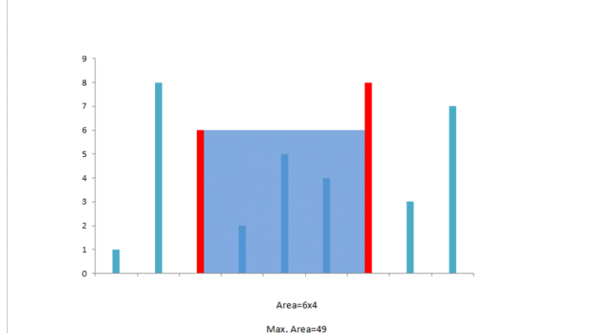

11. Container With Most Water

Given n non-negative integers $a_1$, $a_2$, ..., $a_n$ , where each represents a point at coordinate $(i, a_i)$. n vertical lines are drawn such that the two endpoints of line i is at $(i, a_i)$ and $(i, 0)$. Find two lines, which together with x-axis forms a container, such that the container contains the most water.

Note: You may not slant the container and n is at least 2.


The above vertical lines are represented by array [1,8,6,2,5,4,8,3,7]. In this case, the max area of water (blue section) the container can contain is 49.

**Example:**
```
Input: [1,8,6,2,5,4,8,3,7]
Output: 49
```

# Summary
We have to maximize the Area that can be formed between the vertical lines using the shorter line as length and the distance between the lines as the width of the rectangle forming the area.

# Solution
---
## Approach 1: Brute Force
**Algorithm**

In this case, we will simply consider the area for every possible pair of the lines and find out the maximum area out of those.

```java
public class Solution {
    public int maxArea(int[] height) {
        int maxarea = 0;
        for (int i = 0; i < height.length; i++)
            for (int j = i + 1; j < height.length; j++)
                maxarea = Math.max(maxarea, Math.min(height[i], height[j]) * (j - i));
        return maxarea;
    }
}
```

**Complexity Analysis**
* Time complexity : $O(n^2)$. Calculating area for all $\frac{n(n-1)}{2}$ height pairs.
* Space complexity : $O(1)$. Constant extra space is used.

## Approach 2: Two Pointer Approach
**Algorithm**

The intuition behind this approach is that the area formed between the lines will always be limited by the height of the shorter line. Further, the farther the lines, the more will be the area obtained.

We take two pointers, one at the beginning and one at the end of the array constituting the length of the lines. Futher, we maintain a variable $\text{maxarea}$ to store the maximum area obtained till now. At every step, we find out the area formed between them, update $\text{maxarea}$ and move the pointer pointing to the shorter line towards the other end by one step.

The algorithm can be better understood by looking at the example below:

`1 8 6 2 5 4 8 3 7`





How this approach works?

Initially we consider the area constituting the exterior most lines. Now, to maximize the area, we need to consider the area between the lines of larger lengths. If we try to move the pointer at the longer line inwards, we won't gain any increase in area, since it is limited by the shorter line. But moving the shorter line's pointer could turn out to be beneficial, as per the same argument, despite the reduction in the width. This is done since a relatively longer line obtained by moving the shorter line's pointer might overcome the reduction in area caused by the width reduction.

For further clarification click here and for the proof click [here](https://leetcode.com/problems/container-with-most-water/discuss/6089/Anyone-who-has-a-O(N)-algorithm/7268).
```java
public class Solution {
    public int maxArea(int[] height) {
        int maxarea = 0, l = 0, r = height.length - 1;
        while (l < r) {
            maxarea = Math.max(maxarea, Math.min(height[l], height[r]) * (r - l));
            if (height[l] < height[r])
                l++;
            else
                r--;
        }
        return maxarea;
    }
}
```

**Complexity Analysis**

* Time complexity : $O(n)$. Single pass.

* Space complexity : $O(1)$. Constant space is used.

# Submissions
---
**Solution 1: (Two Pointers)**
```
Runtime: 80 ms
Memory Usage: N/A
```
```python
class Solution:
    def maxArea(self, height):
        """
        :type height: List[int]
        :rtype: int
        """
        left, right, res = 0, len(height)-1, 0
        while left < right:
            area = (right-left) * min(height[right], height[left])
            res = max(res, area)
            if height[right] < height[left]: right-=1  
            else: left+=1
        return res
```

**Solution 2: (Two Pointers)**
```
Runtime: 76 ms
Memory Usage: 11.7 MB
```
```c
#define min(_a, _b) ((_a) <= (_b) ? (_a) : (_b))
int maxArea(int* height, int heightSize){
    int left = 0, right = heightSize-1;
    int ans = 0, h = 0;
    while (left < right) {
        h = min(height[left], height[right]);
        if (ans < h*(right-left)) {
            ans = h*(right-left);
        }
        if (h == height[left]) {
            left += 1;
        } else {
            right -= 1;
        }
    }
    return ans;
}
```
