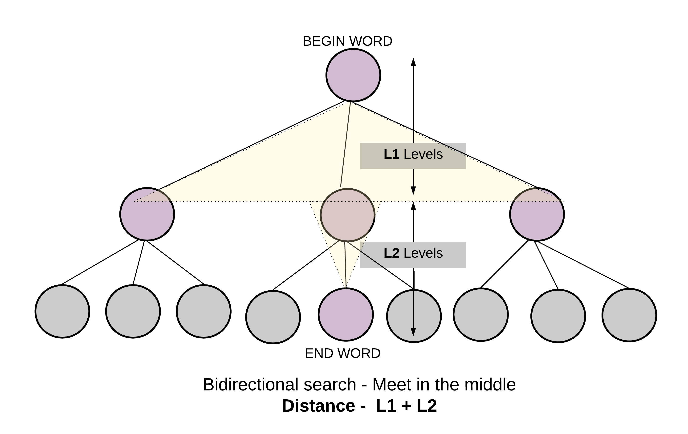

127. Word Ladder

Given two words (`beginWord` and `endWord`), and a dictionary's word list, find the length of shortest transformation sequence from `beginWord` to `endWord`, such that:

* Only one letter can be changed at a time.
* Each transformed word must exist in the word list. Note that `beginWord` is not a transformed word.

**Note:**

* Return `0` if there is no such transformation sequence.
* All words have the same length.
* All words contain only lowercase alphabetic characters.
* You may assume no duplicates in the word list.
* You may assume `beginWord` and `endWord` are non-empty and are not the same.

**Example 1:**
```
Input:
beginWord = "hit",
endWord = "cog",
wordList = ["hot","dot","dog","lot","log","cog"]

Output: 5

Explanation: As one shortest transformation is "hit" -> "hot" -> "dot" -> "dog" -> "cog",
return its length 5.
```

**Example 2:**
```
Input:
beginWord = "hit"
endWord = "cog"
wordList = ["hot","dot","dog","lot","log"]

Output: 0

Explanation: The endWord "cog" is not in wordList, therefore no possible transformation.
```

# Solution
---
We are given a `beginWord` and an `endWord`. Let these two represent start node and end node of a graph. We have to reach from the `start node` to the `end node` using some intermediate nodes/words. The intermediate nodes are determined by the wordList given to us. The only condition for every step we take on this ladder of words is the current word should change by just `one letter`.


We will essentially be working with an undirected and unweighted graph with words as nodes and edges between words which differ by just one letter. The problem boils down to finding the shortest path from a start node to a destination node, if there exists one. Hence it can be solved using `Breadth First Search` approach.

One of the most important step here is to figure out how to find adjacent nodes i.e. words which differ by one letter. To efficiently find the neighboring nodes for any given word we do some pre-processing on the words of the given `wordList`. The pre-processing involves replacing the letter of a word by a non-alphabet say, `*`.


This pre-processing helps to form generic states to represent a single letter change.

For e.g. `Dog ----> D*g <---- Dig`

Both Dog and Dig map to the same intermediate or generic state `D*g`.

The preprocessing step helps us find out the generic one letter away nodes for any word of the word list and hence making it easier and quicker to get the adjacent nodes. Otherwise, for every word we will have to iterate over the entire word list and find words that differ by one letter. That would take a lot of time. This preprocessing step essentially builds the adjacency list first before beginning the breadth first search algorithm.

For eg. While doing BFS if we have to find the adjacent nodes for `Dug` we can first find all the generic states for `Dug`.

* `Dug => *ug`
* `Dug => D*g`
* `Dug => Du*`

The second transformation `D*g` could then be mapped to `Dog` or `Dig`, since all of them share the same generic state. Having a common generic transformation means two words are connected and differ by one letter.

## Approach 1: Breadth First Search
**Intuition**

Start from `beginWord` and search the `endWord` using BFS.

**Algorithm**

1. Do the pre-processing on the given wordList and find all the possible generic/intermediate states. Save these intermediate states in a dictionary with key as the intermediate word and value as the list of words which have the same intermediate word.

1. Push a tuple containing the `beginWord` and `1` in a queue. The `1` represents the level number of a node. We have to return the level of the `endNode` as that would represent the shortest sequence/distance from the beginWord.

1. To prevent cycles, use a `visited` dictionary.

1. While the queue has elements, get the front element of the queue. Let's call this word as `current_word`.

1. Find all the generic transformations of the `current_word` and find out if any of these transformations is also a transformation of other words in the word list. This is achieved by checking the `all_combo_dict`.

1. The list of words we get from `all_combo_dict` are all the words which have a common intermediate state with the `current_word`. These new set of words will be the adjacent nodes/words to `current_word` and hence added to the queue.

1. Hence, for each word in this list of intermediate words, append `(word, level + 1)` into the queue where level is the level for the `current_word`.

1. Eventually if you reach the desired word, its level would represent the shortest transformation sequence length.

>Termination condition for standard BFS is finding the end word.

```python
from collections import defaultdict
class Solution(object):
    def ladderLength(self, beginWord, endWord, wordList):
        """
        :type beginWord: str
        :type endWord: str
        :type wordList: List[str]
        :rtype: int
        """

        if endWord not in wordList or not endWord or not beginWord or not wordList:
            return 0

        # Since all words are of same length.
        L = len(beginWord)

        # Dictionary to hold combination of words that can be formed,
        # from any given word. By changing one letter at a time.
        all_combo_dict = defaultdict(list)
        for word in wordList:
            for i in range(L):
                # Key is the generic word
                # Value is a list of words which have the same intermediate generic word.
                all_combo_dict[word[:i] + "*" + word[i+1:]].append(word)


        # Queue for BFS
        queue = collections.deque([(beginWord, 1)])
        # Visited to make sure we don't repeat processing same word.
        visited = {beginWord: True}
        while queue:
            current_word, level = queue.popleft()      
            for i in range(L):
                # Intermediate words for current word
                intermediate_word = current_word[:i] + "*" + current_word[i+1:]

                # Next states are all the words which share the same intermediate state.
                for word in all_combo_dict[intermediate_word]:
                    # If at any point if we find what we are looking for
                    # i.e. the end word - we can return with the answer.
                    if word == endWord:
                        return level + 1
                    # Otherwise, add it to the BFS Queue. Also mark it visited
                    if word not in visited:
                        visited[word] = True
                        queue.append((word, level + 1))
                all_combo_dict[intermediate_word] = []
        return 0
```

**Complexity Analysis**

* Time Complexity: $O(M \times N)$, where $M$ is the length of words and $N$ is the total number of words in the input word list. Finding out all the transformations takes $M$ iterations for each of the $N$ words. Also, breadth first search in the worst case might go to each of the $N$ words.

* Space Complexity: $O(M \times N)$, to store all MM transformations for each of the $N$ words, in the `all_combo_dict` dictionary. `Visited` dictionary is of $N$ size. Queue for BFS in worst case would need space for all NN words.

## Approach 2: Bidirectional Breadth First Search
**Intuition**

The graph formed from the nodes in the dictionary might be too big. The search space considered by the breadth first search algorithm depends upon the branching factor of the nodes at each level. If the branching factor remains the same for all the nodes, the search space increases exponentially along with the number of levels. Consider a simple example of a binary tree. With each passing level in a complete binary tree, the number of nodes increase in powers of `2`.

We can considerably cut down the search space of the standard breadth first search algorithm if we launch two simultaneous BFS. One from the `beginWord` and one from the `endWord`. We progress one node at a time from both sides and at any point in time if we find a common node in both the searches, we stop the search. This is known as `bidirectional BFS` and it considerably cuts down on the search space and hence reduces the time and space complexity.


**Algorithm**

1. The algorithm is very similar to the standard BFS based approach we saw earlier.

1. The only difference is we now do BFS starting two nodes instead of one. This also changes the termination condition of our search.

1. We now have two visited dictionaries to keep track of nodes visited from the search starting at the respective ends.

1. If we ever find a node/word which is in the visited dictionary of the parallel search we terminate our search, since we have found the meet point of this bidirectional search. It's more like meeting in the middle instead of going all the way through.

    >Termination condition for bidirectional search is finding a word which is already been seen by the parallel search.

1. The shortest transformation sequence is the sum of levels of the meet point node from both the ends. Thus, for every visited node we save its level as value in the visited dictionary.



```python
from collections import defaultdict
class Solution(object):
    def __init__(self):
        self.length = 0
        # Dictionary to hold combination of words that can be formed,
        # from any given word. By changing one letter at a time.
        self.all_combo_dict = defaultdict(list)

    def visitWordNode(self, queue, visited, others_visited):
        current_word, level = queue.popleft()
        for i in range(self.length):
            # Intermediate words for current word
            intermediate_word = current_word[:i] + "*" + current_word[i+1:]

            # Next states are all the words which share the same intermediate state.
            for word in self.all_combo_dict[intermediate_word]:
                # If the intermediate state/word has already been visited from the
                # other parallel traversal this means we have found the answer.
                if word in others_visited:
                    return level + others_visited[word]
                if word not in visited:
                    # Save the level as the value of the dictionary, to save number of hops.
                    visited[word] = level + 1
                    queue.append((word, level + 1))
        return None

    def ladderLength(self, beginWord, endWord, wordList):
        """
        :type beginWord: str
        :type endWord: str
        :type wordList: List[str]
        :rtype: int
        """

        if endWord not in wordList or not endWord or not beginWord or not wordList:
            return 0

        # Since all words are of same length.
        self.length = len(beginWord)

        for word in wordList:
            for i in range(self.length):
                # Key is the generic word
                # Value is a list of words which have the same intermediate generic word.
                self.all_combo_dict[word[:i] + "*" + word[i+1:]].append(word)


        # Queues for birdirectional BFS
        queue_begin = collections.deque([(beginWord, 1)]) # BFS starting from beginWord
        queue_end = collections.deque([(endWord, 1)]) # BFS starting from endWord

        # Visited to make sure we don't repeat processing same word
        visited_begin = {beginWord: 1}
        visited_end = {endWord: 1}
        ans = None

        # We do a birdirectional search starting one pointer from begin
        # word and one pointer from end word. Hopping one by one.
        while queue_begin and queue_end:

            # One hop from begin word
            ans = self.visitWordNode(queue_begin, visited_begin, visited_end)
            if ans:
                return ans
            # One hop from end word
            ans = self.visitWordNode(queue_end, visited_end, visited_begin)
            if ans:
                return ans

        return 0
```

**Complexity Analysis**

* Time Complexity: $O(M \times N)$, where $M$ is the length of words and $N$ is the total number of words in the input word list. Similar to one directional, bidirectional also takes M*NM∗N for finding out all the transformations. But the search time reduces to half, since the two parallel searches meet somewhere in the middle.

* Space Complexity: $O(M \times N)$, to store all $M$ transformations for each of the $N$ words, in the `all_combo_dict` dictionary, same as one directional. But bidirectional reduces the search space. It narrows down because of meeting in the middle.

# Submissions
---
**Solution: (Bidirectional BFS)**
```
Runtime: 96 ms
Memory Usage: 16.2 MB
```
```python
class Solution:
    def __init__(self):
        self.length = 0
        # Dictionary to hold combination of words that can be formed,
        # from any given word. By changing one letter at a time.
        self.all_combo_dict = collections.defaultdict(list)

    def visitWordNode(self, queue, visited, others_visited):
        current_word, level = queue.popleft()
        for i in range(self.length):
            # Intermediate words for current word
            intermediate_word = current_word[:i] + "*" + current_word[i+1:]

            # Next states are all the words which share the same intermediate state.
            for word in self.all_combo_dict[intermediate_word]:
                # If the intermediate state/word has already been visited from the
                # other parallel traversal this means we have found the answer.
                if word in others_visited:
                    return level + others_visited[word]
                if word not in visited:
                    # Save the level as the value of the dictionary, to save number of hops.
                    visited[word] = level + 1
                    queue.append((word, level + 1))
        return None
    
    def ladderLength(self, beginWord: str, endWord: str, wordList: List[str]) -> int:
        
        if endWord not in wordList or not endWord or not beginWord or not wordList:
            return 0

        # Since all words are of same length.
        self.length = len(beginWord)

        for word in wordList:
            for i in range(self.length):
                # Key is the generic word
                # Value is a list of words which have the same intermediate generic word.
                self.all_combo_dict[word[:i] + "*" + word[i+1:]].append(word)


        # Queues for birdirectional BFS
        queue_begin = collections.deque([(beginWord, 1)]) # BFS starting from beginWord
        queue_end = collections.deque([(endWord, 1)]) # BFS starting from endWord

        # Visited to make sure we don't repeat processing same word
        visited_begin = {beginWord: 1}
        visited_end = {endWord: 1}
        ans = None

        # We do a birdirectional search starting one pointer from begin
        # word and one pointer from end word. Hopping one by one.
        while queue_begin and queue_end:

            # One hop from begin word
            ans = self.visitWordNode(queue_begin, visited_begin, visited_end)
            if ans:
                return ans
            # One hop from end word
            ans = self.visitWordNode(queue_end, visited_end, visited_begin)
            if ans:
                return ans

        return 0
```

**Solution 2: (BFS)**
```
Runtime: 244 ms
Memory Usage: 7.6 MB
```
```c
typedef struct queue{
    int loc;
    int step;
    struct queue *next;
}queue;

struct queue *head = NULL;
struct queue *tail = NULL;

void pop(){
    if(head){
        struct queue *temp = head;
        head = head->next;
        free(temp);
    }
}

void push (struct queue * q){
    if(!head){
        head = q;
        tail = q;
        head -> next = NULL;
        tail -> next = NULL;
    }
    else{
        tail-> next = q;
        tail = tail->next;
        tail-> next = NULL;
    }
}

void create_push(int loc, int step){
    struct queue * new = malloc(sizeof(queue));
    new->loc = loc;
    new->step = step;
    push(new);
}

int bfs(char* b, char* e, char ** wordList, char* visited, int size){
    if(!strcmp(b,e))
        return head->step;
    
    int leng = strlen(b);
    int i, j;
    //char* temp1 = malloc(sizeof(char)*leng+1);
    //char* temp2 = malloc(sizeof(char)*leng+1);
    int curr = head->step;
    

    for(i=0;i<size;i++){
        if(visited[i])
            continue;
        int diff =0;
        
        for(j=0;j<leng;j++){
            if(b[j] != wordList[i][j]){
                diff++;
                if(diff>1)
                    break;
            }
        }
        if(diff==1){
            create_push(i, curr+1);
            visited[i] = 1;
        }
        //this is too slow 
/*        for(j=0;j<leng;j++){
            strncpy(temp1,b,leng);
            strncpy(temp2,wordList[i],leng);
            temp1[j] = ' ';
            temp2[j] = ' ';
            temp1[leng] = '\0';
            temp2[leng] = '\0';
            if(!strncmp(temp1,temp2,leng)){
                printf("%d %s\n", head->step, wordList[i]);
                create_push(i, curr+1);
                visited[i] = 1;
            }
        }*/
    }
    int ret = 0;
    if(head->next){
        pop();
        ret = bfs(wordList[head->loc], e, wordList, visited, size);        
    }
    else{
        return 0;
    }
    return ret;
}

int ladderLength(char * beginWord, char * endWord, char ** wordList, int wordListSize){
    int visited[wordListSize];
    memset(visited, 0, wordListSize*sizeof(visited[0]));
    
    int ret = 0;
    create_push(-1,1);
    ret = bfs(beginWord, endWord, wordList, visited, wordListSize);
    while(head)
        pop();
    
    return ret;
}
```

**Solution 3: (BFS)**
```
Runtime: 132 ms
Memory Usage: 17.5 MB
```
```python
class Solution:
    def ladderLength(self, beginWord: str, endWord: str, wordList: List[str]) -> int:
        N = len(endWord)
        g = collections.defaultdict(list)
        for word in wordList:
            for i in range(N):
                g[word[:i]+'*'+word[i+1:]] += [word]
        q = collections.deque([(beginWord, 1)])
        seen = set([beginWord])
        while q:
            cur, step = q.popleft()
            if cur == endWord:
                return step
            for i in range(N):
                cand = cur[:i]+'*'+cur[i+1:]
                for ncur in g[cand]:
                    if ncur not in seen:
                        seen.add(ncur)
                        q += [(ncur, step+1)]
        return 0
```

**Solution 4: (BFS)**
```
Runtime: 112 ms
Memory Usage: 14 MB
```
```c++
class Solution {
public:
    int ladderLength(string beginWord, string endWord, vector<string>& wordList) {
        unordered_set<string> wordSet; // declare an unordered set
        
        bool isPresent = false; // to find whether end word is present in word list or not
        
        // Inserting all words from wordList to wordSet
        for(string word: wordList)
        {
            if(endWord.compare(word) == 0) // if end word is present in wordList
            {
                isPresent = true;
            }
            
            wordSet.insert(word); // Inserting each word in wordSet
        }
        
        if(isPresent == false) // if end word is not present in worrd List
            return 0;
        
        queue<string> q; // declare an queue, for BFS traversal
        q.push(beginWord); // push begi word into our queue
        
        int depth = 0; // for telling depth of the queue we are exploring
        
        // Implementing BFS
        while(q.empty() == false)
        {
            depth = depth + 1; // if one level is over increment depth
            
            int levelSize = q.size(); // number of words present at a level
            
            // travelling in each level
            while(levelSize--)
            {
                string curr = q.front();
                q.pop();
                
                // checking for all possible depth word
                for(int i = 0; i < curr.length(); i++) // for each index
                {
                    string temp = curr; 
                    
                    //checking out each possibility of alphabet
                    for(char c = 'a'; c <= 'z'; c++)
                    {
                        temp[i] = c;
                        
                        if(curr.compare(temp) == 0) // skipping the same word
                            continue;
                        
                        if(temp.compare(endWord) == 0) // if matches with end word
                            return depth + 1;
                        
                        // if present in word set
                        if(wordSet.find(temp) != wordSet.end())
                        {
                            q.push(temp);
                            wordSet.erase(temp);
                        }
                    }
                }
            }
        }
        
        return 0; // and at last, we still not able to find our end word.
    }
};
```
