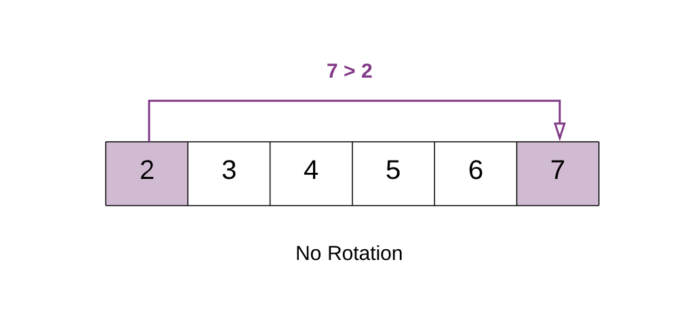
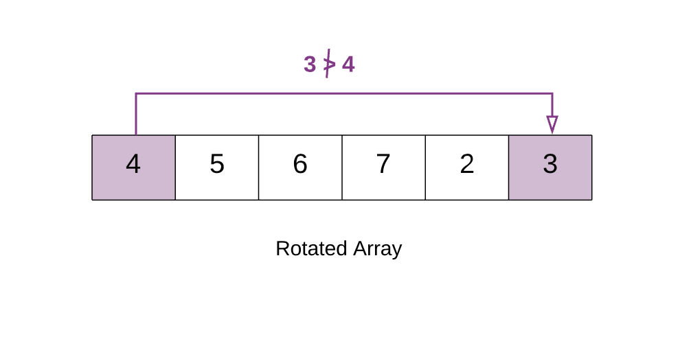
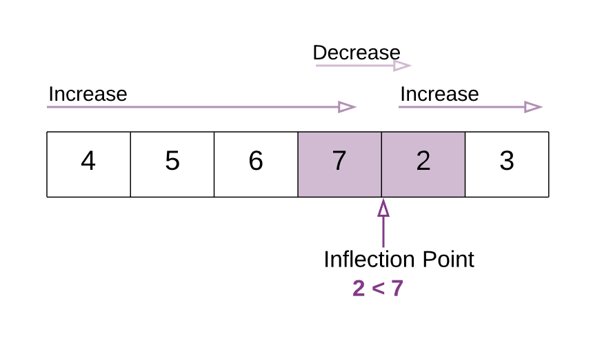
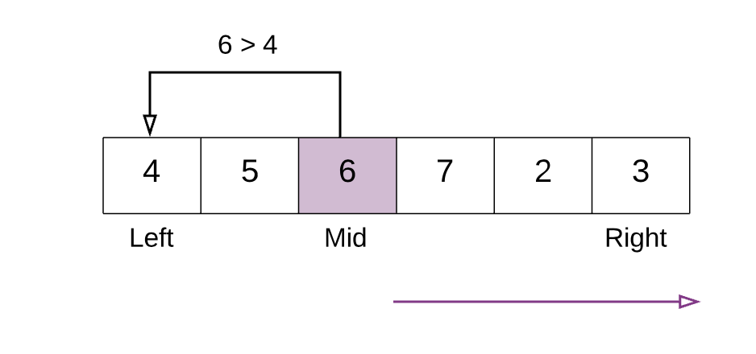
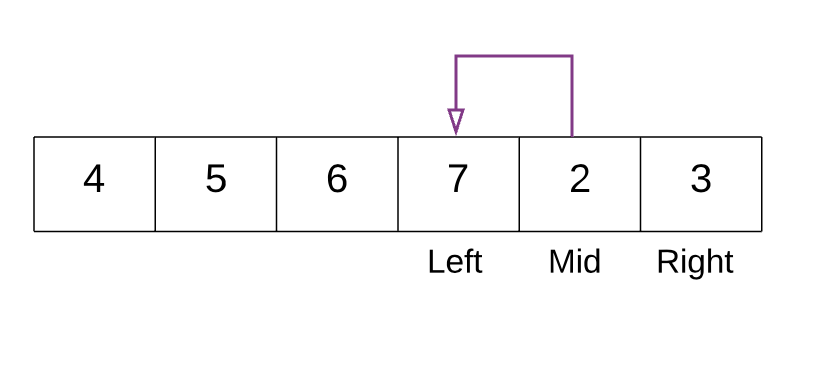

153. Find Minimum in Rotated Sorted Array

Suppose an array sorted in ascending order is rotated at some pivot unknown to you beforehand.

(i.e.,  `[0,1,2,4,5,6,7]` might become  `[4,5,6,7,0,1,2]`).

Find the minimum element.

You may assume no duplicate exists in the array.

**Example 1:**
```
Input: [3,4,5,1,2] 
Output: 1
```

**Example 2:**
```
Input: [4,5,6,7,0,1,2]
Output: 0
```

# Solution
---
## Approach 1: Binary Search
**Intuition**

A very brute way of solving this question is to search the entire array and find the minimum element. The time complexity for that would be $O(N)$ given that N is the size of the array.

A very cool way of solving this problem is using the Binary Search algorithm. In binary search we find out the mid point and decide to either search on the left or right depending on some condition.

Since the given array is sorted, we can make use of binary search. However, the array is rotated. So simply applying the binary search won't work here.

In this question we would essentially apply a modified version of binary search where the condition that decides the search direction would be different than in a standard binary search.

We want to find the smallest element in a rotated sorted array. What if the array is not rotated? How do we check that?

If the array is not rotated and the array is in ascending order, then last element > first element.



In the above example `7 > 2`. This means that the array is still sorted and has no rotation.



In the above example `3 < 4`. Hence the array is rotated. This happens because the array was initially `[2, 3 ,4 ,5 ,6 ,7]`. But after the rotation the smaller elements `[2,3]` go at the back. i.e. `[4, 5, 6, 7, 2, 3]`. Because of this the first element `[4]` in the rotated array becomes greater than the last element.

This means there is a point in the array at which you would notice a change. This is the point which would help us in this question. We call this the `Inflection Point`.



In this modified version of binary search algorithm, we are looking for this point. In the above example notice the `Inflection Point`.

>All the elements to the left of inflection point > first element of the array.\
All the elements to the right of inflection point < first element of the array.

**Algorithm**

1. Find the `mid` element of the array.
1. If `mid element > first element of array` this means that we need to look for the inflection point on the right of mid.
1. If `mid element < first element of array` this that we need to look for the inflection point on the left of mid.
\
In the above example mid element `6` is greater than first element `4`. Hence we continue our search for the inflection point to the right of mid.
1. We stop our search when we find the `inflection point`, when either of the two conditions is satisfied:
  * `nums[mid] > nums[mid + 1]` Hence, **mid+1** is the smallest.

  * `nums[mid - 1] > nums[mid]` Hence, **mid** is the smallest.


In the above example. With the marked left and right pointers. The mid element is `2`. The element just before `2` is `7` and `7>2` i.e. `nums[mid - 1] > nums[mid]`. Thus we have found the point of inflection and 2 is the smallest element.

```python
class Solution(object):
    def findMin(self, nums):
        """
        :type nums: List[int]
        :rtype: int
        """
        # If the list has just one element then return that element.
        if len(nums) == 1:
            return nums[0]

        # left pointer
        left = 0
        # right pointer
        right = len(nums) - 1

        # if the last element is greater than the first element then there is no rotation.
        # e.g. 1 < 2 < 3 < 4 < 5 < 7. Already sorted array.
        # Hence the smallest element is first element. A[0]
        if nums[right] > nums[0]:
            return nums[0]

        # Binary search way
        while right >= left:
            # Find the mid element
            mid = left + (right - left) / 2
            # if the mid element is greater than its next element then mid+1 element is the smallest
            # This point would be the point of change. From higher to lower value.
            if nums[mid] > nums[mid + 1]:
                return nums[mid + 1]
            # if the mid element is lesser than its previous element then mid element is the smallest
            if nums[mid - 1] > nums[mid]:
                return nums[mid]

            # if the mid elements value is greater than the 0th element this means
            # the least value is still somewhere to the right as we are still dealing with elements greater than nums[0]
            if nums[mid] > nums[0]:
                left = mid + 1
            # if nums[0] is greater than the mid value then this means the smallest value is somewhere to the left
            else:
                right = mid - 1
```

**Complexity Analysis**

* Time Complexity : Same as Binary Search $O(\log N)$
* Space Complexity : $O(1)$

## Submissions
---
**Solution: (Binary Search)**
```
Runtime: 48 ms
Memory Usage: 13.9 MB
```
```python
class Solution:
    def findMin(self, nums: List[int]) -> int:
        # If the list has just one element then return that element.
        if len(nums) == 1:
            return nums[0]

        # left pointer
        left = 0
        # right pointer
        right = len(nums) - 1

        # if the last element is greater than the first element then there is no rotation.
        # e.g. 1 < 2 < 3 < 4 < 5 < 7. Already sorted array.
        # Hence the smallest element is first element. A[0]
        if nums[right] > nums[0]:
            return nums[0]

        # Binary search way
        while right >= left:
            # Find the mid element
            mid = left + (right - left) // 2
            # if the mid element is greater than its next element then mid+1 element is the smallest
            # This point would be the point of change. From higher to lower value.
            if nums[mid] > nums[mid + 1]:
                return nums[mid + 1]
            # if the mid element is lesser than its previous element then mid element is the smallest
            if nums[mid - 1] > nums[mid]:
                return nums[mid]

            # if the mid elements value is greater than the 0th element this means
            # the least value is still somewhere to the right as we are still dealing with elements greater than nums[0]
            if nums[mid] > nums[0]:
                left = mid + 1
            # if nums[0] is greater than the mid value then this means the smallest value is somewhere to the left
            else:
                right = mid - 1
```

**Solution 1: (Binary Search)**
```
Runtime: 4 ms
Memory Usage: 6 MB
```
```c
int findMin(int* nums, int numsSize){
    // If the list has just one element then return that element.
    if (numsSize == 1)
        return nums[0];

    // left pointer
    int left = 0;
    // right pointer
    int right = numsSize - 1;
    int mid;

    // if the last element is greater than the first element then there is no rotation.
    // e.g. 1 < 2 < 3 < 4 < 5 < 7. Already sorted array.
    // Hence the smallest element is first element. A[0]
    if (nums[right] > nums[0])
        return nums[0];

    // Binary search way
    while (right >= left) {
        // Find the mid element
        mid = left + (right - left) / 2;
        // if the mid element is greater than its next element then mid+1 element is the smallest
        // This point would be the point of change. From higher to lower value.
        if (nums[mid] > nums[mid + 1])
            return nums[mid + 1];
        // if the mid element is lesser than its previous element then mid element is the smallest
        if (nums[mid - 1] > nums[mid])
            break;

        // if the mid elements value is greater than the 0th element this means
        // the least value is still somewhere to the right as we are still dealing with elements greater than nums[0]
        if (nums[mid] > nums[0])
            left = mid + 1;
        // if nums[0] is greater than the mid value then this means the smallest value is somewhere to the left
        else
            right = mid - 1;
    }
    return nums[mid];
}
```

**Solution 3: (Binary Search)**
```
Runtime: 0 ms
Memory Usage: 6.1 MB
```
```c
int findMin(int* nums, int numsSize){
    // left pointer
    int left = 0;
    // right pointer
    int right = numsSize - 1;
    int mid;

    // Binary search way
    while (left < right) {
        // Find the mid element
        mid = left + (right - left) / 2;
        if (nums[mid] > nums[right])
            left = mid+1;
        else
            right = mid;
    }
    return nums[left];
}
```

// **Solution 3: (Binary Search)**
// ```
// Runtime: 0 ms
// Memory Usage: 10.3 MB
// ```
// ```c++
// class Solution {
// public:
//     int findMin(vector<int>& nums) {
//         int s=0, e=nums.size()-1;
//         int mid = s + (e-s)/2;
//         while(s<e){
//             if (nums[mid] >= nums[0]){
//                 s = mid + 1;
//             }
//             else{
//                 e = mid;
//             }
//             mid = s + (e-s)/2;
//         }
//         // cout << "Start Index after exiting loop is " << s << endl;
//         // To cover the edge case where array is not rotated.
//         if (nums[s] > nums[0]){
//             return nums[0];
//         }
//         return nums[s];
//     }
// };
// ```
